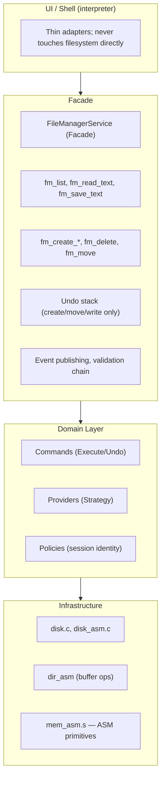
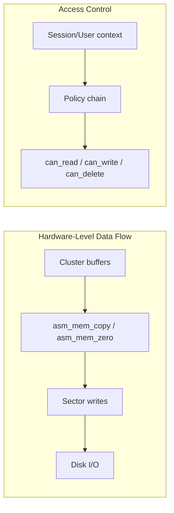

# Flinstone Project

A low-level C-based file system and shell with hardware-level disk operations and systems-forward architecture. Data lives on hardware-backed storage; ASM primitives drive sector buffers and cluster I/O. Designed for educational use, Flinstone provides real design-pattern structure for file management and a composable path toward production-grade persistence.

## 📚 Overview

The Flinstone Project is a modular operating systems educational project written in C. It provides hardware-level disk operations (cluster read/write/zero via ASM-backed buffers), an interactive shell interface, and design patterns (Facade, Strategy, Command, Observer, Chain of Responsibility) to keep the codebase composable and testable. An x86-64 assembly layer supplies performance-critical memory primitives for sector buffers, cluster clears, and directory entry writes.

## ✨ Features

- **Hardware-level disk & file system** — Cluster-based storage with ASM-backed buffer I/O; sector/cluster ops at the metal
- **Design-pattern file management** — Facade (FileManagerService), Provider/Strategy (Local, InMemory), Command (undoable ops), Events, Chain of Responsibility (access checks)
- **ASM memory primitives** — `asm_mem_copy`, `asm_mem_zero`, `asm_block_fill` for hot-path operations (memcpy-only; no overlap)
- **Priority queue** — Multi-priority task scheduling with FIFO tie-breaking for deferred FS work
- **Path support** — `.` (current), `..` (parent), `./foo`, normalized path resolution
- **Path log** — In-memory log of file/dir operations (`where`, `loc`)
- **Session identity** — Policy checks receive caller-provided user/session context (no hard-coded identity)
- **Undo semantics** — Create, move, write are undoable; delete is non-undoable (documented)
- **Interactive & batch shell** — Thread-pooled command execution
- **Unit testing** — CUnit-based test suite

## 🏗️ Architecture





## 📁 File Structure

| File/Folder | Description |
|-------------|-------------|
| **main.c** | Entry point, batch parsing, shell init |
| **interpreter.c / .h** | Command dispatch, thin adapter to service layer |
| **common.c / .h** | Globals, help text, `g_cwd` |
| **util.c / .h** | `resolve_path`, history, `trim_whitespace` |
| **disk.c / disk.h** | Disk I/O (text hex format, hardware-backed) |
| **disk_asm.c / .h** | ASM-backed cluster read/write/zero |
| **cluster.c / .h** | Cluster management, hex conversion |
| **mem_asm.s** | x86-64 ASM: `asm_mem_copy`, `asm_mem_zero`, `asm_block_fill` |
| **alloc/alloc_core.s** | Thread-safe allocator core: lock, brk, free-list, malloc_nolock |
| **alloc/alloc_malloc.s** | malloc, calloc, realloc (GAS/AT&T x86-64) |
| **alloc/alloc_free.s** | free with forward coalescing |
| **alloc/alloc.h** | C declarations for ASM allocator |
| **dir_asm.c / .h** | ASM-backed directory buffer ops |
| **drivers/port_io.s** | x86-64 ASM: `port_inb`, `port_outb`, `port_inw`, `port_outw` |
| **drivers/block_driver.c** | Block device (sector I/O) – host: disk_asm, BAREMETAL: IDE |
| **drivers/keyboard_driver.c** | Keyboard – host: stdin, BAREMETAL: port 0x60 |
| **drivers/display_driver.c** | Display – host: printf, BAREMETAL: VGA 0xB8000 |
| **drivers/timer_driver.c** | Timer – host: usleep, BAREMETAL: PIT |
| **drivers/pic_driver.c** | Interrupt controller – host: no-op, BAREMETAL: 8259 PIC |
| **drivers/drivers.c** | Driver subsystem init/shutdown |
| **fs.c / fs.h** | Legacy FS helpers (mkdir, rmtree, cat, redirect) |
| **fs_types.h** | Domain types: `fs_node_t`, provider/command vtables |
| **fs_provider.c / .h** | `IFileSystemProvider`: Local, InMemory |
| **fs_command.c / .h** | Undoable commands: create, delete, move, write |
| **fs_facade.c / .h** | `FileManagerService` facade |
| **fs_events.c / .h** | Event bus (FileCreated, FileSaved, etc.) |
| **fs_chain.c / .h** | Chain of Responsibility for validation |
| **fs_policy.c / .h** | Access policies (e.g. protected paths) |
| **fs_service_glue.c / .h** | Service init, `g_fm_service` |
| **path_log.c / .h** | In-memory path operation log |
| **priority_queue.c / .h** | Multi-priority task queue (FIFO tie-break) |
| **task_manager.c / .h** | Task manager — routes to thread pool PQ |
| **threadpool.c / .h** | PQ-driven thread pool (priority scheduling) |
| **mem_domain.c / .h** | Memory domains + ASM buffer ops (copy/zero/fill) |
| **vrt.c / .h** | Virtual Resource Table (handles → resources) |
| **vfs.c / .h** | VFS: host_vfs, memory_vfs backends |
| **drivers/driver_caps.h** | Block/keyboard/display capability structs |
| **VM/vm.c, vm_host.c, vm_sdl.c, vm_font.c, ...** | x86 emulator (VM_ENABLE=1): host owns VM data, SDL2 window (VM_SDL=1), PQ scheduling |
| **terminal.c / .h** | Raw mode terminal (interactive) |
| **Makefile** | Build (C + ASM), test target |

## 🛠️ Build & Run

### Prerequisites

- GCC compiler
- POSIX-compliant OS (Linux/macOS)
- (Optional) CUnit for tests: `apt install libcunit1-dev` or `make deps-cunit`

### Build

```bash
make
```

Builds `BPForbes_Flinstone_Shell` with `mem_asm.s` and `drivers/port_io.s` linked.

**Optional: ASM heap allocator** (malloc/calloc/realloc/free in GAS x86-64):
```bash
make USE_ASM_ALLOC=1
```
Replaces the system allocator for the process. Use for testing or bare-metal targets. Disable (`USE_ASM_ALLOC=0` or omit) if batch mode shows instability.

**Bare-metal build** (for bootable kernel, not userspace):
```bash
make baremetal
```
Uses port I/O and VGA directly. Requires bare-metal target.

**Embedded x86 VM** (emulation-based hypervisor with CPU, RAM, GPU, timer, interrupts):
```bash
make vm
./BPForbes_Flinstone_Shell -Virtualization -y -vm
```
- **Host layer** (`vm_host`): Parent system maintains VM data (guest RAM, vCPU, keyboard queue)
- **CPU**: vCPU state, real-mode, minimal opcode subset (MOV, IN, OUT, INT, IRET, STOSB, etc.)
- **RAM**: 16MB guest RAM via mem_domain + asm_mem_copy/asm_mem_zero
- **GPU/VGA**: Guest 0xb8000 rendered via display_driver.refresh_vga (ASM copy)
- **Timer**: PIT ports 0x40–0x43; **PIC**: 0x20, 0x21, 0xA0, 0xA1
- **Scheduling**: Priority queue (PQ) for vCPU quanta, display refresh, timer ticks

**VM with SDL2 window** (WSLg-friendly popup, framebuffer blit):
```bash
make vm-sdl
./BPForbes_Flinstone_Shell -Virtualization -y -vm
```
SDL2: use system package (`apt install libsdl2-dev`) or fetch locally:
```bash
make deps        # Fetches and builds SDL2 into deps/install
make vm-sdl      # Uses deps/install if present, else pkg-config
```

### Run

```bash
./BPForbes_Flinstone_Shell
```

Interactive mode. For batch:

```bash
./BPForbes_Flinstone_Shell help
./BPForbes_Flinstone_Shell dir . where
```

### Test

```bash
make BPForbes_Flinstone_Tests
./BPForbes_Flinstone_Tests
```

**Core ASM + PQ tests** (no CUnit):
```bash
make test_mem_asm      # mem_asm vs memcpy/memset
make test_priority_queue   # PQ invariants (FIFO tie-break, ordering)
make test_alloc_libc   # allocator with libc
make test_alloc_asm   # allocator with ASM heap (USE_ASM_ALLOC)
make test_core        # mem_asm + PQ
```

**Debug build** (ASM contract asserts):
```bash
make debug   # -DMEM_ASM_DEBUG -g
```

## 💬 Command Reference

### Navigation

| Command | Description |
|---------|-------------|
| `cd [path]` | Change directory (no args prints current) |

### Disk Operations

| Command | Description |
|---------|-------------|
| `createdisk <volume> <rowCount> <nibbleCount> [-y\|-n]` | Create new disk file |
| `format <disk_file> <volume> <rowCount> <nibbleCount>` | Format existing disk |
| `setdisk <disk_file>` | Set disk file to use |
| `listclusters` | List disk cluster contents |
| `printdisk` | Print disk with header |
| `writecluster <index> -t\|-h <data>` | Write to cluster |
| `delcluster <index>` | Zero out cluster |
| `update <index> -t\|-h <data>` | Delete then write cluster |
| `addcluster [-t\|-h <data>]` | Append cluster |
| `initdisk <count> <size>` | Init in-memory geometry |
| `search <text> [-t\|-h]` | Search disk |
| `du [dtl [clusters...]]` | Disk usage |
| `import <textfile> <txtfile> [clusters clusterSize]` | Import drive listing |

### Directory Operations

| Command | Description |
|---------|-------------|
| `dir [path]` | List directory contents |
| `listdirs` | List directories in cwd |
| `mkdir <path>` | Create directory (parents created if needed) |
| `rmdir <path>` | Remove empty directory |
| `rmtree <path>` | Recursively remove directory |

### File Operations

| Command | Description |
|---------|-------------|
| `make <filename>` | Create file interactively (end with `EOF`) |
| `write <file> <content>` | Write content to file |
| `cat <filename>` | Display file contents |
| `type <filename>` | Same as cat |
| `mv <src> <dst>` | Move or rename file/directory |

### Other

| Command | Description |
|---------|-------------|
| `version [-y\|-n]` | Print version |
| `help` | Display help |
| `redirect <file>` | Redirect output (`redirect off` to restore) |
| `rerun <N>` | Re-run Nth history command |
| `where [N]`, `loc [N]` | Show path log (last N ops, default 16) |
| `exit [-y\|-n]` | Exit shell |
| `clear` | Clear screen |
| `history`, `his` | Show command history |
| `cc` | Clear history |

### Path Support

- `.` — current directory
- `..` — parent directory
- `./foo` — foo in current directory
- Paths are normalized (e.g. `a/b/../c` → `a/c`)

### Undo Semantics

- **Undoable:** create file, create dir, move, write (save)
- **Non-undoable:** delete, rmtree — excluded from undo stack

### Batch Shortcut

```bash
./BPForbes_Flinstone_Shell <volume> <rows> <nibbles> [-y]
```

Equivalent to `createdisk` with the same parameters.

## 🖥️ Example Shell Session

```shell
cd /workspace
mkdir projects/sub
cd projects
write sub/readme.txt "Hello Flinstone!"
cat sub/readme.txt
dir .
mv sub/readme.txt readme.txt
where 5
```

## ⚖️ Legal and Ethical Notice

This project was developed in an academic setting under a legal contract and with all proper permissions. It is provided strictly for educational and research purposes. Unauthorized duplication or malicious use may violate laws such as the Computer Fraud and Abuse Act (CFAA).

## 👤 Author

**Bailey Forbes**  
Computer Science B.S., Indiana University Southeast (Alumnus)  
📧 baileyforbes@rocketmail.com

## 🪪 License

MIT License — See `LICENSE` for details.
