# Flintstone Project

A low-level C-based file system and shell with hardware-level disk operations and systems-forward architecture. Data lives on hardware-backed storage; ASM primitives drive sector buffers and cluster I/O. Designed for educational use, Flintstone provides real design-pattern structure for file management and a composable path toward production-grade persistence.

## 📚 Overview

The Flintstone Project is a modular operating systems educational project written in C. It provides hardware-level disk operations (cluster read/write/zero via ASM-backed buffers), an interactive shell interface, and design patterns (Facade, Strategy, Command, Observer, Chain of Responsibility) to keep the codebase composable and testable. An x86-64 assembly layer supplies performance-critical memory primitives for sector buffers, cluster clears, and directory entry writes.

## ✨ Features

- **Hardware-level disk & file system** — Cluster-based storage with ASM-backed buffer I/O; sector/cluster ops at the metal
- **Design-pattern file management** — Facade (FileManagerService), Provider/Strategy (Local, InMemory), Command (undoable ops), Events, Chain of Responsibility (access checks)
- **ASM memory primitives** — `asm_mem_copy`, `asm_mem_zero`, `asm_block_fill` for hot-path operations (memcpy-only; no overlap)
- **Priority queue** — Multi-priority task scheduling with FIFO tie-breaking for deferred FS work
- **Path support** — `.` (current), `..` (parent), `./foo`, normalized path resolution
- **Path log** — In-memory log of file/dir operations (`where`, `loc`)
- **Session identity** — Policy checks receive caller-provided user/session context (no hard-coded identity)
- **Undo semantics** — Create, move, write are undoable; delete is non-undoable (documented)
- **Interactive & batch shell** — Thread-pooled command execution
- **Unit testing** — CUnit-based test suite

## 🏗️ Architecture

```mermaid
flowchart TB
    subgraph UI["UI / Shell (interpreter)"]
        A["Thin adapters; never touches filesystem directly"]
    end

    subgraph Facade["FileManagerService (Facade)"]
        B["fm_list, fm_read_text, fm_save_text"]
        C["fm_create_*, fm_delete, fm_move"]
        D["Undo stack (create/move/write only)"]
        E["Event publishing, validation chain"]
    end

    subgraph Domain["Domain Layer"]
        F["Commands (Execute/Undo)"]
        G["Providers (Strategy)"]
        H["Policies (session identity)"]
    end

    subgraph Infra["Infrastructure"]
        I["disk.c, disk_asm.c"]
        J["dir_asm (buffer ops)"]
        K["mem_asm.s — ASM primitives"]
    end

    UI --> Facade
    Facade --> Domain
    Domain --> Infra
```




## 📁 File Structure

| File/Folder | Description |
|-------------|-------------|
| **main.c** | Entry point, batch parsing, shell init |
| **interpreter.c / .h** | Command dispatch, thin adapter to service layer |
| **common.c / .h** | Globals, help text, `g_cwd` |
| **util.c / .h** | `resolve_path`, history, `trim_whitespace` |
| **disk.c / disk.h** | Disk I/O (text hex format, hardware-backed) |
| **disk_asm.c / .h** | ASM-backed cluster read/write/zero |
| **cluster.c / .h** | Cluster management, hex conversion |
| **mem_asm.s** | x86-64 ASM: `asm_mem_copy`, `asm_mem_zero`, `asm_block_fill` |
| **dir_asm.c / .h** | ASM-backed directory buffer ops |
| **drivers/port_io.s** | x86-64 ASM: `port_inb`, `port_outb`, `port_inw`, `port_outw` |
| **drivers/block_driver.c** | Block device (sector I/O) – host: disk_asm, BAREMETAL: IDE |
| **drivers/keyboard_driver.c** | Keyboard – host: stdin, BAREMETAL: port 0x60 |
| **drivers/display_driver.c** | Display – host: printf, BAREMETAL: VGA 0xB8000 |
| **drivers/timer_driver.c** | Timer – host: usleep, BAREMETAL: PIT |
| **drivers/pic_driver.c** | Interrupt controller – host: no-op, BAREMETAL: 8259 PIC |
| **drivers/drivers.c** | Driver subsystem init/shutdown |
| **fs.c / fs.h** | Legacy FS helpers (mkdir, rmtree, cat, redirect) |
| **fs_types.h** | Domain types: `fs_node_t`, provider/command vtables |
| **fs_provider.c / .h** | `IFileSystemProvider`: Local, InMemory |
| **fs_command.c / .h** | Undoable commands: create, delete, move, write |
| **fs_facade.c / .h** | `FileManagerService` facade |
| **fs_events.c / .h** | Event bus (FileCreated, FileSaved, etc.) |
| **fs_chain.c / .h** | Chain of Responsibility for validation |
| **fs_policy.c / .h** | Access policies (e.g. protected paths) |
| **fs_service_glue.c / .h** | Service init, `g_fm_service` |
| **path_log.c / .h** | In-memory path operation log |
| **priority_queue.c / .h** | Multi-priority task queue |
| **task_manager.c / .h** | Task manager wrapper |
| **threadpool.c / .h** | Thread pool for command execution |
| **terminal.c / .h** | Raw mode terminal (interactive) |
| **Makefile** | Build (C + ASM), test target |

## 🛠️ Build & Run

### Prerequisites

- GCC compiler
- POSIX-compliant OS (Linux/macOS)
- (Optional) CUnit for tests: `sudo apt install libcunit1 libcunit1-dev`

### Build

```bash
make
```

Builds `BPForbes_Flinstone_Shell` with `mem_asm.s` and `drivers/port_io.s` linked.

**Bare-metal build** (for bootable kernel, not userspace):
```bash
make CFLAGS="-Wall -Wextra -pthread -DDRIVERS_BAREMETAL=1"
```
Uses port I/O and VGA directly. Requires bare-metal target.

### Run

```bash
./BPForbes_Flinstone_Shell
```

Interactive mode. For batch:

```bash
./BPForbes_Flinstone_Shell help
./BPForbes_Flinstone_Shell dir . where
```

### Test

```bash
make BPForbes_Flinstone_Tests
./BPForbes_Flinstone_Tests
```

## 💬 Command Reference

### Navigation

| Command | Description |
|---------|-------------|
| `cd [path]` | Change directory (no args prints current) |

### Disk Operations

| Command | Description |
|---------|-------------|
| `createdisk <volume> <rowCount> <nibbleCount> [-y\|-n]` | Create new disk file |
| `format <disk_file> <volume> <rowCount> <nibbleCount>` | Format existing disk |
| `setdisk <disk_file>` | Set disk file to use |
| `listclusters` | List disk cluster contents |
| `printdisk` | Print disk with header |
| `writecluster <index> -t\|-h <data>` | Write to cluster |
| `delcluster <index>` | Zero out cluster |
| `update <index> -t\|-h <data>` | Delete then write cluster |
| `addcluster [-t\|-h <data>]` | Append cluster |
| `initdisk <count> <size>` | Init in-memory geometry |
| `search <text> [-t\|-h]` | Search disk |
| `du [dtl [clusters...]]` | Disk usage |
| `import <textfile> <txtfile> [clusters clusterSize]` | Import drive listing |

### Directory Operations

| Command | Description |
|---------|-------------|
| `dir [path]` | List directory contents |
| `listdirs` | List directories in cwd |
| `mkdir <path>` | Create directory (parents created if needed) |
| `rmdir <path>` | Remove empty directory |
| `rmtree <path>` | Recursively remove directory |

### File Operations

| Command | Description |
|---------|-------------|
| `make <filename>` | Create file interactively (end with `EOF`) |
| `write <file> <content>` | Write content to file |
| `cat <filename>` | Display file contents |
| `type <filename>` | Same as cat |
| `mv <src> <dst>` | Move or rename file/directory |

### Other

| Command | Description |
|---------|-------------|
| `version [-y\|-n]` | Print version |
| `help` | Display help |
| `redirect <file>` | Redirect output (`redirect off` to restore) |
| `rerun <N>` | Re-run Nth history command |
| `where [N]`, `loc [N]` | Show path log (last N ops, default 16) |
| `exit [-y\|-n]` | Exit shell |
| `clear` | Clear screen |
| `history`, `his` | Show command history |
| `cc` | Clear history |

### Path Support

- `.` — current directory
- `..` — parent directory
- `./foo` — foo in current directory
- Paths are normalized (e.g. `a/b/../c` → `a/c`)

### Undo Semantics

- **Undoable:** create file, create dir, move, write (save)
- **Non-undoable:** delete, rmtree — excluded from undo stack

### Batch Shortcut

```bash
./BPForbes_Flinstone_Shell <volume> <rows> <nibbles> [-y]
```

Equivalent to `createdisk` with the same parameters.

## 🖥️ Example Shell Session

```shell
cd /workspace
mkdir projects/sub
cd projects
write sub/readme.txt "Hello Flintstone!"
cat sub/readme.txt
dir .
mv sub/readme.txt readme.txt
where 5
```

## ⚖️ Legal and Ethical Notice

This project was developed in an academic setting under a legal contract and with all proper permissions. It is provided strictly for educational and research purposes. Unauthorized duplication or malicious use may violate laws such as the Computer Fraud and Abuse Act (CFAA).

## 👤 Author

**Bailey Forbes**  
Computer Science B.S., Indiana University Southeast (Alumnus)  
📧 baileyforbes@rocketmail.com

## 🪪 License

MIT License — See `LICENSE` for details.
