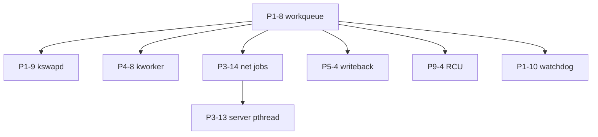

# Kernel background jobs (workqueues)

Normative roadmap rows live in **`docs/ROADMAP.md`** (Phase 1 **P1-8**–**P1-10**, plus **P3-14**, **P4-8**, **P5-4**, **P9-4**). This document explains **why** those rows exist, how they relate to common kernel daemons, and what “done” looks like for implementers.

## Two layers: kernel jobs vs userland tasks

| Layer | Examples in Flinstone | Roadmap |
|-------|----------------------|---------|
| **Kernel / supervisor** | `kswapd`-class reclaim, writeback flush, `kworker` deferred IRQ, net RX/timer jobs, RCU grace threads, watchdog | **P1-8** framework + domain rows below |
| **Userland (hosted shell)** | **`server`** chat recv **`pthread`** (**P3-13**) | **`docs/P3_13_CHAT_SERVER.md`** §7 — **not** a substitute for **P1-8** |

Kernel jobs must respect **P1-3** (lock ordering, no unbounded work under spinlocks) and **P1-7** (timers for periodic wakeups).

---

## Linux analog → Flinstone roadmap

| Domain | Typical Linux component | Flinstone row | Goal (summary) |
|--------|-------------------------|---------------|----------------|
| **Framework** | `kthread`, `workqueue`, `schedule_work` | **P1-8** | Schedule bounded asynchronous work outside hardirq; park/wake/teardown API |
| **Memory management** | **`kswapd`** — reclaim inactive pages, swap, avoid OOM | **P1-9** | Background scan of **P1-4** PMM / **P1-5** arenas; pressure hooks before alloc fails |
| **Storage & FS** | **`flush`** / **pdflush** / **bdi-writeback** — dirty page writeback | **P5-4** | Periodic flush of **P5-3** dirty cache to **P4-4** block backends |
| **CPU / SMP** | **`rcuop`**, **`rcuc`** — RCU grace periods | **P9-4** | Deferred free after read-side critical sections (**P9-3** SMP) |
| **System maintenance** | **`kworker`** — deferred work from IRQ | **P4-8** | Queue bottom-half work from **P4-2** hardirq; run on **P1-8** threads |
| **Networking** | softirq, NAPI, TCP timer wheel, delayed ACK | **P3-14** | RX dequeue, connection timers, ARP cache sweep (**#240**) on **P1-8** |
| **System timing** | **watchdog** + timekeeping work | **P1-10** | Health/timeouts using **P1-7** / **P0-5**; lab panic policy documented |

**Informative references (not copy Linux verbatim):** kernel workqueue design notes; **RFC 1122** (host requirements) for memory and net timeouts; **RFC 793** for TCP timers; **ARM DEN0022** / Intel SDM where jobs interact with power or IPIs (**P9-3**).

---

## P1-8 — Workqueue framework (build first)

**Deliverables:**

- **`fl_workqueue_t`** backed by the existing **`priority_queue_t`** MLQ (**`kernel/core/sched/priority_queue.c`**, same structure as shell **`threadpool`** jobs)
- **Kernel threads** or hosted **pthread** bridge on **H** that share one **scheduling contract**
- Per-item **work struct**: function pointer, context, **no unbounded heap** in the dispatcher
- Integration with **`fl_net_netdev_shutdown`** (**#232**) and driver teardown (**P4-2**)

**Contracts (normative shards):**

| Row | Header | Umbrella |
|-----|--------|----------|
| **P1-8** | **`contracts/runtime/contract_p1_workqueue.h`** | **`contract_runtime.h`** |
| **P1-9** | **`contract_p1_reclaim.h`** | **`contract_runtime.h`** |
| **P1-10** | **`contract_p1_watchdog.h`** | **`contract_runtime.h`** |
| **P3-14** | **`contracts/networking/contract_p3_background.h`** | **`contract_networking.h`** |
| **P4-8** | **`contracts/drivers/contract_p4_kworker.h`** | **`contract_drivers.h`** |
| **P5-4** | **`contracts/storage/contract_p5_writeback.h`** | **`contract_storage.h`** |
| **P9-4** | **`contracts/hardening/contract_p9_rcu.h`** | **`contract_hardening.h`** |

Work tags (**`FL_BG_JOB_TAG_*`**, **`FL_NET_BG_TAG_ARP_TICK`**) and MLQ layers (**`FL_WQ_LAYER_*`**) live in these headers, not only in implementation **`.h`** files.

**Source tree (scaffold — builds, handlers mostly no-op):**

| Path | Row | Notes |
|------|-----|--------|
| **`kernel/core/sched/workqueue.c`** | **P1-8** | MLQ wrapper: **`fl_wq_enqueue`** → **`pq_push`**, **`fl_wq_poll`** → **`pq_pop`** |
| **`kernel/core/sched/priority_queue.c`** | shared | Scheduler-grade multilevel queue (also **`g_pool.pq`** in **`threadpool.c`**) |
| **`kernel/core/sched/bg_jobs.c`** | **P1-9**, **P1-10**, tick hub | **`fl_bg_jobs_tick`**; reclaim/watchdog stubs |
| **`kernel/core/net/net_background.c`** | **P3-14** | **`fl_net_background_tick`**, ARP sweep kick stub |
| **`kernel/core/sched/threadpool.c`** | — | Shell command pool on **H** (not kernel workqueue) |

Planned domain files (not yet in tree): **P5-4** writeback, **P4-8** IRQ bottom-half queue, **P9-4** RCU grace jobs.

**Acceptance:**

- [x] Enqueue 1000 no-op jobs without leak; clean shutdown with pending work — **`make test_workqueue_p18`** (**#242**)
- [ ] Assert **P1-3** lock-order violations in debug builds when a job takes forbidden locks (future)
- [x] Document which jobs may block vs must stay non-blocking (table below)

### Handler blocking policy (**#242**)

| Job / kick | Row | May block? | Notes |
|------------|-----|------------|--------|
| **P1-8** dispatcher (`fl_wq_poll`) | **P1-8** | N/A | Runs handlers synchronously; keep each handler short |
| **`bg_reclaim_work`** | **P1-9** | No (target) | Must not take **P1-3** locks while holding PMM locks out of order |
| **`bg_watchdog_work`** | **P1-10** | No (target) | Read-only health checks; panic policy is explicit |
| **`net_bg_work`** (ARP tick) | **P3-14** | No (target) | Bounded cache walk only; no wire I/O in tick |
| **P5-4** writeback (planned) | **P5-4** | Yes (bounded) | May wait on block I/O; rate-limited batches |
| **P4-8** IRQ bottom half (planned) | **P4-8** | Yes (bounded) | Locks allowed per **P1-3** graph after hardirq |
| **P9-4** RCU grace (planned) | **P9-4** | No | Wait for quiescent state, no unbounded sleep |

**SMP / locking:** **`fl_wq_default()`** is **single-writer** until **P9-3** (documented in **`contract_p1_workqueue.h`**). Debug builds assert no nested **`fl_wq_poll`**. **`fl_wq_drain(..., timeout_ms)`** uses **P1-7** **`fl_time_monotonic_ns`** when **`timeout_ms > 0`**.

---

## Domain jobs (after P1-8)

### P1-9 — Memory reclaim (`kswapd` analog)

- Wake on alloc failure trend or periodic tick
- Reclaim cold frames from PMM free lists; optional swap stub on **H** only
- Depends: **P1-4**, **P1-5**, **P1-8**

### P5-4 — Dirty writeback (`flush` / `bdi-writeback` analog)

- Walk dirty **P5-3** pages; issue block I/O in batches
- Rate-limit writes under memory pressure
- Depends: **P5-3**, **P4-4**, **P1-8**

### P4-8 — Deferred IRQ work (`kworker` analog)

- **Hardirq** (**P4-2**) queues short descriptor to workqueue; handler runs with locks allowed per graph
- Depends: **P4-2**, **P1-3**, **P1-8**

### P3-14 — Network stack background

- RX: pull frames from **P3-1** netdev queue into stack
- TCP: RTO/retransmit timer tick (**P3-7**), delayed ACK timer
- ARP: optional **`fl_net_arp_tick`** TTL sweep (**#240**)
- Depends: **P3-1**, **P3-7**, **P1-7**, **P1-8**

### P9-4 — RCU grace-period jobs (`rcuop` / `rcuc` analog)

- Read-side markers + grace-period detection before freeing shared structures
- Depends: **P9-3**, **P1-3**, **P1-8**

### P1-10 — Watchdog / health monitor

- Periodic check: tick advancement (**P0-5** / **P1-7**), stuck workqueue, net stall
- Policy: log, reset subsystem, or panic (lab **Kconfig**)
- Depends: **P1-7**, **P1-8**

---

## Suggested implementation order

**P3-13** chat can ship on hosted **pthread** before **P1-8** exists; migrating net timers to **P3-14** reduces duplicate ad-hoc threads later.

---

## Related docs

- **`docs/ROADMAP.md`** — authoritative **P\*** IDs and snapshot table
- **`docs/P3_13_CHAT_SERVER.md`** — userland background recv for **`server`**
- **`docs/P3_NETWORKING.md`** — stack layers fed by **P3-14**
