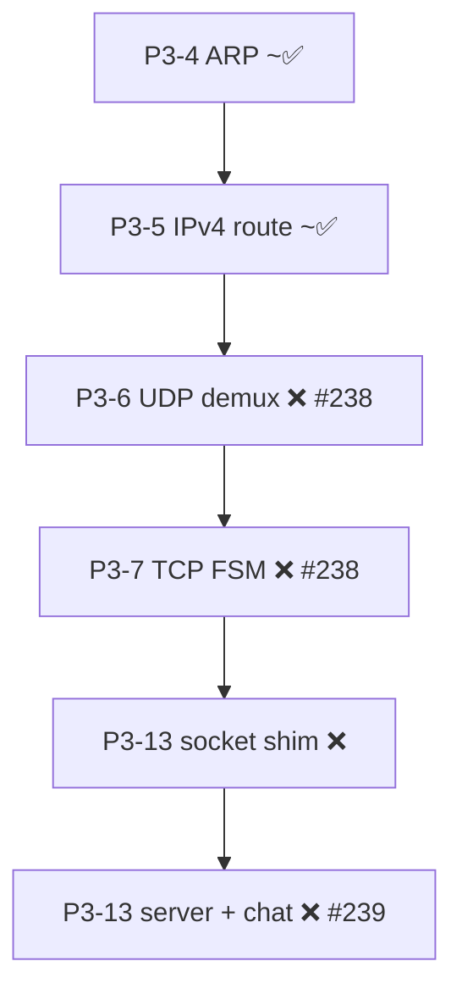
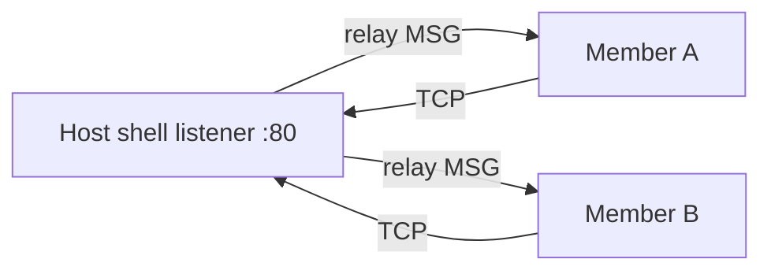

# P3-13 — Chat room (`server` session) implementation plan

This document is the **implementation guide** for the P3 networking end state: a **multi-user chat room** between Flinstone shells. It is normative for **product behavior** and **module boundaries**; roadmap status lives in **`docs/ROADMAP.md`** and layer context in **`docs/P3_NETWORKING.md`**.

**GitHub:** [#239](https://github.com/BPForbes/Bailey-Forbes-Flinstone/issues/239) (P3-13 application layer) depends on [#238](https://github.com/BPForbes/Bailey-Forbes-Flinstone/issues/238) (P3-6 UDP + P3-7 TCP infrastructure).

---

## 1 — Product summary

Two or more users, each running **`BPForbes_Flinstone_Shell`**, join the same **session** bound to **`ip:port`**. One machine **hosts** (listens); others **join** (connect). Users send **text messages** to the room while the shell stays interactive (**background receive task**).

| Shell command | Example | Effect |
|---------------|---------|--------|
| **`server host`** | `server host 45.68.43.4:80` | Listen on **45.68.43.4:80**; caller is **host**; start background I/O |
| **`server join`** | `server join 45.68.43.4:80` | TCP connect to host; enter session as **member** |
| **`server msg`** | `server msg Hello room` | Send chat line to all other members (via host relay) |
| **`server leave`** | `server leave` | Disconnect locally; if **host**, **elect new host** |
| **`server kill`** | `server kill` | **Host only** — close listener and drop **all** members |

**Authz:** non-host **`server kill`** → deny (**P2-3** / `fl_shell_authz_builtin`).

**Not in v1:** TLS (**P3-9**), usernames beyond principal id, private DMs, file transfer, IPv6.

---

## 2 — Dependency ladder (build order)

Implement **bottom-up**. Do **not** put server/chat logic in **P3-4**–**P3-7** modules; keep it in **P3-13** files.



| Step | Roadmap | Deliverable | Unblocks |
|------|---------|-------------|----------|
| 1 | **P3-6** | `net_udp.c`: port demux, checksum, bounded RX queue | Datagram façade, optional `udpsend` |
| 2 | **P3-7** | `net_tcp.c` (extend): **RFC 793** listen/connect/send/recv state machine on netdev + hosted fallback | Reliable byte stream |
| 3 | **P3-13a** | `net_socket.c` + `contract_p3_sockets.h` | `fl_socket` / `fl_bind` / `fl_listen` / `fl_accept` / `fl_connect` / `fl_send` / `fl_recv` / `fl_close` |
| 4 | **P3-13b** | `server_session.c` + wire codec | Session table, framing, host relay |
| 5 | **P3-13c** | `cmd_server.c` + background thread | Shell UX + `server msg` |
| 6 | **P3-13d** | Tests + CI | Loopback two-shell or scripted TCP peers |

**Prerequisites outside P3:** **#232** `fl_net_netdev_shutdown` for clean session teardown; **P2-3** authz on bind/listen/kill.

---

## 3 — Session topology (hub model)

Use a **star topology**: the **host** holds the **listener**; every **member** opens one **TCP connection** to the host. The host **relays** chat to all other connected members.



**Why hub (not mesh):** one listen socket, one place for **host election** and **`kill`**, simpler NAT/lab setup, matches `server host <ip:port>` / `server join <ip:port>` UX.

**Host transfer:** when the **host** runs **`server leave`**, pick the **longest-connected remaining member** (by `joined_tick`); send **`CTRL_HOST_PROMOTE`** to that member; they call **`fl_listen`** on the same **`ip:port`** (or inherit listener fd via handoff — see §6). Other members stay connected; only control role changes.

---

## 4 — Wire protocol (Flinstone session framing)

All application bytes ride on **TCP** (**RFC 793**). One **logical frame** per message:

| Offset | Size | Field | Description |
|--------|------|-------|-------------|
| 0 | 1 | **`magic`** | `0xFL` → use **`0x46`** (`'F'`) for v1 |
| 1 | 1 | **`version`** | `1` |
| 2 | 1 | **`opcode`** | See table below |
| 3 | 1 | **`flags`** | Reserved `0`; later: UTF-8, system |
| 4 | 2 | **`length_be`** | Payload length **0..`FL_SERVER_MAX_MSG`** |
| 6 | *n* | **`payload`** | UTF-8 bytes (no NUL terminator on wire) |

**Opcodes (v1):**

| Opcode | Name | Direction | Payload |
|--------|------|-----------|---------|
| `0x01` | **`HELLO`** | Member → Host | `principal_id` ASCII (or empty + default) |
| `0x02` | **`HELLO_ACK`** | Host → Member | `member_slot` u8 + optional room banner |
| `0x10` | **`MSG`** | Any → Host → relay | Chat text UTF-8 |
| `0x11` | **`MSG_BROADCAST`** | Host → All | `slot:u8` + text (who spoke) |
| `0x20` | **`CTRL_LEAVE`** | Any | Empty — peer hung up |
| `0x21` | **`CTRL_KILL`** | Host → All | Empty — session ending |
| `0x22` | **`CTRL_HOST_PROMOTE`** | Host → Member | Empty — recipient becomes host |
| `0x7F` | **`ERR`** | Any | ASCII reason |

**Limits (define in `contract_p3_server.h` or `net_server.h`):**

| Constant | Suggested | Purpose |
|----------|-----------|---------|
| **`FL_SERVER_MAX_MEMBERS`** | `16` | Connected TCP clients (excludes host processTable) |
| **`FL_SERVER_MAX_MSG`** | `512` | Max UTF-8 payload per frame |
| **`FL_SERVER_INBOUND_RING`** | `32` | Pending lines for shell display |
| **`FL_SERVER_TCP_BACKLOG`** | `8` | `listen()` backlog |

**Parsing rules:** reject `length_be > FL_SERVER_MAX_MSG`; reject unknown **`version`**; partial reads buffered per connection (TCP byte stream).

---

## 5 — Module and file layout

| Path | Layer | Responsibility |
|------|-------|----------------|
| **`contracts/networking/contract_p3_sockets.h`** | Contract | Socket handle types, errors, caps |
| **`contracts/networking/contract_p3_server.h`** | Contract | Opcodes, limits, session states |
| **`kernel/core/net/net_socket.c`** | P3-13 | Socket table; dispatch UDP/TCP |
| **`kernel/core/net/net_udp.c`** | P3-6 | Port demux (**#238**) |
| **`kernel/core/net/net_tcp.c`** | P3-7 | TCP FSM (**#238**) |
| **`kernel/core/net/net_server.c`** | P3-13 | Session hub: listen, accept, relay, promote |
| **`kernel/core/net/net_server.h`** | P3-13 | C API used by shell |
| **`userland/command/cmd_server.c`** | Shell | Parse `host`/`join`/`leave`/`kill`/`msg` |
| **`userland/shell/server_bg.c`** | Shell | Background pthread: `recv` → inbound ring |
| **`tests/test_p3_server.c`** | Test | Loopback host + join + msg round-trip |

Register **`server`** in **`fl_shell_cmd`** table (same pattern as **`ping`**).

**Do not** implement chat relay inside **`net_wire_host.c`** or **`cmd_ping.c`**.

---

## 6 — C API (kernel/session)

Suggested **`net_server.h`** surface for the shell (names illustrative):

```c
typedef enum {
    FL_SERVER_ROLE_NONE = 0,
    FL_SERVER_ROLE_HOST,
    FL_SERVER_ROLE_MEMBER
} fl_server_role_t;

fl_result_t fl_server_parse_endpoint(const char *ip_port, uint32_t *addr_be, uint16_t *port_be);
fl_result_t fl_server_host(uint32_t bind_addr_be, uint16_t port_be);
fl_result_t fl_server_join(uint32_t host_addr_be, uint16_t port_be);
fl_result_t fl_server_send_msg(const char *utf8, size_t len);
fl_result_t fl_server_leave(void);
fl_result_t fl_server_kill(void);  /* host only */
int fl_server_poll_inbound(char *buf, size_t cap);  /* non-blocking line for shell */
```

**`fl_server_parse_endpoint`:** split **`45.68.43.4:80`** — reuse **`fl_net_ipv4_parse_literal`** on host part; port via **`strtoul`** (1–65535); reject `:` in IPv6 for v1.

**Internal session struct (host):**

- `listen_sock` (socket shim handle)
- `members[FL_SERVER_MAX_MEMBERS]` — `{ sock, slot, joined_tick, principal_label }`
- `host_member_slot` — which slot is current host (0 = host process itself)

**Host `leave` algorithm:**

1. Find member with max `joined_tick`.
2. Send **`CTRL_HOST_PROMOTE`** on that TCP connection.
3. Close host listener; promoted member's shell calls **`fl_server_host`** on same endpoint (or passes listener fd — v1: re-bind same port after short delay).
4. Remaining members: no TCP reconnect in v1 if host IP/port unchanged and promoted peer re-listens quickly (document as lab limitation; v2 optional **`CTRL_REBIND`**).

---

## 7 — Background task (shell integration)

**Requirement:** after **`server host`** or **`server join`**, the user can still type commands; inbound chat must appear without blocking **`readline`** forever.

**Hosted v1 approach (documented):**

1. **`pthread_create`** dedicated **recv thread** (see existing **`pthread`** / worker pool in **`userland/shell/sh.c`**).
2. Thread loop: **`fl_server_poll_tcp`** / blocking **`fl_recv`** with timeout → decode frames → push lines into **`inbound_ring`** (mutex).
3. Main thread: before printing prompt (or in **`select`** on stdin if added later), drain ring: `[@slot] text\n`.
4. On **`server leave`** / **`kill`** / shell exit: set `atomic shutdown`, **`pthread_join`**, **`fl_server_leave`**.

**Rules:**

- Only **one** active session per shell process.
- **`server host`** while already in session → error.
- Shell **`exit`** while in session → implicit **`leave`** (or **`kill`** if host — policy: prefer **`leave`** to avoid surprising remote users).

---

## 8 — Socket shim (under session)

Mirror Linux semantics at the **contract** layer; implementation routes to in-tree TCP/UDP when **`fl_net_route_lookup`** hits, else hosted syscall fallback (same pattern as ICMP in **`net_wire_host.c`**).

| API | TCP | UDP |
|-----|-----|-----|
| **`fl_socket`** | `FL_SOCK_STREAM` | `FL_SOCK_DGRAM` |
| **`fl_bind`** | Required before listen | Required before recv |
| **`fl_listen` / `fl_accept`** | Host only | N/A |
| **`fl_connect`** | Member join | Optional |
| **`fl_send` / `fl_recv`** | Session frames | `udpsend` helper |

Socket handles are **small integers** indexing a static table — **not** host fds exposed to guest policy.

---

## 9 — Standards map (P3-13 slice)

| Concern | Reference |
|---------|-----------|
| TCP byte stream | **RFC 793** |
| UDP helpers | **RFC 768** |
| IPv4 bind/connect | **RFC 791** |
| Ethernet on wire | **IEEE 802.3**, **RFC 894** |
| ARP on LAN | **RFC 826** |
| Hosted fallback | POSIX.1-2017 `socket` (informative) |
| Text chat encoding | UTF-8 (no specific RFC; validate non-control ASCII subset for v1) |

---

## 10 — Phased acceptance tests

| Phase | Test | Pass criteria |
|-------|------|----------------|
| **P3-7** | `test_tcp_loopback_connect` | SYN/ACK/ACK + send payload on loopback netdev |
| **P3-13a** | `test_socket_loopback` | `fl_bind` + `fl_listen` + `fl_accept` + echo one frame |
| **P3-13b** | `test_server_frame_codec` | Encode/decode all opcodes; reject oversize |
| **P3-13c** | `test_server_host_join_msg` | Two logical peers on **127.0.0.1:9xxx**; one **`MSG`** received |
| **P3-13d** | `test_server_host_leave_promote` | Host leave → second member can accept new listener (scripted) |
| **P3-13e** | `test_server_kill_authz` | Guest **`kill`** denied |

Add **`make test_p3_server`** target when **`tests/test_p3_server.c`** exists (may alias into **`test_p3_network`** initially).

---

## 11 — Implementation checklist (copy into PRs)

### #238 — Infrastructure (not P3-13)

- [ ] **`net_udp.c`**: demux by destination port; bounded queue
- [ ] **`net_tcp.c`**: states `CLOSED`, `LISTEN`, `SYN_SENT`, `ESTABLISHED`, `CLOSE_WAIT`; window stub OK
- [ ] Egress path uses **`fl_net_wire_egress_l4`** for TCP segments (extend **`ipbuf`** beyond 576 when sending data)
- [ ] **`make test_p3_network`** covers TCP connect on loopback

### #239 — P3-13 chat room

- [ ] **`contract_p3_sockets.h`** + **`contract_p3_server.h`** wired in **`contract_networking.h`**
- [ ] **`net_socket.c`** shim
- [ ] **`net_server.c`** hub + framing
- [ ] **`cmd_server.c`** + **`server_bg.c`**
- [ ] **`server host` / `join` / `msg` / `leave` / `kill`** per §1
- [ ] Background recv thread + inbound ring display
- [ ] **P2-3** deny non-host **`kill`**
- [ ] **`docs/ROADMAP.md`** P3-13 integration → **~✅** when checklist done

---

## 12 — Related documents

| Doc | Role |
|-----|------|
| **`docs/P3_NETWORKING.md`** | Layer map, PRE 4.2.0 status, env vars |
| **`docs/ROADMAP.md`** | P0–P9 table, phase gates, **P3-13** row |
| **`kernel/core/net/README.md`** | File index (update when modules land) |
| **`contracts/networking/README.txt`** | Shard list |
| **#238**, **#239**, **#240**, **#241** | Issue tracking |

---

## 13 — UX examples (end state)

```text
$ server host 10.0.2.15:7777
[server] hosting on 10.0.2.15:7777 (background on)

$ server msg Welcome
[server] sent to 0 peers

# Second machine:
$ server join 10.0.2.15:7777
[server] joined slot 1

$ server msg Hi from B
# On host machine (background):
[@1] Hi from B

$ server leave
[server] left

# Host only:
$ server kill
[server] session closed
```

Public-IP example from product spec: **`server host 45.68.43.4:80`** — requires routable **45.68.43.4**, open port **80**, and **P3-5**/**P3-4** working on the wire path (not loopback-only).
