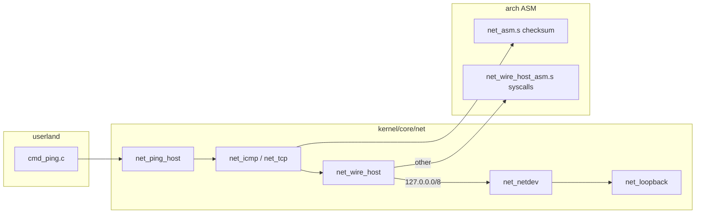

# P3 networking (PRE 4.2.0)

Normative contracts live under **`contracts/networking/`** (umbrella **`contract_networking.h`**). This document describes the **implementation** in **`kernel/core/net/`**, how it maps to roadmap rows **P3-1 … P3-12**, and how **architecture-specific ASM** backs hosted wire I/O and checksum hot paths.

## Goals

- **In-tree** IPv4 framing, ICMP echo, TCP SYN probe, minimal DNS A-record lookup, and **software loopback** (P3-2) without calling `/bin/ping` or `getaddrinfo`.
- **Hosted edge only:** Linux **socket syscalls** (and optional **TAP**) are the OS boundary; probes build and parse packets in C.
- **Shell:** `ping` and `check requirements` for CI and lab validation (`scripts/check_network_requirements.sh`).

## Layer map

| Module | Roadmap | Role |
|--------|---------|------|
| **`net_wire.c`** | Wire vocabulary | Ethernet+IPv4 frame build/parse, MTU, `fl_net_frame_view_t` / `fl_net_frame_mut_t` |
| **`net_eth.c`** | L2 helpers | Aliases/constants over wire |
| **`net_ipv4.c`** | P3-5 (partial) | IPv4 header build, literal/loopback address helpers |
| **`net_checksum.c`** | P3-5 | Internet checksum; **`asm_net_checksum16`** when `FL_NET_ASM_AVAILABLE` |
| **`net_icmp.c`** | P3-5 | ICMP echo request/reply exchange |
| **`net_tcp.c`** | P3-7 (probe only) | TCP SYN build + SYN probe via wire host |
| **`net_dns.c`** | P3-8 (minimal) | DNS-over-UDP A query via `/etc/resolv.conf` |
| **`net_loopback.c`** | P3-2 | In-memory netdev: ICMP echo reply, TCP RST+ACK on SYN |
| **`net_netdev.c`** | P3-1 | Driver registry, send/recv, timeouts, P2-3 authz hook |
| **`net_tap.c`** | P3-3 | Linux TAP (`IFF_TAP \| IFF_NO_PI`), `SKIP_TAP=1` |
| **`net_wire_host.c`** | Hosted shim | Off-loopback ICMP/UDP via ASM syscalls; loopback via netdev |
| **`net_wire_host_syscall.c`** | Hosted shim | C errno bridge to **`net_host_*_asm`** |
| **`net_ping_host.c`** | Shell API | `fl_net_ping` / format helpers |
| **`net_requirements.c`** | CI | `fl_net_probe_endpoint`, `SKIP_NETWORK_INTEROP` |

## Data path (ping)



1. **`fl_net_resolve_ipv4`** (`net_dns.c`) — literal, `localhost`, or DNS UDP to nameserver.
2. **ICMP** (`port == 0`): **`fl_net_icmp_echo_exchange`** → **`fl_net_wire_send_icmp`**.
3. **TCP** (`port > 0`): **`fl_net_tcp_syn_probe`** builds SYN with explicit **`sport`** → **`fl_net_wire_send_tcp_syn`** validates header ports match.
4. **Loopback:** full **Ethernet+IPv4** frame through **`fl_net_netdev_loopback()`** (P3-2).
5. **Off-loopback:** ICMP/UDP use **`net_host_socket` / `sendto` / `recvfrom`** (ASM on Linux x86_64 and AArch64). TCP raw probe still uses libc **`socket`/`select`** for `SOCK_RAW` (documented gap).

## Source port (`sport`)

- **UDP** (`fl_net_wire_send_udp`): when **`sport != 0`**, the hosted path **`bind(2)`**s the datagram socket to **`INADDR_ANY:sport`** before **`sendto`**. DNS uses **`sport = 40053`** toward port 53.
- **TCP SYN:** **`sport`** is encoded in the SYN segment by **`fl_net_tcp_build_syn`**; **`fl_net_wire_send_tcp_syn`** rejects a mismatch between the argument and **`tcp[0..1]`** (no silent ignore).
- There is **no** `(void)sport_unused` discard: unused parameters were removed in favor of real bind/validation.

## Architecture-specific ASM

| Symbol | x86_64 GAS | x86_64 NASM | AArch64 GAS |
|--------|------------|-------------|-------------|
| **`asm_net_checksum16`** | `arch/x86_64/gas/net_asm.s` | `arch/x86_64/nasm/net_asm.asm` | `arch/arm/gas/net_asm.s` |
| **`asm_net_htons_be16`** | same | same | same |
| **`asm_net_tcp_build_syn`** | same | same | same |
| **`asm_net_tcp_build_rst_ack`** | same | same | same |
| **`asm_net_tcp_read_ports_be`** | same | same | same |
| **`asm_net_icmp_echo_request_build`** | same | same | same |
| **`asm_net_icmp_echo_reply_match`** | same | same | same |
| **`asm_net_pseudo_header_fill12`** | same | same | same |
| **`asm_net_pseudo_checksum_tcpudp`** | same | same | same |
| **`asm_net_dns_query_header_prefix`** | same | same | same |
| **`net_host_socket_asm`** | `arch/x86_64/gas/net_wire_host_asm.s` | `arch/x86_64/nasm/net_wire_host_asm.asm` | `arch/arm/gas/net_wire_host_asm.s` |
| **`net_host_bind_asm`** | same | same | same |
| **`net_host_sendto_asm`** | same | same | same |
| **`net_host_recvfrom_asm`** | same | same | same |
| **`net_host_close_asm`** | same | same | same |
| **`net_host_setsockopt_asm`** | same | same | same |

Headers: **`kernel/include/fl/net_asm.h`** → arch **`net_asm.h`**.

Build: **`FL_NET_ASM_AVAILABLE=1`** (with **`FL_STACK_ASM_AVAILABLE`**) and **`NET_ASM_OBJ`** linked into the shell and **`make test_p3_network`**. Pattern matches **`disk_host_io.c`** / **`disk_host_pread64_asm`**.

## P3-x status on this branch

| Row | Contract | Implementation on branch |
|-----|----------|---------------------------|
| **P3-1** | ✅ | `net_netdev.c`, authz hook in `sh.c` |
| **P3-2** | ✅ | `net_loopback.c` frame path + RX queue |
| **P3-3** | ✅ | `net_tap.c` (CI often skips without `CAP_NET_ADMIN`) |
| **P3-4** ARP | ✅ contract | ❌ not implemented |
| **P3-5** IPv4 | ✅ contract | ⚠️ build/parse/checksum; no full routing |
| **P3-6** UDP | ✅ contract | ⚠️ DNS + wire host datagrams only |
| **P3-7** TCP | ✅ contract | ⚠️ SYN probe only |
| **P3-8** DNS | ✅ contract | ⚠️ A record, single nameserver |
| **P3-12** DHCP | ✅ contract | ❌ not implemented |

## Shell commands

```text
ping <host> [port] [-c count] [-W timeout_ms]
check requirements <host> <port>
```

- **`port` omitted or 0** — ICMP echo (loopback via netdev; off-loopback ICMP socket).
- **`port` 1–65535** — TCP SYN probe (loopback RST+ACK; off-loopback raw TCP).

Environment:

| Variable | Meaning |
|----------|---------|
| **`SKIP_NETWORK_INTEROP=1`** | Skip live probes (P0 CI) |
| **`SKIP_TAP=1`** | Do not open TAP |
| **`P3_PROBE_HOST` / `P3_PROBE_PORT`** | CI targets (`scripts/check_network_requirements.sh`) |

## Tests

```bash
make test_p3_network
make check-network-requirements
```

## Related docs

- **`contracts/networking/README.txt`** — contract shards vs P2
- **`docs/ROADMAP.md`** — P3 rows and phase gates
- **`kernel/core/net/README.md`** — file index and include graph
- **`AGENTS.md`** — build/test and versioning for this PR

## Future work

- **P3-4** ARP + **P3-5** routing table for off-loopback without raw sockets
- **P3-7** full TCP state machine; move raw-TCP **`select`** path to ASM or netdev TX
- **P3-12** DHCP for hosted labs
- Bare-metal NIC driver feeding **`fl_net_driver_t`** instead of TAP/socket shim
