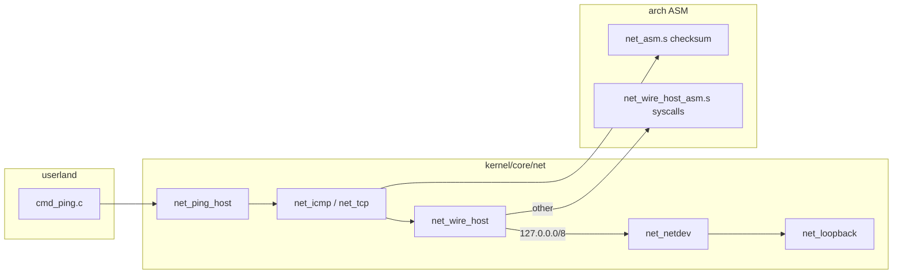

# P3 networking (PRE 4.2.0)

Normative contracts live under **`contracts/networking/`** (umbrella **`contract_networking.h`**). This document describes the **implementation** in **`kernel/core/net/`**, how it maps to roadmap rows **P3-1 … P3-13**, and how **architecture-specific ASM** backs hosted wire I/O and checksum hot paths.

## Goals

- **In-tree** IPv4 framing, ICMP echo, TCP SYN probe, minimal DNS A-record lookup, and **software loopback** (P3-2) without calling `/bin/ping` or `getaddrinfo`.
- **IPv6 foundation (P3-11):** **`net_ipv6`**, **`net_icmpv6`**, **`net_ndp`**, loopback **`FL_ETHERTYPE_IPV6`** dispatch, IPv6 FIB, and **`fl_net_dns_resolve_aaaa`** stub — see **#280** / PR **#301**; TAP/wire egress and production TCPv6 remain epic tail.
- **Hosted edge only:** Linux **socket syscalls** (and optional **TAP**) are the OS boundary; probes build and parse packets in C.
- **Shell:** `ping` and `check requirements` for CI and lab validation (`scripts/check_network_requirements.sh`).
- **End state (P3-13):** multi-user **chat room** via shell **`server`** — implementation plan: **[`docs/P3_13_CHAT_SERVER.md`](P3_13_CHAT_SERVER.md)** (wire protocol, hub topology, module layout, phased tests). Tracked in **#239**; prerequisites in **#238**.

## P3-13 — chat room (summary)

| Item | Detail |
|------|--------|
| **Product** | `server host/join <ip:port>`, `server msg`, `server leave`, `server kill` (host-only) |
| **Topology** | Star: host listens; members connect; host relays **`MSG`** |
| **Transport** | TCP (**RFC 793**) after **P3-7**; framing + opcodes in **`P3_13_CHAT_SERVER.md`** §4 |
| **Shell** | Background **pthread** recv loop + inbound ring (see plan §7) |
| **Build order** | P3-6 → P3-7 → socket shim → `net_server.c` → `cmd_server.c` |

Full spec: **[`docs/P3_13_CHAT_SERVER.md`](P3_13_CHAT_SERVER.md)**.

## Layer map

| Module | Roadmap | Role |
|--------|---------|------|
| **`net_wire.c`** | Wire vocabulary | Ethernet+IPv4 frame build/parse, MTU, `fl_net_frame_view_t` / `fl_net_frame_mut_t` |
| **`net_packet.c`** | Packet backbone | Layered **L2 / IPv4 / L4** slices (`fl_net_packet_t`), RX/TX pipeline stages (**`contract_p3_packet.h`**) |
| **`net_eth.c`** | L2 helpers | Aliases/constants over wire |
| **`net_arp.c`** | P3-4 | ARP request/reply, bounded cache, **`fl_net_arp_tick`**, gratuitous ARP |
| **`net_baremetal.c`** | P3-1 / **#241** | **`DRIVERS_BAREMETAL`** lab **802.3** driver (RX ring, ARP/ICMP on wire) |
| **`net_route.c`** | P3-5 / P3-11 | LPM table (IPv4 + **`fl_net_route_add6`** / **`fl_net_route_lookup6`**); **`fl_net_route_configure_static`**; TAP via **FL_NET_TAP_*** (Linux) |
| **`net_wire_egress.c`** | P3-5 / P3-6 | IPv4 L4 egress (ARP + netdev); **`fl_net_wire_egress_l4_pkt`** / **`l4_xmit_pkt`** |
| **`net_udp.c`** | P3-6 (partial) | **`fl_net_udp_build_datagram`** for task-backend socket egress |
| **`net_dhcp.c`** | P3-12 (lab) | BOOTP codec; **`fl_net_packet_bind_l4`** / **`fl_net_dhcp_*_pkt`** over L4 slices |
| **`net_background.c`** | P3-14 / distribution | Workqueue tick; blended socket + ARP task backend (P3-13 wire RX TODO) |
| **`net_ipv4.c`** | P3-5 (partial) | IPv4 header build, literal/loopback address helpers |
| **`net_ipv6.c`** | P3-11 | IPv6 header build/parse, loopback/link-local helpers |
| **`net_icmpv6.c`** | P3-11 | ICMPv6 echo on software loopback |
| **`net_ndp.c`** | P3-11 | NDP NS/NA + neighbor cache (loopback) |
| **`net_checksum.c`** | P3-5 | Internet checksum; **`asm_net_checksum16`** when `FL_NET_ASM_AVAILABLE` |
| **`net_icmp.c`** | P3-5 | ICMP echo request/reply exchange |
| **`net_tcp.c`** | P3-7 (probe only) | **`fl_net_tcp_build_syn_pkt`** + SYN probe; hosted **`fl_net_tcp_stream_*`** |
| **`net_dns.c`** | P3-8 (minimal) | DNS-over-UDP **A** + **`fl_net_dns_resolve_aaaa`** (localhost stub + UDP AAAA) via `/etc/resolv.conf` |
| **`net_loopback.c`** | P3-2 | In-memory netdev: ICMP echo reply, TCP RST+ACK on SYN |
| **`net_netdev.c`** | P3-1 | Driver registry, send/recv, timeouts, P2-3 authz hook |
| **`net_tap.c`** | P3-3 | Linux TAP (`IFF_TAP \| IFF_NO_PI`), `SKIP_TAP=1` |
| **`net_wire_host.c`** | Hosted edge | **`fl_net_wire_send_icmp_pkt`** / **`send_udp_pkt`**; off-loopback syscalls; loopback via netdev |
| **`net_wire_host_syscall.c`** | Hosted shim | C errno bridge to **`net_host_*_asm`** |
| **`net_ping_host.c`** | Shell API | `fl_net_ping` / format helpers |
| **`net_requirements.c`** | CI | `fl_net_probe_endpoint`, `SKIP_NETWORK_INTEROP` |

## Packet structuring (cross-cutting)

Packets are the shared backbone for **P3-4** … **P3-12** — not a separate roadmap row. Normative types live in **`contracts/networking/contract_p3_packet.h`** (included from **`contract_networking.h`**):

| Type | Role |
|------|------|
| **`fl_net_pkt_slice_t`** | Non-owning **off** + **len** inside a frame buffer |
| **`fl_net_packet_t`** | Parsed **Ethernet + IPv4** view with optional **l4** slice and **valid** layer bits |
| **`fl_net_pipeline_rx_t`** | RX stages: **DRV_RX → PARSE_L2 → PARSE_L3 → PARSE_L4 → ROUTE → DELIVER** |
| **`fl_net_pipeline_tx_t`** | TX stages: **BUILD_L4 → BUILD_IPV4 → BUILD_L2 → ROUTE → ARP → DRV_TX** |

**Implementation:** **`fl_net_packet_parse_eth_ipv4`**, **`fl_net_packet_bind_l4`**, **`fl_net_packet_l4_view`**, **`fl_net_packet_copy_l4`**, **`fl_net_pipeline_rx_feed`** in **`net_packet.c`**. **`net_wire_egress.c`** uses the parser for ICMP echo reply extraction. **`net_dhcp.c`** binds BOOTP as L4-only packets before hosted UDP send; **`net_background.c`** relays via **`fl_net_packet_copy_l4`**.

## Blended ARP + socket model (task backend)

Logical channels use the **socket four-tuple** from **`contract_p3_socket.h`**:

\[
\text{Socket}(A,B) = (IP_A, Port_A, IP_B, Port_B)
\]

(all multi-byte fields in **network byte order** in **`fl_net_socket_endpoint_t`**).

**Send path** (implemented today for UDP datagrams):

\[
\text{App Data} \rightarrow \text{Socket} \rightarrow \text{UDP} \rightarrow \text{IPv4} \rightarrow \operatorname{ARP}(IP_B) \rightarrow \text{Ethernet} \rightarrow \text{NIC}
\]

| Module | Role |
|--------|------|
| **`net_udp.c`** | **`fl_net_udp_build_datagram`** — UDP header + payload (host-order ports at API) |
| **`net_wire_egress.c`** | **`fl_net_wire_egress_l4_xmit`** — route → ARP → IPv4/Ethernet TX (no reply wait) |
| **`net_background.c`** | Task backend hub: **`fl_net_task_backend_socket_send`**, **`peer_bind`**, **`hub_bind`**, **`server_relay_to_clients`** |

**Client → server → other clients** (relay model; full **P3-13** TCP/socket shim TODO):

\[
C_1 \xrightarrow{\text{Socket}(C_1,S)} S \xrightarrow{\text{Socket}(S,C_2)} C_2
\]

- **Same-host:** inbox fan-out via **`fl_net_task_backend_send_packet`**.
- **Wire:** when **`hub_bind`** and per-client **`peer_bind`** are set, the server relay builds **Socket(hub, Cᵢ)** and calls **`fl_net_wire_egress_l4_xmit`** (ARP per destination IP).
- **`fl_net_background_tick`** does **not** recv from the shared loopback netdev queue (ICMP/TCP probes use that queue via **`net_wire_egress`**).

## Data path (ping)



1. **`fl_net_resolve_ipv4`** (`net_dns.c`) — literal, `localhost`, or DNS UDP to nameserver.
2. **ICMP** (`port == 0`): **`fl_net_icmp_echo_exchange`** → **`fl_net_wire_send_icmp`**.
3. **TCP** (`port > 0`): **`fl_net_tcp_syn_probe`** builds SYN with explicit **`sport`** → **`fl_net_wire_send_tcp_syn`** validates header ports match.
4. **Loopback:** full **Ethernet+IPv4** frame through **`fl_net_netdev_loopback()`** (P3-2).
5. **Off-loopback:** ICMP/UDP use **`net_host_socket` / `sendto` / `recvfrom`** (ASM on Linux x86_64 and AArch64). TCP raw probe still uses libc **`socket`/`select`** for `SOCK_RAW` (documented gap).

## Endian / packet / MLQ framework (internal-only path)

The networking stack uses a layered, in-tree byte-order path so packets and
their headers can be framed and dispatched without leaning on libc or the
hosted shim. This is the path the `udpsend` / `udplisten` / `server` /
distro-style verbs ride on for hot writes.

```text
       call site                  fl_net_htons / fl_net_htonl
       in shell verb              fl_net_ntohs / fl_net_ntohl     (net_endian.h)
       or test                                  |
                                                v
       inline header              FL_NET_ASM_AVAILABLE? --yes--> asm_net_htons_be16
       byte writes                                                asm_net_htonl_be32
       via fl_net_put_u16_be /                                    asm_net_ntohs_be16
       fl_net_put_u32_nbo                                         asm_net_ntohl_be32
       (memcpy-clean on every                                    (single `bswap` / `rev`)
       host endianness)                       --no--> portable bit-shift fallback

       v
       net_packet.c               fl_net_packet_parse_eth_ipv4 / _bind_l4 / _l4_view
       (P3 layered slices)        fl_net_pipeline_rx_feed / fl_net_pipeline_tx_*

       v
       net_background.c           Workqueue / MLQ (priority_queue.h, PQ_NUM_PRIORITIES=4)
       (P3-14 task hub)           drains the bound socket + ARP tasks in priority order
                                  (`fl_net_arp_tick` already runs here; future RX dequeue
                                  / TCP timer wheel ride the same MLQ — see #238).
```

**Why this matters:**

- The endian helpers are the **first-class internal architecture import**.
  They never delegate to libc. ASM is the preferred backend; pure bit-shift
  is the K/B / cross-arch fallback. See `kernel/core/net/net_endian.h`.
- The packet module (`net_packet.c`) and wire builders (`net_wire*.c`)
  build every frame through `fl_net_put_u16_be` / `fl_net_put_u32_nbo`
  (memcpy-clean, host-endian independent) plus `fl_net_htons` / `fl_net_htonl`
  for inline header field writes. There is no open-coded `htons(3)` /
  `htonl(3)` left in the application path.
- The **net MLQ** in `priority_queue.h` (scheduler-grade, `PQ_NUM_PRIORITIES = 4`,
  `O(1)` push/pop, bitmap layer select) is the dispatch fabric for the
  P3-14 background hub (`net_background.c`). Anything the packet module
  emits for "framed for send" or "ready for RX dispatch" can land on that
  queue via the existing workqueue surface; the endian helpers are safe to
  call from any layer (signal-handler-safe / hardirq-safe / pure functions
  with no globals).

## Source port (`sport`)

- **UDP** (`fl_net_wire_send_udp`): when **`sport != 0`**, the hosted path **`bind(2)`**s the datagram socket to **`INADDR_ANY:sport`** before **`sendto`**. DNS uses **`sport = 40053`** toward port 53.
- **TCP SYN:** **`sport`** is encoded in the SYN segment by **`fl_net_tcp_build_syn`**; **`fl_net_wire_send_tcp_syn`** rejects a mismatch between the argument and **`tcp[0..1]`** (no silent ignore).
- There is **no** `(void)sport_unused` discard: unused parameters were removed in favor of real bind/validation.

## Architecture-specific ASM

| Symbol | x86_64 GAS | x86_64 NASM | AArch64 GAS |
|--------|------------|-------------|-------------|
| **`asm_net_checksum16`** | `arch/x86_64/gas/net_asm.s` | `arch/x86_64/nasm/net_asm.asm` | `arch/arm/gas/net_asm.s` |
| **`asm_net_htons_be16`** | same | same | same |
| **`asm_net_ntohs_be16`** | same | same | same |
| **`asm_net_htonl_be32`** | same | same | same |
| **`asm_net_ntohl_be32`** | same | same | same |
| **`asm_net_htonll_be64`** | same | same | same |
| **`asm_net_ntohll_be64`** | same | same | same |
| **`asm_net_tcp_build_syn`** | same | same | same |
| **`asm_net_tcp_build_rst_ack`** | same | same | same |
| **`asm_net_tcp_read_ports_be`** | same | same | same |
| **`asm_net_icmp_echo_request_build`** | same | same | same |
| **`asm_net_icmp_echo_reply_match`** | same | same | same |
| **`asm_net_pseudo_header_fill12`** | same | same | same |
| **`asm_net_pseudo_checksum_tcpudp`** | same | same | same |
| **`asm_net_dns_query_header_prefix`** | same | same | same |
| **`asm_net_arp_cache_clear`** | same | same | same |
| **`asm_net_arp_cache_lookup`** | same | same | same |
| **`asm_net_arp_cache_insert`** | same | same | same |
| **`asm_net_arp_cache_evict_oldest`** | same | same | same |
| **`net_host_socket_asm`** | `arch/x86_64/gas/net_wire_host_asm.s` | `arch/x86_64/nasm/net_wire_host_asm.asm` | `arch/arm/gas/net_wire_host_asm.s` |
| **`net_host_bind_asm`** | same | same | same |
| **`net_host_sendto_asm`** | same | same | same |
| **`net_host_recvfrom_asm`** | same | same | same |
| **`net_host_close_asm`** | same | same | same |
| **`net_host_setsockopt_asm`** | same | same | same |

Headers: **`kernel/include/fl/net_asm.h`** → arch **`net_asm.h`**.

Build: **`FL_NET_ASM_AVAILABLE=1`** (with **`FL_STACK_ASM_AVAILABLE`**) and **`NET_ASM_OBJ`** linked into the shell and **`make test_p3_network`**. Pattern matches **`disk_host_io.c`** / **`disk_host_pread64_asm`**.

## P3-x status on this branch

Legend matches **`docs/ROADMAP.md`**: **✅** complete; **~✅** usable lab subset; **⚠️** in progress; **❌** not started.

| Row | Contract | Integration |
|-----|----------|-------------|
| **P3-1** | ✅ | ~✅ — `net_netdev.c`, authz hook in `sh.c` |
| **P3-2** | ✅ | ~✅ — `net_loopback.c` frame path + RX queue |
| **P3-3** | ✅ | ~✅ — `net_tap.c` (CI often skips without `CAP_NET_ADMIN`) |
| **P3-4** ARP | ✅ | ✅ — cache + exchange; **`fl_net_arp_tick`** (hosted workqueue + bare-metal PIT BH); gratuitous ARP |
| **P3-5** IPv4 | ✅ | ~✅ — LPM + **`fl_net_route_configure_static`**; lab route without **FL_NET_TAP_*** on **B**; Linux ICMP fallback when unrouted |
| **P3-6** UDP | ✅ | ~✅ — DNS + wire host datagrams only |
| **P3-7** TCP | ✅ | ~✅ — SYN probe + **`fl_net_tcp_stream_*`** hosted listen/connect/accept |
| **P3-8** DNS | ✅ | ~✅ — A record + **AAAA** stub (`fl_net_dns_resolve_aaaa`) |
| **P3-11** IPv6 + ICMPv6 | ✅ | ~✅ — loopback ICMPv6/NDP, IPv6 FIB, ethertype dispatch; TAP/wire IPv6 stretch (**#280**) |
| **P3-10** Wi‑Fi station | ✅ | ~✅ — **`contract_p3_wifi.h`**, **`net_wifi_he`**, hosted lab scan/connect (**#279** PR #306); shell **`wifi`** + **`wifi_router`** DB; **`fl_net_wifi_station_netdev()`** NULL; SAE/WPA/TWT/mgmt + P4 NIC block production — **`docs/GITHUB_ISSUE_SYNC_279.md`** |
| **P3-9** TLS | ✅ | ~✅ — **`net_tls_hosted.c`** record-size boundary (no mbedtls yet) |
| **P3-12** DHCP | ✅ | ~✅ — BOOTP codec + **`fl_net_dhcp_*_pkt`** over **`fl_net_packet_t`** |
| **P3-14** background | ✅ | ~✅ — **`fl_net_arp_tick`** on workqueue; TCP timer wheel / RX dequeue still **#238** |
| **P3-13** `server` + messaging | ✅ | ~✅ — `server host/join/msg/announce/nick/connected/leave/kill` shipped (PR #282); `udpsend` / `udplisten` (#239); **#283** PROMOTE6 + `host_addr` callback; **#280** IPv6 loopback/NDP foundation (PR #301); **#279** Wi‑Fi **~✅** foundation (PR #306); native `fl_socket` waits on **P3-7** TCP state machine. **`docs/P3_13_FOLLOWUP.md`** |

## Standards map (integration targets)

| Layer / feature | Normative references | PRE 4.2.0 status |
|-----------------|----------------------|------------------|
| Ethernet L2 | **IEEE 802.3**; IPv4 over Ethernet **RFC 894** | ✅ TAP + loopback + **B** lab **`net_baremetal.c`** |
| ARP (**P3-4**) | **RFC 826** | ✅ cache, exchange, **`fl_net_arp_tick`**, gratuitous ARP |
| IPv4 / ICMP (**P3-5**) | **RFC 791**, **RFC 792** | ~✅ routing + netdev ICMP |
| IPv6 / ICMPv6 / NDP (**P3-11**) | **RFC 8200**, **RFC 4443**, **RFC 4861** | ~✅ loopback foundation (**`net_ipv6`**, **`net_icmpv6`**, **`net_ndp`**); TAP/production path **#280** tail |
| UDP (**P3-6**) | **RFC 768** | ~✅ DNS + hosted datagram shim |
| TCP (**P3-7**) | **RFC 793** | ~✅ SYN probe + hosted stream shim (in-tree FSM TODO) |
| DNS (**P3-8**) | **RFC 1035** (subset) | ~✅ A record |
| DHCP (**P3-12**) | **RFC 2131**, **RFC 2132** | ~✅ codec + lab client (not production lease manager) |
| Wi‑Fi station (**P3-10**) | **IEEE 802.11ax-2021**; **802.11i**; **WPA3-SAE** (RFC 7664) | ~✅ contract + HE IE parser + hosted lab scan/connect (**#279**); production assoc/DHCP blocked on P4 NIC + SAE/WPA wire |
| `server` + messaging (**P3-13**) | **RFC 793** (TCP session); **RFC 768** (UDP helpers) | ~✅ — hosted-socket implementation (PR #282 + #239); native non-hosted path queued behind **P3-7** TCP state machine |

## Application-layer and common Internet protocols

Inventory of **named protocols** (and closely related APIs) versus what this tree implements today. Transport and below are included for context; module mapping is in [Layer map](#layer-map) and [Standards map](#standards-map-integration-targets).

| Protocol / product API | Ports (typical) | Normative refs | In repo today | Where / notes |
|------------------------|-----------------|----------------|---------------|---------------|
| **ICMP echo** (ping) | — (IP proto 1) | **RFC 792** | ~✅ | **`net_icmp.c`**, **`fl_net_ping`**, shell **`ping`** (port 0) |
| **UDP** | 1–65535 | **RFC 768** | ~✅ | **`net_udp.c`**, **`fl_net_wire_send_udp_pkt`**; not a general datagram API for apps yet |
| **TCP** | 1–65535 | **RFC 793** | ~✅ | **`net_tcp_fsm.c`** loopback FSM + **`net_tcp.c`** / **`fl_net_tcp_stream_*`** |
| **TLS** | 443 (HTTPS) | **RFC 8446** (TLS 1.3); **RFC 5246** (TLS 1.2) | ~✅ | **`net_tls_hosted.c`** — record cap + optional OpenSSL client bridge (**#252**) |
| **DNS** | 53/udp | **RFC 1035** (subset) | ~✅ | **`net_dns.c`** — multi-NS **`/etc/resolv.conf`**, retries, **A** + **AAAA** stub (**#251**, **#280**) |
| **DHCP** (IPv4) | 67/68/udp | **RFC 2131**, **RFC 2132** | ~✅ | **`net_dhcp.c`** — codec + **`fl_net_dhcp_acquire`** (**#247**); renew/rebind FSM future |
| **HTTP** | 80/tcp | **RFC 9110**, **RFC 9112** | ~✅ (subset) | **`net_http.c`** — HTTP/1.0 GET + status parse (**#259** / **PX-11**) |
| **HTTPS** | 443/tcp | **RFC 9110** + **RFC 8446** | ❌ | Same as HTTP over **P3-9** TLS on hosted builds; **HTTP(S) boot** (**PX-12**) reuses **P3-7**/**P3-9** |
| **SMTP** | 25, 587/tcp | **RFC 5321** | ❌ | Not planned in **P3**; no module |
| **IMAP** | 143, 993/tcp | **RFC 3501** | ❌ | Not planned in **P3**; no module |
| **FTP** | 20–21/tcp | **RFC 959** | ❌ | Not used; file sharing uses **custom TCP framing** (**`docs/SERVER.md`**, **`contract_p3_session_wire.h`**, **P5** file delivery), not FTP |
| **SFTP** | 22/tcp (SSH) | **RFC 4253** / draft SFTP | ❌ | Not implemented; same **server** file path as FTP row |
| **TFTP** | 69/udp | **RFC 1350** | ~✅ (subset) | **`net_tftp.c`** — RRQ build + client read over egress UDP (**#260** / **PX-12**) |
| **Flinstone `server`** (chat + files) | user **`ip:port`** | **RFC 793** transport; app opcodes in **`contract_p3_session_wire.h`** | ~✅ (chat); ⏳ (files) | Hosted-socket implementation shipped on PR **#282** / **#239**: `server host/join/msg/announce/nick/set-nick/connected/leave/kill`, host transfer + auto-reconnect, prompt-aware async output; `udpsend` / `udplisten` and `arp` / `ifconfig` / `route` / `netstat` / `nslookup` / `netsh` distro-style verbs landed alongside. File-chunk path (`server send -file` via `FILE_OFFER`/`FILE_CHUNK`/`FILE_DONE`) is the remaining follow-up. Product spec **`docs/SERVER.md`**, plan **`docs/P3_13_CHAT_SERVER.md`**, per-item review status **`docs/P3_13_FOLLOWUP.md`**. |

**Clarifications**

- **“Implemented”** here means **in-tree or hosted-shim code in `kernel/core/net/`** (or shell **`ping`** / **`check requirements`**), not every POSIX **`curl`**, **`sendmail`**, or **`ftp`** binary on the host OS.
- **HTTPS** is **not** a separate stack layer in this repo: it is **HTTP over TLS**, with TLS intended to stay in **userland** libraries on **H** per **`contract_p3_tls_hosted.h`**.
- **Mail (SMTP/IMAP)** and **FTP/SFTP** are **out of scope** for the current **PRE 4.2.0** network prep train; document them here so expectations stay aligned with **`docs/ROADMAP.md`** and **`docs/SERVER.md`**.

## Bare-metal lab bring-up (**DRIVERS_BAREMETAL**, **#237** / **#241**)

PRE **4.2.0** ships an in-tree **lab** path (not production virtio/MMIO — that stays **P4**-class):

| Step | API / module |
|------|----------------|
| Init | **`fl_net_baremetal_init()`** — lab **`fl_net_driver_t`**, MAC **`02:11:22:33:44:55`**, IPv4 **`10.0.2.15/24`**, GW **`10.0.2.2`** |
| Route | **`fl_net_route_configure_static`** — no **`FL_NET_TAP_*`** env on **B** |
| Neighbor | **`fl_net_arp_send_gratuitous`** on bring-up; **`fl_net_arp_tick`** from PIT IRQ0 bottom-half (~100 Hz) |
| Frames | **`lab_driver_send` / `recv`** — **802.3**-style RX ring; ARP + ICMP echo for lab addresses |
| Loopback | **`fl_net_loopback_exchange`** — shared egress/host path (**#237** gap 4) |
| Shutdown | **`fl_net_baremetal_shutdown()`** via **`fl_net_netdev_shutdown()`** |

**Build:** **`make baremetal`** links the lab driver; **`make test_p3_network`** covers ARP tick eviction and static routes on the hosted test binary.

**Still open:** production NIC (**virtio** / board MMIO), full **RFC 793** TCP FSM, general UDP demux for apps — **#238** / **P4** / **#239**.

## Shell commands

```text
ping <host> [port] [-c count] [-W timeout_ms]
ping6 <host> [-c count] [-W timeout_ms]
check requirements <host> <port>
wifi scan [-band any|2|5|6]
wifi join [-b <bssid>] <ssid> [password]
wifi leave
wifi status
wifi known
```

- **`port` omitted or 0** — ICMP echo (loopback via netdev; off-loopback ICMP socket).
- **`port` 1–65535** — TCP SYN probe (loopback RST+ACK; off-loopback raw TCP).

### Wi‑Fi (`wifi`) — P3-10

Shell verbs live in **`userland/command/cmd_wifi.c`**. Saved router profiles use SQLite **`wifi_router`** in **`fl_wifi.db`** (**`net_wifi_db.c`**); passphrases are stored hashed, not plaintext.

| Command | Purpose |
|---------|---------|
| **`wifi scan [-band any\|2\|5\|6]`** | Scan for APs. On **Linux**, uses **`wpa_cli`** when its control socket answers, else **NetworkManager `nmcli`**. Without a host backend, falls back to the in-tree **lab** list (`LabAxHome`, `GuestOpen`) and prints a stderr warning. |
| **`wifi join [-b <bssid>] <ssid> [password]`** | Associate with an SSID from the last scan. **`-b`** pins a BSSID when several APs share a name. After join on Linux, copies router **DHCP IPv4** (prefers RFC1918) and **SLAAC/DHCPv6** global IPv6 into the shell netdev/FIB when available. |
| **`wifi leave`** | Disconnect and remove WLAN IPv4/IPv6 from the in-tree iface/route view; clears joined flags in **`fl_wifi.db`**. |
| **`wifi status`** | Prints FSM state, active backend (`wpa_cli`, `nmcli`, or lab), interface name, and assigned IPv4/IPv6 when up. |
| **`wifi known`** | List saved profiles (BSSID, band, auth, joined flag, last-join time). |

**Linux host backend** (real hardware scan/join):

| Variable | Default | Meaning |
|----------|---------|---------|
| **`FL_NET_WIFI_IFACE`** | auto-detect | Wireless netdev (`wlan0`, `wlp2s0`, …). Probed via **`nmcli`**, **`/proc/net/wireless`**, then **`wlan0`**. |
| **`FL_NET_WIFI_WPA_CLI`** | `wpa_cli` | Path to **`wpa_cli`** when **`wpa_supplicant`** owns the interface. |
| **`FL_NET_WIFI_NMCLI`** | `nmcli` | Path to **`nmcli`** when NetworkManager manages Wi‑Fi. |
| **`FL_NET_WIFI_USE_WPA`** | unset | **`1`** — force **`wpa_cli`** only; **`0`** — force in-tree lab simulation; unset — try **`wpa_cli`**, then **`nmcli`**. |
| **`FL_WIFI_DB_PATH`** | see below | Override SQLite profile DB location. |

**Profile database:** tries **`FL_WIFI_DB_PATH`**, then repo-relative **`userland/shell/fl_wifi.db`**, then **`~/.local/share/BPForbes_Flinstone_Shell/fl_wifi.db`**, then **`/tmp/fl_wifi.db`**.

**Prerequisites (Linux, real scan):** install **`network-manager`** and/or **`wpasupplicant`** so **`nmcli`** or **`wpa_cli`** is on **`PATH`**. Requires **`FL_AUTHZ_OP_NETDEV_IO`** (shell grants this on hosted builds). **macOS/Windows** and container/CI environments without a Wi‑Fi netdev always use the lab list.

**Examples:**

```text
wifi scan
wifi scan -band 5
wifi join "Hilton Honors" my-passphrase
wifi join -b aa:bb:cc:dd:ee:ff "Hilton Honors"
wifi status
wifi leave
wifi known
```

Environment (general networking):

| Variable | Meaning |
|----------|---------|
| **`SKIP_NETWORK_INTEROP=1`** | Skip live probes (P0 CI) |
| **`SKIP_TAP=1`** | Do not open TAP |
| **`P3_PROBE_HOST` / `P3_PROBE_PORT`** | CI targets (`scripts/check_network_requirements.sh`) |

## Tests

```bash
make test_p3_network
make test_p3_wifi test_wifi_db
make check-network-requirements
```

## Related docs

- **[Application-layer and common Internet protocols](#application-layer-and-common-internet-protocols)** — DNS, DHCP, HTTP/HTTPS, SMTP/IMAP, FTP/SFTP, TFTP, **`server`** status table
- **`docs/P3_13_CHAT_SERVER.md`** — **P3-13** chat room implementation plan (wire protocol, APIs, tests)
- **`contracts/networking/README.txt`** — contract shards vs P2
- **`docs/ROADMAP.md`** — P3 rows and phase gates
- **`docs/P3_NETWORKING_DEFERRED.md`** — P3-10 / P3-11 deferral vs **~✅** foundation (not “IPv4-only”)
- **`docs/GITHUB_ISSUE_SYNC_PR301.md`** — maintainer checklist for **#280** / **#283** issue bodies
- **`docs/GITHUB_ISSUE_SYNC_279.md`** — maintainer checklist for **#279** / **#257** P3-10 scope vs PR #306
- **`kernel/core/net/README.md`** — file index and include graph
- **`AGENTS.md`** — build/test and versioning for this PR

## Lab TAP addressing

| Variable | Default | Meaning |
|----------|---------|---------|
| **`FL_NET_TAP_IPV4`** | `10.0.2.15` | Host address on TAP |
| **`FL_NET_TAP_PREFIX`** | `24` | Prefix length |
| **`FL_NET_TAP_GW`** | `10.0.2.2` | Default gateway for off-subnet ARP |

## Future work

| Priority | Item | Notes |
|----------|------|--------|
| **P3-12** | DHCP renew/rebind FSM | Lease DB and renew/rebind after **`fl_net_dhcp_acquire`** |
| **P3-10** | Wi‑Fi 802.11ax station | **~✅** foundation (PR #306): contract, HE parser, lab scan/connect, **`wifi`** shell; tail: P4 NIC, SAE/WPA/TWT, netdev + DHCP composition |
| **P3-13** | Chat room | Foundations shipped (PR #282 + #239 `udpsend`/`udplisten`); **#283** PROMOTE6 foundation; **#280** IPv6 loopback/NDP foundation (PR #301); **#279** Wi‑Fi foundation; native non-hosted `fl_socket` gated on **P3-7** TCP state machine |
| ~~Patch~~ | ~~ARP cache TTL / loopback dedup~~ | Done (**#237**, **#240**): **`fl_net_arp_tick`**, **`fl_net_loopback_exchange`**, PIT BH on **B** |
| ~~P3-5~~ | ~~Drop Linux ICMP fallback~~ | Done (**#262**): egress-only ICMP/UDP when unrouted |
| **P3-7** | Production TCP timers | Loopback **RFC 793** FSM landed (**#238**); TAP retransmit/TIME_WAIT remain |
| **P4** | Production **802.3** / virtio NIC | Board/MMIO driver feeding **`fl_net_driver_t`** (beyond lab **`net_baremetal.c`**) |

**GitHub issues (umbrella):** PR **#275** closes **#238–#267** except **#239** (P3-13 **`server`**); tracker [`docs/GITHUB_ISSUES_238_267_TRACKER.md`](GITHUB_ISSUES_238_267_TRACKER.md).
