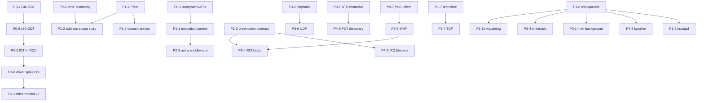

# Flinstone OS-Platform Roadmap

This document is the **single platform roadmap** for Flinstone: phased goals (**P0–P9**), **normative references**, **rough implementation** sketches (typically **H → K → B**), and **Appendix D** (bare-metal correctness checklist). It does **not** commit to calendar dates; phases are **dependency-ordered**. **Canonical work items** live in the **phase tables**; extended “credibility” notes (**§11–§12**) cover gaps not yet folded into a **P**-ID.

### Document map

| Section | Purpose |
|---------|---------|
| [Scope tiers](#scope-tiers-pick-one-primary-track-per-initiative) | **H / K / B** meaning |
| [Major (A) milestones](#major-a-release-milestones-illustrative) | How phases roll up to **major** releases (illustrative) |
| [Phase advancement gates](#phase-advancement-gates) | When it is reasonable to start the next phase block |
| [H → K → B graduation](#track-graduation-criteria-h-to-k-to-b) | What “proven” means before lifting a subsystem |
| [Phase dependency sketch](#phase-dependency-sketch-p0-to-p4) | Why **P0** and **Appendix D** front-load bare-metal correctness |
| [How work interlinks](#how-work-interlinks-examples-across-phases-and-a-releases) | Boot ↔ net ↔ firmware ↔ time ↔ SMP coupling |
| **Phase 0–9** | Feature IDs, goals, acceptance |
| [QEMU lab bring-up](qemu-lab.md) | Phase **8** external **QEMU** recipes (**`-M`**, virtio, TAP, **`-icount`**) |
| [Module contracts](#module-contracts-abstraction-and-p0-p9-coverage) | **Data-distribution contracts**: abstraction + **P0–P9** ❌/⚠️/✅ snapshot (see table). |
| [Background jobs](#background-jobs-kernel-workqueues) | **P1-8** framework + domain jobs (kswapd, writeback, kworker, net, RCU, watchdog). Detail: **`docs/BACKGROUND_JOBS.md`**. |
| [Platform credibility (extended)](#platform-credibility--extended-sections-11-and-12) | **§11–§12** + staffing note only |
| [Appendix A–D](#appendix-a--standards-map-non-exhaustive) | Standards index, DoD template, first vertical slice, bare-metal checklist |

**Scope tiers (pick one primary track per initiative):**

| Tier | Meaning |
|------|--------|
| **H** | **Hosted:** shell and subsystems run as a normal process on Linux (fastest path to real I/O). |
| **K** | **Kernel-shaped:** same abstractions, stricter boundaries; still may run hosted until a boot path exists. |
| **B** | **Bare metal / VM-first:** firmware-visible ownership, guest-visible devices, or true supervisor bring-up. |

Unless stated otherwise, **start at H**, prove APIs and tests, then **lift** the same contracts toward K/B.

**Global engineering standards (apply to every item below):**

1. **Layering:** hardware-facing code stays behind narrow driver ops; policy and orchestration stay in C; hot paths may use existing ASM patterns where the repo already does so.
2. **Determinism & failure modes:** every new subsystem defines **error codes**, **OOM behavior**, and **degraded operation** (what still works when a dependency fails).
3. **Tests:** each feature lands with a **focused automated test** (existing `make` test target or new one); hardware-only paths need **QEMU/tap/offline** shims for CI.
4. **Documentation:** public contract (headers + short `docs/` section) before wide refactors; **no silent behavior change** for shell builtins.
5. **Security default:** **deny-by-default** for new powers (raw I/O, promiscuous NIC, arbitrary mount); explicit capability or build flag to enable lab modes.
6. **Atomics & memory order:** prefer **ISO C11** `<stdatomic.h>` (**§7.17**) for new **lock-free** data structures in portable C. **Architecture barriers** (`DMB`/`DSB`/`ISB`, x86 fence intrinsics) live only under **`kernel/arch/**`** (or arch ASM), each with a **short comment** tying the barrier to the spec (e.g. ARM ARM / Intel SDM).
7. **Public API lifecycle:** once a **P0-1** subsystem header set is marked **frozen**, exported contracts are **append-only**. **Breaking** changes require a **new feature ID**, user-visible deprecation, and a **`version/entries/*.ver`** note before removal.
8. **Compiler hardening (CI / lab):** document optional flags alongside **P0-3** (matrix may vary): e.g. **`-fstack-protector-strong`**, **`-fsanitize=address,undefined`** on debug jobs where cost is acceptable, **`-fcf-protection=full`** (**Intel CET**, x86_64), **`-mbranch-protection=standard`** (**AArch64** PAC/BTI). Do not change default **B**/**release** presets silently—record in **`version/entries`**.

---

## Module contracts (abstraction and P0-P9 coverage)

This section is **normative for terminology** in this repo: what we mean by a **module contract**, how it differs from **functionality**, and a **snapshot** of how far **`develop`** has explicit **data-distribution** models for each **`P*-*` roadmap row**. For **P0-1** and **P0-2**, the snapshot also tracks the **normative C bundle** under **`contracts/foundations/`**; for **P1-1** … **P1-7**, it tracks the **P1 runtime bundle** under **`contracts/runtime/`**; for **P2-1** … **P2-4**, it tracks the **P2 identity bundle** under **`contracts/identity/`**; for **P3-1** … **P3-12**, it tracks the **P3 networking bundle** under **`contracts/networking/`**; for **P4-1** … **P4-7**, it tracks the **P4 driver / hardware-facing bundle** under **`contracts/drivers/`**; for **P5-1** … **P5-7**, it tracks the **P5 storage / VFS bundle** under **`contracts/storage/`**; for **P6-1** … **P6-5**, it tracks the **P6 observability bundle** under **`contracts/observability/`**; for **P7-1** … **P7-3**, it tracks the **P7 operations bundle** under **`contracts/operations/`**; for **P8-1** … **P8-3**, it tracks the **P8 virtualization bundle** under **`contracts/virtualization/`**; for **P9-1** … **P9-3**, it tracks the **P9 hardening bundle** under **`contracts/hardening/`** (see the table notes below).

**P2 is not a second copy of P0.** **P0** freezes **cross-cutting outcomes and surfaces** (`fl_result_t`, logging and auth wiring, arch CI slices). **P2** freezes **who may act and under what proof** (principal, credentials, authorization, elevation). P2 headers **inherit** P0 and P1 so identity policy uses the same **error and authz vocabulary**; that is **reuse**, not the same roadmap phase. Phase **2** product goals (service-layer principals, hosted credential layout, enforcement depth, elevation UX) remain in the **Phase 2** table and in **TODO** callouts (notably **TODO: P2-3** later in this file).

**P3 is not a second copy of P2.** **P3** freezes **octet paths, framing, protocol headers, queues, and time-backed network behaviour**. **P2** still owns **identity and proof**; **P3** composes **only** the **P2-3** `fl_authz_operation_t` slice (**FL_AUTHZ_OP_NETDEV_***) for raw netdev and TAP gates via **`contract_p3_trust.h`**, not the full **`contract_identity.h`** bundle—see **`contracts/networking/README.txt`**.

**P4 is not a second copy of P3.** **P4** freezes **IRQ lifecycle, bus/config access, virtio transports, FDT enumeration policy, firmware CPUON/OFF contracts, and driver v2 lifecycle hooks**. **IP, UDP/TCP, and TLS datagram paths** remain **P3**; include **`contract_networking.h`** only where a translation unit actually implements that stack—see **`contracts/drivers/README.txt`**.

**P5 is not a second copy of P4.** **P5** freezes **VFS mount and vnode interchange, pluggable filesystem backends, and page-cache coherency vocabulary**. **Virtqueues, IRQ lifecycle, and block transport setup** remain **P4**; include **`contract_drivers.h`** only where those surfaces are implemented—see **`contracts/storage/README.txt`**.

**P6 is not a second copy of P5.** **P6** freezes **structured logging policy, ring-buffer retention, hosted persistent log interchange, audit-trail caps, and static tracepoint vocabulary**. **VFS mount tables and pluggable FS backends** remain **P5**; include **`contract_storage.h`** only where those surfaces are implemented—see **`contracts/observability/README.txt`**.

**P7 is not a second copy of P6.** **P7** freezes **hosted service supervision, packaging/version interchange, remote-admin compile gates, and shell batch argv grouping**. **Audit and log sinks** remain **P6**; include **`contract_observability.h`** only where those surfaces are implemented—see **`contracts/operations/README.txt`**.

**P8 is not a second copy of P4.** **P8** freezes **replay-visible timing**, **guest-side virtio vocabulary**, and **QEMU-class lab machine profiles** that compose **P4-4** virtio transport rules without re-homing descriptor ownership. **Virtqueue programming, IRQ setup, and MSI/INTX delivery** remain **P4**; include **`contract_drivers.h`** only where a translation unit implements those surfaces—see **`contracts/virtualization/README.txt`**.

**P9 is not a second copy of P8.** **P9** freezes **fuzz harness interchange**, **static-analysis gate vocabulary**, and **SMP scale-out rules** that compose **P1-3** / **P1-6** and **P4-7** without redefining the **P8** QEMU fixture model. **Guest virtio timing and `-M` profile caps** remain **P8**; include **`contract_virtualization.h`** only where QEMU lab metadata or replay timelines cross that boundary—see **`contracts/hardening/README.txt`**.

### Abstraction (high level)

A **module contract** (also called a **distribution contract** here) is a **frozen blueprint for how data and outcomes may cross a boundary** between parts of the system: which handles or buffers move where, who allocates or frees them, which error channels apply, and which **surfaces** exist for interchange. It is **declarative**—it **models** allowed I/O and responsibility; it does **not** by itself add product features. **Implementation** (drivers, rate limits, caches, IRQ handlers) may **enforce** the model, but enforcement code is **not** the same artifact as the **contract definition** (headers, tables, and short normative prose).

Close analogs elsewhere in computing: **interface / API contract**, **protocol specification** (message flow), **interchange schema**, or **ABI** when the boundary is registers and calling convention.

### Legend (P0–P9 snapshot)

Two columns track different concerns:

| Symbol | **Contract completion** | **Module integration** |
|--------|-------------------------|---------------------------|
| **✅** | Normative **contract bundle** for the row is **explicit**, **stable**, and **complete enough** that other subsystems can rely on it **without inferring rules only from implementation** (**`contracts/*/*.h`**, **`FL_CONTRACT_*_CONTRACT_DEFINED`**, adjacent **`fl/*`** boundary headers). | **Enforcement / bring-up** for that row is **wired and test-covered** enough for the current track (**H** hosted lab and/or **B** where claimed)—not necessarily full product or silicon completeness. |
| **~✅** | *(prefix on **✅** only)* Same as **✅**; remaining gaps are **patch-scale** only (in-source **`TODO(P*/Codex)`** / **`TODO(CR)`**—see note below). | Same as **✅** for hosted/lab scope; **bare-metal** proof or UX polish called out in tree, not a missing contract or subsystem. |
| **⚠️** | A **real contract model exists** but coverage is **incomplete**, still a **placeholder**, or a **deferred TODO** references that row. | **Partial** implementation (hooks, lab subset, or hosted-only path); phase gates or **Appendix D** items still open. |
| **❌** | **No** dedicated **data-distribution contract** for that row. | **No** meaningful integration yet (or process-only row with no module boundary). |

**Process-only rows (clarified):** **P0-3** is **✅** for contract completion because **`contract_p0_ci.h`** records the **CI realism** model alongside **GitHub Actions** enforcement. **P9-1** / **P9-2** *process gates* are additionally given **normative C vocabulary** under **`contracts/hardening/`**; full harness/CI wiring remains **module integration**.

### P0–P9 module-contract snapshot (`develop`)

**Note:** Re-verify this table when preparing a release; it reflects the **contract-packaging** story, not full feature completion.

**Patch-scale TODOs (`~` prefix on integration ✅):** Use **~✅** when a row has **in-source** **`TODO(P*/Codex)`** for that milestone, **bare-metal / arch proof** gaps on **B**, or **hosted-only** wiring that **looks** complete (e.g. **P1-1** **`malloc`** execution context, **P1-7** POSIX **`clock_gettime`** only—**not** AArch64 Generic Timer / **P0-5** tick on **B**). Use plain **✅** only when **hosted/lab** wiring and tests are complete **and** no **B**-path or phase follow-up remains (**P0-1**–**P0-3** on **4.1.0**). Inventory: **`docs/p0_p2_pr_coverage.md`**. **P0–P2 integration:** every row is **✅** or **~✅**—no **⚠️**.

**P0 row criterion (aligned with `contracts/foundations/`):** **P0-1** through **P0-8** are **✅** when the normative **C contract bundle** under **`contracts/foundations/`** defines that row: **P0-1**/**P0-2** via **`contract_foundations.h`**, **`contract_result.h`**, log/auth/driver wiring, **`contract_extend.h`**, and **`contract_compile_ext.h`**; **P0-3**–**P0-8** via **`contract_p0_ci.h`**, **`contract_p0_arm_gic.h`**, **`contract_p0_x86_idt.h`**, **`contract_p0_x86_gdt.h`**, **`contract_p0_fdt.h`**, and **`contract_p0_uart.h`** (obligations as comments + **`FL_CONTRACT_P0_*_CONTRACT_DEFINED`** markers). **Implementation completion** for IRQ/DTB/UART/CI still follows phase gates and **Appendix D**; this snapshot tracks **contract definition**, not “all silicon paths verified.”

**P1 row criterion (aligned with `contracts/runtime/`):** **P1-1** through **P1-7** are **✅** when the normative **C contract bundle** under **`contracts/runtime/`** defines that row via **`contract_runtime.h`** (umbrella) and the **`contract_p1_*.h`** shards (**`FL_CONTRACT_P1_*_CONTRACT_DEFINED`** markers). **P1-8**–**P1-10** are **✅** for **contract completion** (**`contract_p1_workqueue.h`**, **`contract_p1_reclaim.h`**, **`contract_p1_watchdog.h`** in **`contract_runtime.h`**); **P1-8** module integration **~✅** (**`make test_workqueue_p18`**, **#242**). **P1-9**/**P1-10** integration **❌** (stub handlers). **P3-14** contract **✅** (**`contract_p3_background.h`**); integration **~✅** (ARP sweep on workqueue; TCP timer wheel / RX dequeue TODO). **P4-8**, **P5-4**, **P9-4** contract shards exist; integration **❌**—see **[Background jobs](#background-jobs-kernel-workqueues)**. **Kernel / scheduler / MM implementation** still follows phase gates (e.g. **P1 → P2**); this snapshot tracks **contract definition**, not full **B**-path validation of PMM or arenas.

**P2 row criterion (aligned with `contracts/identity/`):** **P2-1** through **P2-4** are **✅** when the normative **C contract bundle** under **`contracts/identity/`** defines that row via **`contract_identity.h`** (umbrella, inheriting **`contract_runtime.h`**) and the matching **`contract_p2_*.h`** shards (**`FL_CONTRACT_P2_*_CONTRACT_DEFINED`** markers). **Phase 2** implementation (principal wiring, lab credential files, central **`can_*`** enforcement, elevation UX) still follows phase gates and **TODO: P2-3** below; this snapshot tracks **contract definition**, not “middleware fully enforced” or “Phase **2** shipped.”

**P3 row criterion (aligned with `contracts/networking/`):** **P3-1** through **P3-12** are **✅** here when the normative **C contract bundle** under **`contracts/networking/`** defines that row via **`contract_networking.h`** (umbrella: **`contract_extend.h`** + **`contract_p3_wire.h`** + **`contract_p3_packet.h`** (layered packet/pipeline vocabulary, not a **P3-*** row) + **`contract_p3_trust.h`**, then **`contract_p3_*.h`** shards with **`FL_CONTRACT_P3_*_CONTRACT_DEFINED`** markers). **`contract_p3_trust.h`** composes the **P2-3** `fl_authz_operation_t` slice only so **P3** is **not** an include-graph clone of **`contract_identity.h`**. **P3-10** / **P3-11** shards record explicit **`[DEFERRED]`** scope at the **contract-definition** layer. **Phase 3** implementation (stack, drivers, CI interop) still follows phase gates below; the **Module integration** column tracks **`kernel/core/net/`** + hosted shims on **`develop`** / **PRE 4.2.0** trains (**`docs/P3_NETWORKING.md`**). Legend: **✅** shipped to phase acceptance; **~✅** usable lab subset (shell **`ping`** / **`check requirements`**, CUnit, documented skips); **⚠️** started but below row goals; **❌** no in-tree implementation.

**P4 row criterion (aligned with `contracts/drivers/`):** **P4-1** through **P4-7** are **✅** for **contract completion** when the normative **C contract bundle** under **`contracts/drivers/`** defines that row via **`contract_drivers.h`** (umbrella: **`contract_extend.h`**, then **`contract_p4_*.h`** shards with **`FL_CONTRACT_P4_*_CONTRACT_DEFINED`** markers). **Module integration** is tracked separately: lab helpers under **`kernel/drivers/p4_*.c`** and **`fl/driver/p4_*.h`** (driver lock self-test, IRQ hardirq/BH, PCIe BAR/MSI, virtio golden-vector, xHCI MMIO/TRB, FDT walk, PSCI status mapping). A **full USB hub tree**, production virtio on metal, and bare-metal PSCI SMC remain **P4→P5** gates—not required for contract **✅**.

**P5 row criterion (aligned with `contracts/storage/`):** **P5-1** through **P5-7** are **✅** for **contract completion** when the normative **C contract bundle** under **`contracts/storage/`** defines that row via **`contract_storage.h`** (**`FL_CONTRACT_P5_STORAGE_REV` 4**; umbrella: **`contract_extend.h`**, then **`contract_p5_*.h`** shards with **`FL_CONTRACT_P5_*_CONTRACT_DEFINED`** markers). **P5-5**–**P5-7** freeze **server_share** staging, cross-user **file delivery** metadata, and **member identity** disambiguation for the **P3-13** server product (**`docs/SERVER.md`**). **Module integration** (mount tables wired to real roots, pluggable backends beyond lab FAT32, unified buffer cache with net/block, **`server_share/`** on disk) still follows Phase **5** gates; this snapshot tracks **contract definition**, not “full root filesystem on **B**.”

**P6 row criterion (aligned with `contracts/observability/`):** **P6-1** through **P6-5** are **✅** for **contract completion** when the normative **C contract bundle** under **`contracts/observability/`** defines that row via **`contract_observability.h`** (**`FL_CONTRACT_P6_OBSERVABILITY_REV` 2**; umbrella: **`contract_extend.h`**, then **`contract_p6_*.h`** shards with **`FL_CONTRACT_P6_*_CONTRACT_DEFINED`** markers). **P6-1** composes **`contract_log.h`** from foundations rather than redefining sink types. **Module integration** (hosted rotation/fsync policy, tamper-evident segments, trace emitters on hot paths) still follows Phase **6** gates and **TODO: P6-*** callouts below; this snapshot tracks **contract definition**, not “full **RFC 5424** export” or “signed audit segments shipped.”

**P7 row criterion (aligned with `contracts/operations/`):** **P7-1** through **P7-3** plus shell batch argv (**`contract_p7_shell_batch.h`**) are **✅** for **contract completion** when the normative **C contract bundle** under **`contracts/operations/`** defines that row via **`contract_operations.h`** (**`FL_CONTRACT_P7_OPERATIONS_REV` 3**; umbrella: **`contract_extend.h`**, then **`contract_p7_*.h`** shards with **`FL_CONTRACT_P7_*_CONTRACT_DEFINED`** markers). **Module integration** (supervision daemons, reproducible tarball/OSTree, lab reverse shell behind **`CONFIG_LAB_REVERSE_SHELL`**) still follows Phase **7** gates and **TODO: P7** callouts below; this snapshot tracks **contract definition**, not “full ops stack shipped.”

**P8 row criterion (aligned with `contracts/virtualization/`):** **P8-1** through **P8-3** are **✅** for **contract completion** when the normative **C contract bundle** under **`contracts/virtualization/`** defines those rows via **`contract_virtualization.h`** (**`FL_CONTRACT_P8_VIRTUALIZATION_REV` 1**; umbrella: **`contract_extend.h`**, then **`contract_p8_timing.h`**, **`contract_p8_virtio_guest.h`**, and **`contract_p8_qemu_lab.h`** with **`FL_CONTRACT_P8_*_CONTRACT_DEFINED`** markers). **P4-4** virtio queue mechanics remain **`contracts/drivers/`**; include **`contract_drivers.h`** only where a translation unit programs rings. **Module integration** stays **❌** in this snapshot until **Phase 8** gates land (e.g. **NIC** replay in **`make test_replay`**, inter-VM automation beyond static docs, **VM** parity on metal where claimed). **`docs/qemu-lab.md`**, **`contracts json`** (**`p8_virtualization_rev`**), **`make test_invariants`**, and **`scripts/baseline_tests.sh`** are **contract-packaging / verification** aids—they do **not** finalize the integration column.

**P9 row criterion (aligned with `contracts/hardening/`):** **P9-1** through **P9-4** are **✅** for **contract completion** when the normative **C contract bundle** under **`contracts/hardening/`** defines those rows via **`contract_hardening.h`** (**`FL_CONTRACT_P9_HARDENING_REV` 2**; umbrella: **`contract_extend.h`**, then **`contract_p9_fuzz.h`**, **`contract_p9_static_analysis.h`**, **`contract_p9_smp.h`**, and **`contract_p9_rcu.h`** with **`FL_CONTRACT_P9_*_CONTRACT_DEFINED`** markers). **Lock ordering** and **PSCI** mechanics remain **`contracts/runtime/`** and **`contracts/drivers/`**; include those umbrellas where bring-up code is implemented. **Module integration** stays **❌** in this snapshot until **Phase 9** gates land (production fuzz harnesses in CI, Coverity/static-analysis upload baselines, bare-metal secondaries online). **P9** headers plus **`contracts json`** (**`p9_hardening_rev`**), **`make test_invariants`**, and **`scripts/baseline_tests.sh`** record vocabulary and wiring checks—they do **not** finalize the integration column.

| ID | Topic | Contract completion | Module integration |
|----|--------|---------------------|-------------------|
| **P0-1** | Subsystem boundaries | ✅ | ✅ |
| **P0-2** | Error taxonomy (`fl_result_t` as outcome channel) | ✅ | ✅ |
| **P0-3** | CI realism | ✅ | ✅ |
| **P0-4** | ARM GIC EOI correctness | ✅ | ~✅ |
| **P0-5** | x86_64 IDT + IRQ0 timer tick | ✅ | ~✅ |
| **P0-6** | x86_64 GDT (minimal flat) | ✅ | ✅ |
| **P0-7** | Device tree (FDT / DTB) metadata | ✅ | ✅ |
| **P0-8** | Early serial console (UART) | ✅ | ✅ |
| **P1-1** | Execution context | ✅ | ✅ |
| **P1-2** | Address space story | ✅ | ~✅ |
| **P1-3** | Preemption contract | ✅ | ~✅ |
| **P1-4** | Physical frame allocator (PMM) | ✅ | ~✅ |
| **P1-5** | Memory domain arenas | ✅ | ~✅ |
| **P1-6** | Driver model reentrancy | ✅ | ~✅ |
| **P1-7** | Timekeeping | ✅ | ~✅ |
| **P1-8** | Background jobs (workqueues) | ✅ | ~✅ |
| **P1-9** | Memory reclaim job (`kswapd`) | ✅ | ❌ |
| **P1-10** | Watchdog / health monitor | ✅ | ❌ |
| **P2-1** | Principal model | ✅ | ✅ |
| **P2-2** | Credential store (hosted) | ✅ | ✅ |
| **P2-3** | Authorization middleware | ✅ | ~✅ |
| **P2-4** | Sudo-like elevation (hosted) | ✅ | ✅ |
| **P3-1** | Device abstraction (`netdev`) | ✅ | ~✅ |
| **P3-2** | Loopback (software) | ✅ | ~✅ |
| **P3-3** | TAP backend (hosted only) | ✅ | ~✅ |
| **P3-4** | ARP | ✅ | ~✅ |
| **P3-5** | IPv4 | ✅ | ~✅ |
| **P3-6** | UDP | ✅ | ~✅ |
| **P3-12** | DHCP client (IPv4) | ✅ | ~✅ |
| **P3-13** | Chat room (`server`) | ✅ | ~✅ |
| **P3-14** | Net stack background jobs | ✅ | ~✅ |
| **P3-7** | TCP (large) | ✅ | ~✅ |
| **P3-8** | DNS client | ✅ | ~✅ |
| **P3-9** | TLS (hosted) | ✅ | ~✅ |
| **P3-10** | Wi‑Fi station path `[DEFERRED]` | ✅ | ~✅ |
| **P3-11** | IPv6 + ICMPv6 | ✅ | ~✅ |
| **P4-1** | Driver model v2 | ✅ | ✅ |
| **P4-2** | IRQ lifecycle | ✅ | ✅ |
| **P4-3** | PCIe config space access (lab) | ✅ | ⚠️ |
| **P4-4** | Virtio net/block | ✅ | ⚠️ |
| **P4-5** | USB stack | ✅ | ⚠️ |
| **P4-6** | FDT-driven machine discovery (lab) | ✅ | ⚠️ |
| **P4-7** | PSCI client (AArch64) | ✅ | ⚠️ |
| **P4-8** | Deferred IRQ work (`kworker`) | ✅ | ❌ |
| **P5-1** | VFS layer | ✅ | ❌ |
| **P5-2** | Pluggable FS | ✅ | ❌ |
| **P5-3** | Page cache | ✅ | ❌ |
| **P5-4** | Dirty page writeback job | ✅ | ❌ |
| **P5-5** | Server share staging (`server_share/`) | ✅ | ❌ |
| **P5-6** | Cross-user file delivery (server send -file) | ✅ | ❌ |
| **P5-7** | Server member identity (principal + member_id) | ✅ | ❌ |
| **P6-1** | Structured log API (sink / line path) | ✅ | ⚠️ |
| **P6-2** | Ring buffer sink | ✅ | ⚠️ |
| **P6-3** | Persistent log (hosted) | ✅ | ❌ |
| **P6-4** | Audit trail (vs history, sink path) | ✅ | ⚠️ |
| **P6-5** | Tracing hooks | ✅ | ❌ |
| **P7-1** | Service supervision | ✅ | ❌ |
| **P7-2** | Packaging | ✅ | ❌ |
| **P7-3** | Remote admin path | ✅ | ❌ |
| **P7 (batch)** | Shell batch argv (`contracts` / `audit`) | ✅ | ⚠️ |
| **P8-1** | Device timing fidelity | ✅ | ❌ |
| **P8-2** | Guest virtio | ✅ | ❌ |
| **P8-3** | QEMU / machine emulation (lab) | ✅ | ❌ |
| **P9-1** | Fuzzing | ✅ | ❌ |
| **P9-2** | Coverity / static analysis | ✅ | ❌ |
| **P9-3** | SMP bring-up (B) | ✅ | ❌ |
| **P9-4** | RCU grace-period jobs | ✅ | ❌ |

**Summary:** **Contract completion** — **P0-1**–**P0-8**, **P1-1**–**P1-7**, **P2-1**–**P2-4**, **P3-1**–**P3-12** (including **`[DEFERRED]`** shards), **P4-1**–**P4-7**, **P5-1**–**P5-7**, **P6-1**–**P6-5**, **P7-1**–**P7-3**, **P7 (batch)**, **P8-1**–**P8-3**, and **P9-1**–**P9-3** are **✅** under their **`contracts/*`** bundles. **Module integration (P0–P2)** — **✅:** **P0-1**–**P0-3**, **P0-6**–**P0-8**, **P1-1**, **P2-1**, **P2-2**, **P2-4** (hosted/lab wired and tested on **4.1.0**). **~✅:** **P1-7** (hosted POSIX `clock_gettime` only; **B** Generic Timer / **P0-5** tick follow-up). **~✅:** **P0-4**, **P0-5** (arch **B** evidence TODOs), **P1-2**–**P1-6** (**B** PMM/arena/NASM), **P2-3** (guest deny suite + shell gates; netdev hook on **PRE 4.2.0** **`ping`** path—see **TODO: P2-3**). See **`docs/p0_p2_pr_coverage.md`**. **Module integration (P3, PRE 4.2.0)** — **~✅:** **P3-1**–**P3-9**, **P3-12**, **P3-13**, **P3-14** (in-tree stack + **`fl_net_packet_t`** layering, hosted socket/TCP stream shim, DHCP codec/lab client, ARP sweep on workqueue, TLS sizing hook, **server foundations** from `#239` / PR `#282` — `server host/join/leave/kill/announce/msg/nick` + `udpsend` / `udplisten` + `arp` / `ifconfig` / `route` / `netstat` / `nslookup` / `netsh` distro-style verbs; **`make test_p3_network`** / `make test_p3_server` / `make test_p3_udp_cmds` / `make test_p3_net_tools`; TAP/interop skips documented). Deferred siblings tracked: `#283` (`OP_CTRL_HOST_PROMOTE6`), `#280` (IPv6), `#279` (Wi-Fi), native non-hosted `fl_socket` (gated on **P3-7**) — see **`docs/P3_13_FOLLOWUP.md`**. **P3-10** / **P3-11** module integration **~✅** foundation (**#279** PR #306, **#280** PR #301); production Wi‑Fi NIC/WPA/TWT tail on **#279**. Detail: **`docs/P3_NETWORKING.md`**, **`docs/GITHUB_ISSUE_SYNC_279.md`**. **P4-1**/**P4-2** **✅**; **P8**/**P9** integration **❌** here.

---

## Major (A) release milestones (illustrative)

Use this table when asking what “**the next A release**” means in terms of phases. **Revised by maintainers** as scope shifts; it is **normative for planning**, not a promise of ship order.

| Release | Phases / artifacts targeted (summary) | Example gate criteria |
|---------|----------------------------------------|------------------------|
| **A1** | **P0** + **Appendix D** execution rows **1–7** (through spinlocks / driver reentrancy) | Default CI green; **P0-1** subsystem headers stable; bare-metal IRQ + table races not blocking K/B bring-up |
| **A2** | **P1** + **P2** + **P3** through **P3-6** (UDP) with loopback + TAP path | **P1-4**/**P1-5** PMM/arenas validated on **B** where applicable; **P2-3** authz tests deny guest on privileged ops; UDP/loopback interop tests in CI or documented skip. **PRE 4.2.0** progress: loopback + ARP + LPM + hosted UDP/ICMP/DNS + DHCP codec (**~✅**); **P3-13** **`server`** app now **~✅** (PR #282 server foundations + #239 `udpsend`/`udplisten` shell verbs) |
| **A3** | **P4** (virtio **P4-4** + IRQ model) + **P6-1**/**P6-2** logging | Virtio ring / golden vectors; **no sleep in hardirq** asserts in debug builds; structured log + ring buffer under test |
| **A4** | **P5**–**P9** as needed (VFS, VM fidelity, hardening) | **P9-1** fuzz triage workflow; **P9-3** SMP bring-up documented with arch memory-model refs + **PSCI** (**P4-7**) where AArch64 applies |

---

## Phase advancement gates

| Transition | Gate (examples — adjust in `docs/` as tooling evolves) |
|------------|--------------------------------------------------------|
| **P0 → P1** | CI green on default matrix; **P0-2** result type merged; **P0-4** GIC EOI fixed on aarch64 bare-metal **or** issue-linked waiver; **P0-5**/**P0-6** on critical x86_64 paths per **Appendix D**; for **B**/**AArch64** beyond fixed QEMU hacks: **P0-7** DTB handoff **or** documented waiver |
| **P1 → P2** | **P1-3** lock-ordering graph committed; **P1-4** PMM **P1-5** arenas behave in **DRIVERS_BAREMETAL** builds; **P1-6** `s_model_lock` guards driver tables |
| **P2 → P3** | **P2-3** unit tests deny guest for **≥3** privileged operations; audit hook stub or **P6** path records denies |
| **P3 → P4** | **P3-2** loopback + **P3-6** UDP stable; TAP (**P3-3**) policy documented for CI |
| **P4 → P5** | **P4-2** IRQ lifecycle + **P4-4** virtio-blk proof on VM track **if** native block-backed VFS is in scope |
| **P5 → P6** | VFS mount semantics + one RO FS story documented alongside `version/entries` |

---

## Track graduation criteria (H to K to B)

| Step | “Done enough to graduate” |
|------|---------------------------|
| **H → K** | Focused **automated tests** pass; **public C API** for the subsystem is frozen (or versioned with explicit compat notes); **one integration test** exercises the subsystem end-to-end on the hosted path (e.g. loopback, TAP, or file bridge). |
| **K → B** | Same contracts where applicable on **B** builds; **Appendix D** items required for the devices under test are closed **or** waived in writing; IRQ / EOI / spinlock rules exercised under QEMU or hardware. |

---

## Phase dependency sketch (P0 to P4)



---

## How work interlinks (examples across phases and A releases)

Phases and **A** milestones are **dependency-ordered**, but real releases often bundle **boot**, **net**, **drivers**, and **time** in one train. Use the patterns below when slicing work or writing **`version/entries/*.ver`**.

| Pattern | Depends on | Unlocks / feeds |
|--------|------------|-----------------|
| **Netboot / PXE / TFTP** (**§12**, **PX-12**) | **P3-12** DHCP, **P3-6** UDP, **P3-7**/**P3-9** for HTTP(S) loaders; optional TCP/TLS for richer loaders | Fetch kernel/initrd **before** a local **P5** root FS is required |
| **HTTP(S) boot** (**§12**) | **P3-7** TCP, **P3-9** TLS on **H** (or a minimal in-loader TLS policy) | Same **PX-12** track; cannot be an afterthought if the org wants “network install only” |
| **UEFI `.efi` chain** (**§12**) | PE/COFF, UEFI memory map; stable view of RAM for **P1-4** PMM later | Runs **before** the in-repo **P3** stack; handoff can pass **DTB** pointer (**P0-7**) into the kernel |
| **Bootloader ↔ networking** | Firmware or second-stage loader configures NIC (UEFI driver, **PXE** stack, or **P4** virtio); then **P3** ARP/IPv4/UDP | One **P3** stack serves **TAP** labs **and** netbooted images once `netdev` and PHY/virtual L2 agree (**IEEE 802.3**) |
| **FDT / `compatible` ↔ drivers** | **P0-7** + **P4-6** parse path | Replaces ad-hoc “QEMU virt only” tables; **PCIe** (**P4-3**) and **virtio** (**P4-4**) nodes still need spec-accurate BAR/queue setup |
| **PSCI ↔ SMP** | **P4-7** (`CPU_ON`, **DEN0022**) + **`cpus` / `psci` nodes** in DT | **P9-3** secondary cores on AArch64; coordinates with **P1-3**/**P1-6** locking |
| **Time** (**P1-7**) | Arch **Generic Timer** (AArch64) or **P0-5** tick path (x86) | **P3-7** TCP RTOs; **P3-9** cert validity windows; **P6** **RFC 5424** timestamps; optional **RFC 5905** NTP on **H** |
| **IPv6** (**P3-11** when promoted) | **P3-1** L2 + neighbor discovery | Dual-stack next to **P3-5**; **P3-8** **AAAA** already anticipates records |
| **Background jobs** | **P1-8** workqueue + **P1-7** timers | **P3-14** net timers/RX; **P4-8** IRQ bottom halves; **P5-4** writeback; **P1-9** reclaim; **P9-4** RCU (**P9-3**); **P1-10** watchdog |

---

## Background jobs (kernel workqueues)

Real kernels run much of their work **asynchronously**—outside the interrupt handler and outside the user’s interactive path—via **kernel threads**, **workqueues**, and periodic **daemons**. Flinstone maps those roles to explicit roadmap rows so subsystems do not grow ad-hoc **`pthread`** or polling loops.

**Implementation guide:** **`docs/BACKGROUND_JOBS.md`**.

| Linux-style role | Flinstone row | Depends on |
|------------------|---------------|------------|
| **Workqueue / `kthread` framework** | **P1-8** | **P1-3**, **P1-1** |
| **`kswapd` (memory reclaim)** | **P1-9** | **P1-8**, **P1-4**, **P1-5** |
| **`flush` / writeback (dirty pages)** | **P5-4** | **P1-8**, **P5-3**, **P4-4** |
| **`kworker` (deferred IRQ work)** | **P4-8** | **P1-8**, **P4-2** |
| **Net stack background (RX queue, TCP timers, ARP sweep)** | **P3-14** | **P1-8**, **P3-1**, **P3-7**, **P1-7** |
| **`rcuop` / `rcuc` (RCU grace)** | **P9-4** | **P1-8**, **P9-3**, **P1-3** |
| **Watchdog / health monitor** | **P1-10** | **P1-8**, **P1-7**, **P0-5** |

**Userland note:** **P3-13** **`server`** chat uses a **hosted shell background thread** (**`docs/P3_13_CHAT_SERVER.md`**). That is intentional for **H** labs; kernel **P1-8** still owns supervisor-side async work (net timers, reclaim, writeback).

---

## Phase 0 — Foundations (cross-cutting)

These items unblock almost everything else.

| ID | Feature | Goal | Standards & acceptance |
|----|---------|------|---------------------------|
| **P0-1** | **Subsystem boundaries** | Freeze public C APIs for “driver ops”, “netdev”, “log sink”, “auth check”. | Headers document lifetime/threads; **no circular deps** across `kernel/` ↔ `userland/` beyond existing glue; `make` parity for default arch. |
| **P0-2** | **Error taxonomy** | Shared `errno`-style or project-specific result type for drivers, VFS, net. | Every new API documents **who frees memory**; no unchecked `void` returns for fallible ops. |
| **P0-3** | **CI realism** | CI runs unit tests without special hardware; optional nightly for TAP/loopback. | **GitHub Actions** green on default matrix; flaky tests quarantined with issue link. Optional **`dtc`** / **FDT** checks for any **`.dts`**/**`.dtb`** committed (see **P0-7**). Document optional **compiler hardening** jobs per global standard **#8** (stack protector, sanitizers, CET/PAC-BTI where supported). |
| **P0-4** | **ARM GIC EOI correctness** | EOI writes the **acked IRQ**, not a hardcoded sentinel. | **ARM GIC** architecture spec; fix pattern in **Appendix D** §1.1; aarch64 bare-metal test or QEMU trace shows de-assert. |
| **P0-5** | **x86_64 IDT + IRQ0 timer tick** | Minimal **IDT**, vector **0x20** IRQ0 path increments `hw_tick_count()`. | **Intel SDM** Vol. 3A; **Appendix D** §1.2 / §3.1 / execution order rows **8–9**; `tick_count()` advances between calls in **B** builds. |
| **P0-6** | **x86_64 GDT (minimal flat)** | Install a known-good **GDT** before relying on IDT/IRQ. | **Appendix D** §3.2 / execution row **8**; `lgdt` + CS reload documented in `docs/` or arch README. |
| **P0-7** | **Device tree (FDT / DTB) metadata** | On **B**/**K** **AArch64**, consume firmware-passed **DTB** (QEMU **`-dtb`**) for memory, CPUs, and **`compatible`**—avoid hard-coded “one board only” tables. | [Devicetree specification](https://devicetree-specification.readthedocs.io/) (devicetree.org); **`dtc`** documented for devs/optional CI (**P0-3**); tests on checked-in **DTB** blobs or QEMU-generated stubs. |
| **P0-8** | **Early serial console (UART)** | **Bring-up output** before full display (**Appendix D** VGA) and often alongside minimal IRQ bring-up: **NS16550**-compatible (PC-style / QEMU `isa-serial`); **PL011** (common AArch64 models). | NS16550 register map (de facto); **ARM PL011** TRM; document **early log** policy vs **P6** full logger. |

**K/B note:** **P0-4–P0-6** are **hard prerequisites** for trustworthy IRQ and timing on bare metal; **P0-7**/**P0-8** are **strongly recommended** before treating arbitrary AArch64 QEMU or real boards as supported—details and file pointers for legacy bugs stay in **Appendix D**.

---

## Phase 1 — Core runtime & process model (K/B track; partial H)

| ID | Feature | Goal | Standards & acceptance |
|----|---------|------|---------------------------|
| **P1-1** | **Execution context** | Define what a “task” is (thread in hosted mode; kernel thread later). | **POSIX threads** acceptable on H; document **signal-safety** rules for driver callbacks. |
| **P1-2** | **Address space story** | Document flat vs paged memory for hosted vs future kernel. | For H: **W^X policy** where applicable (`mmap` advice); for K/B: reference **MMU programming** for target arch (ARMv8A / x86-64 manuals). |
| **P1-3** | **Preemption contract** | Identify which locks may be held across which subsystems. | **Lock ordering graph** in `docs/`; no unbounded work under spinlocks; **irq-safe** rules documented even if hosted IRQ is simulated. **SMP posture:** choose ordering and IRQ boundaries so **P9-3** can add IPIs without redesigning every driver — real SMP stays in **P9-3**. Any **lock-free** fastpath follows global standard **#6** (`<stdatomic.h>` vs arch fences). |
| **P1-4** | **Physical frame allocator (PMM)** | Track **physical** frames for **B** builds; no silent libc `aligned_alloc` as “page” where inappropriate. | **Appendix D** §3.3 / execution row **11**; `pmm_alloc_frame` / `pmm_free_frame` unit tests on **B** config. |
| **P1-5** | **Memory domain arenas** | Domains backed by **fixed arenas** (libc-free on **DRIVERS_BAREMETAL**), not discarded `malloc` wrappers. | **Appendix D** §2.1 / execution row **6**; exhaustion visible; sizes documented per domain. |
| **P1-6** | **Driver model reentrancy** | `s_model_lock` (and related) guard static registration / IRQ dispatch tables. | **Appendix D** §2.4 / execution row **7**; concurrent probe/remove stress test or static review checklist until HW CI exists. |
| **P1-7** | **Timekeeping (arch timers + POSIX view on H)** | **AArch64:** **ARM Generic Timer** (`CNTPCT_EL0` / `CNTVCT_EL0`, control regs per **ARM ARM** §D11). **x86_64:** align **P0-5** PIT/APIC/HPET story in one doc. **H:** **POSIX.1** `clock_gettime(CLOCK_MONOTONIC)` as reference clock. | Single doc names **which counter** backs **TCP** timeouts (**P3-7**), **TLS** time checks (**P3-9**), and **RFC 5424** timestamps (**P6**). Optional **RFC 5905** (NTP) on **H** for wall-clock labs—not an **A2** gate. |
| **P1-8** | **Background jobs framework (workqueues)** | Kernel **workqueues** / **kernel threads**: enqueue bounded deferred work outside hardirq and outside the interactive shell path. | MLQ **`priority_queue_t`**; **`make test_workqueue_p18`** (**#242**); **`contract_p1_workqueue.h`** layers + single-writer policy. See **`docs/BACKGROUND_JOBS.md`**. |
| **P1-9** | **Memory reclaim job (`kswapd` analog)** | Periodic or pressure-driven reclaim of physical frames; reduce OOM before **P1-4** alloc fails. | Runs on **P1-8**; uses **P1-4**/**P1-5**; **RFC 1122**-style pressure behavior (subset). |
| **P1-10** | **Watchdog / health monitor** | Detect stuck subsystems; enforce timeouts; optional panic in lab builds. | **P1-7**/**P0-5** timebase; coordinates with **P1-8** job heartbeats; policy in **`docs/BACKGROUND_JOBS.md`**. |

**References:** POSIX.1 threads; Linux *Understanding the Linux Kernel* (scheduler/MM, workqueue, RCU chapters) as conceptual guides only.

---

## Phase 2 — Identity, users, and privilege (“root” and beyond)

| ID | Feature | Goal | Standards & acceptance |
|----|---------|------|---------------------------|
| **P2-1** | **Principal model** | Introduce `uid`/`gid` (or capability sets) in the service layer. | **Least privilege default:** shell builtins that touch disks/network/raw I/O require elevated principal or explicit `-y` only where already idiomatic. |
| **P2-2** | **Credential store (hosted)** | Minimal `/etc`-style or in-repo config for users (even single user + root). | Password handling: **no plaintext on disk**; use existing host crypto (`crypt(3)` / libsodium) on H; document threat model (“lab only”). |
| **P2-3** | **Authorization middleware** | Central `can_*` checks before FileManager, netdev, mount. | **Unit tests** deny guest principal for privileged ops; **audit log entry** (see Phase 6) on deny/allow. |
| **P2-4** | **Sudo-like elevation (hosted)** | Time-bounded elevation token or explicit `runas` builtin. | **TTY-bound** confirmation for elevation where possible; log **who/when/why**. |

**References:** POSIX.1-2008 (uids); *Saltzer & Kaashoek* principles; avoid inventing crypto—reuse vetted libraries on H.

---

## Phase 3 — Networking (H → K; incremental RFC alignment)

Implement **bottom-up**: **L2 (link layer)** → IPv4/UDP → TCP → sockets façade.

**L2 in this roadmap** means **IEEE 802.3 Ethernet**: MAC addressing, on-the-wire **Ethernet frame** format (length/type field, FCS where applicable), and the usual **DIX / Ethernet II** encapsulation of IPv4 (**RFC 894**). Linux **TUN/TAP** exposes **Ethernet** devices as **802.3-style** frames to user space; the stack should treat **raw L2** as **802.3 Ethernet**, not as an abstract “byte pipe,” so **ARP** and IPv4 placement align with real NICs and lab TAP bridges.

**Performance budgets:** closing a networking **P**-row should include measurable targets in **Appendix B** (e.g. **P3-6** loopback UDP echo ceiling, **P3-12** DHCP transaction timeout bounds)—numeric budgets are **product** choices maintained in `docs/` or test metadata, not fixed globally here.

| ID | Feature | Goal | Standards & acceptance |
|----|---------|------|---------------------------|
| **P3-1** | **Device abstraction (`netdev`)** | TX/RX **IEEE 802.3 Ethernet** frames, MAC get/set, promisc flag, stats counters. | **IEEE 802.3** frame handling (addressing, MTU vs frame size); API mirrors **Linux `net_device`** minimal subset conceptually; **zero-copy optional**, **copy-based default** for simplicity. |
| **P3-2** | **Loopback (software)** | IPv4 `127.0.0.0/8` minimal: ping self, UDP echo. | **RFC 1122** host requirements subset; tests run **without** `/dev/net/tun`. |
| **P3-3** | **TAP backend (hosted only)** | Read/write **IEEE 802.3 Ethernet** frames via Linux TUN/TAP. | **802.3 Ethernet** on the TAP device; root or `CAP_NET_ADMIN` documented; CI uses **virt** runner or skips with explicit `SKIP_TAP=1` + reason in log. |
| **P3-4** | **ARP** | IPv4 neighbor resolution over **IEEE 802.3 Ethernet**. | **RFC 826** over **802.3 MAC**; **RFC 894** type/ethertype expectations; cache with eviction bounds; **flood protection** hooks (stub OK initially). |
| **P3-5** | **IPv4** | Addresses, netmask, routing table (default route), ICMP echo (ping). | **RFC 791** + **RFC 792**; **checksum offload** optional; **path MTU** stub documented. |
| **P3-6** | **UDP** | Demux by port; checksum; basic socket buffer caps. | **RFC 768**; **bounded queues**; drop policy under pressure documented. |
| **P3-12** | **DHCP client (IPv4)** | Minimal **DISCOVER → OFFER → REQUEST → ACK** client for lab addressing and **PX-12** netboot paths. | **RFC 2131**; **RFC 2132** (options subset); finite state machine with **timeouts**; builds on **P3-6**; document interaction with **P3-5** static routes. |
| **P3-13** | **Chat room (`server`)** | **Multi-user chat** and **`server send`** (messages/files): **`server host/join`**, **`server connected`** (member ids + nicknames), **`server send`** with optional **`-id`**, local vs host-global **`server nick`**, **`server leave`**, **`server kill`**; hub relay over TCP; ANSI colours (**`docs/SERVER.md`**). | **RFC 793** + **RFC 768**; **P2-3** on **`kill`** and jail-crossing **`-file`**; **`docs/P3_13_CHAT_SERVER.md`**, **`docs/SERVER.md`**; prep: sockets, session wire, UDP demux; **#239**, **#238**. |
| **P3-7** | **TCP (large)** | Reliable stream for one client/server pair first. | **RFC 793** + selective **RFC 5681** congestion basics later; **interop test** against Linux `nc` or `socat`. |
| **P3-8** | **DNS client** | Resolver for A/AAAA records (AAAA optional). | **RFC 1035** semantics subset; **timeouts** and **retry caps**. |
| **P3-9** | **TLS (hosted)** | Prefer **userland** TLS (e.g. mbedTLS/OpenSSL) behind shell command or libc. | **No TLS in “kernel” layer** until stable memory and time APIs exist on K/B. |
| **P3-10** | **Wi‑Fi station path** `[DEFERRED]` | Do **not** silently drop the gap: either promote to active work or keep this row as the **explicit deferral**. | **IEEE 802.11** / **802.11i** / **802.1X** / **EAP** (informative stack); **P3-12** DHCP after L2; **not** an A1–A2 gate. When un-deferred, expect **P4**-class firmware/driver work plus reuse of **P3** IPv4/UDP/TCP. |
| **P3-11** | **IPv6 + ICMPv6** | Contract **✅**; module integration **~✅** on loopback (**PR #301** / **#280**). Epic tail: TAP/wire egress, TCPv6, SLAAC/DHCPv6. | **RFC 8200**; **RFC 4291**; **RFC 4443**; **RFC 4861**; **P3-8** **AAAA** stub in **`net_dns.c`**. See **`docs/P3_NETWORKING_DEFERRED.md`**. |
| **P3-14** | **Network stack background jobs** | Async RX dequeuing, TCP timer wheel / delayed ACK (**RFC 793**), ARP cache TTL sweep; avoids one-off polling in drivers. | Scheduled on **P1-8**; **P3-1**/**P3-7**/**P1-7**; ties to **#240** ARP TTL. |

**Security standards:** default **no promisc**; **no raw TX** from shell without principal + audit; rate-limit outgoing ARP/ICMP in lab builds.

#### Implementation snapshot (PRE 4.2.0 — `kernel/core/net/`)

Shipped on the **PRE 4.2.0** train (**PR #231** class work). This is the **module integration** view for the [P0–P9 snapshot](#p0p9-module-contract-snapshot-develop) **Module integration** column—not a claim that every Phase 3 acceptance bullet is closed.

| ID | Integration | Notes |
|----|-------------|--------|
| **P3-1** | ~✅ | **`net_netdev.c`**: driver registry, timeouts, **P2-3** authz hook; loopback + TAP backends |
| **P3-2** | ~✅ | **`net_loopback.c`**: Ethernet+IPv4 frame path; ICMP echo reply; TCP RST+ACK on SYN |
| **P3-3** | ~✅ | **`net_tap.c`**: Linux TAP; **`SKIP_TAP=1`** / capability skips in CI |
| **P3-4** | ✅ | **`net_arp.c`**: **RFC 826** cache (**ASM**), **`fl_net_arp_tick`**, gratuitous ARP; hosted workqueue + bare-metal PIT bottom-half |
| **P3-5** | ✅ | **`net_route.c`** LPM + static/TAP configure; **`net_wire_egress.c`**; no **0.0.0.0/0** in-table (**#267**); egress-only ICMP/UDP when unrouted (**#262**); PMTU/offload policy in **`net_ipv4.h`** |
| **P3-6** | ✅ | **`net_udp.c`**: build/parse/xmit/echo; demux queues; loopback + egress wire send |
| **P3-7** | ~✅ | **`net_tcp_fsm.c`** loopback **RFC 793** subset + **`net_tcp.c`** stream/SYN probe; production timers/retransmit remain **#238** follow-up |
| **P3-8** | ✅ | **`net_dns.c`**: **A** queries; up to three nameservers, retries, rotating TXIDs (**#251**) |
| **P3-9** | ~✅ | **`net_tls_hosted.c`**: record cap + optional OpenSSL client bridge when **libssl** present (**#252**) |
| **P3-12** | ~✅ | **`net_dhcp.c`**: codec + **`fl_net_dhcp_acquire`** over egress (**#247**) |
| **P3-13** | ~✅ | Server foundations (**#239** / PR #282) plus PR #301: channel sidecar, host catalog, **#283** PROMOTE6 + `host_addr` callback, **#280** IPv6 loopback foundation, **#284** endian norm. **#279** Wi‑Fi **~✅** foundation (PR #306). Native `fl_socket` gated on **P3-7** TCP. **`docs/P3_13_FOLLOWUP.md`**. |
| **P3-14** | ~✅ | **`net_background.c`**: **`fl_net_arp_tick`**; RX dequeue / TCP timer wheel remain future |
| **P3-10** | ~✅ | **`contract_p3_wifi.h`**, **`net_wifi_he`**, hosted lab scan/connect (**`FL_NET_WIFI_HOSTED_LAB`**), **`wifi_router`** DB + shell **`wifi`** verbs (**PR #306** / **#279**); **`fl_net_wifi_station_netdev()`** NULL; SAE/WPA/mgmt frames + P4 NIC block production |
| **P3-11** | ~✅ | **`contract_p3_ipv6.h`**, **`net_ipv6`/`net_icmpv6`/`net_ndp`**, loopback ICMPv6 + NDP; TAP/wire egress IPv6 stretch remains |

**Shell / CI:** **`ping`**, **`check requirements`**; **`make test_p3_network`**, **`make baremetal`**, **`make test_invariants`**, **`make test_core`**, **`make check-network-requirements`**. **ASM:** **`arch/*/net_asm.*`**, **`arch/*/net_wire_host_asm.*`**. **PRE 4.2.0 (this train):** lab bare-metal **802.3** path (**`net_baremetal.c`**, **#237** / **#241** / **#240**); umbrella **#238–#267** (excl. **#239** **`server`**) on PR **#275**; production virtio NIC is **P4**-class follow-up.

---

## Phase 4 — Drivers & hardware (K/B; staged complexity)

**Dependencies:** **P1-3** (lock/IRQ contract), **P1-6** (table spinlocks), **P0-7** (DTB on AArch64 **B**/**K** lab targets), and **Appendix D** execution rows **1–7** for any path that runs **real concurrent IRQ + registration** on **B**. **P5** virtio-backed VFS on the VM track expects **P4-4** block.

| ID | Feature | Goal | Standards & acceptance |
|----|---------|------|---------------------------|
| **P4-1** | **Driver model v2** | Registration, probe/remove, power hooks, DMA mask. | **Linux driver model** as *conceptual* reference; document differences explicitly. **Phase-complete gate:** `s_model_lock` (**Appendix D** §2.4) guards static tables before declaring **P4** done for IRQ-capable builds. |
| **P4-2** | **IRQ lifecycle** | Hardirq vs threaded bottom half (or workqueue analogue). | **No sleep in true hardirq path**; lockdep-style assertions in debug builds where feasible. |
| **P4-3** | **PCIe config space access (lab)** | MMIO config for one QEMU NIC class. | **PCIe spec** excerpts in docs; **IOMMU later** milestone flagged. |
| **P4-4** | **Virtio net/block** | Paravirtual devices for VM path. | **Virtio 1.x** spec; ring format tests with **golden vectors**. |
| **P4-5** | **USB stack** | **xHCI** host-controller **lab subset** (one **PCIe** function, **QEMU**-class); **command**, **event**, and **transfer** ring ownership; **MMIO** ordering via **`fl_usb_xhci_mmio_*`** glue and **arch** **`.s`**. | **Intel xHCI** spec (register model + TRBs); **USB 3.2** informative for packet layers later; **hub** enumeration and **xHCI compliance** suites **out-of-tree** until promoted. |
| **P4-6** | **FDT-driven machine discovery (lab)** | Walk **DTB** from **P0-7** to enumerate **memory**, **`cpus`**, and **`compatible`** for driver match—QEMU **`-dtb`** / virt DTS in docs. | Devicetree.org **FDT** spec; clarify how much parsing lives in loader vs kernel. |
| **P4-7** | **PSCI client (AArch64)** | **SMC**-based **ARM PSCI** so **P9-3** can bring up secondaries via **`CPU_ON`**; document `CPU_OFF`/`CPU_SUSPEND` as later. | **ARM DEN0022** (PSCI); DT **`psci`** node (`arm,psci-1.0` bindings); **TF-A** as firmware provider on QEMU (informative). |
| **P4-8** | **Deferred IRQ work (`kworker` analog)** | Queue bottom-half work from **P4-2** hardirq onto **P1-8** threads; no heavy work in true hardirq. | **Appendix D** hardirq rules; stress test with synthetic IRQ load; see **`docs/BACKGROUND_JOBS.md`**. |

**Hardware policy:** each driver ships with **QEMU command line** + **known-good hardware ID** table.

---

## Phase 5 — Storage, VFS, and durability

**Dependencies:** **P5-2** on a **B** or VM guest root disk assumes **P4-4** virtio-block (or another committed block transport). Hosted-only VFS bridges may ship earlier on **H**.

**Module-contract snapshot:** **P5-1**–**P5-7** are **✅** for **contract completion** (**`contracts/storage/`**, **`FL_CONTRACT_P5_STORAGE_REV` 4**). See the [P0–P9 snapshot](#p0p9-module-contract-snapshot-develop).

| ID | Feature | Goal | Standards & acceptance |
|----|---------|------|---------------------------|
| **P5-1** | **VFS layer** | Mount table, vnode/inode abstraction, path walk cache limits. | **POSIX pathconf** subset where relevant; **ELOOP** detection on symlinks if added. |
| **P5-2** | **Pluggable FS** | ext4 read-only or FUSE-hosted bridge on H before native ext4 on B. | **fsck** story documented; **journalling** requirements tabled. |
| **P5-3** | **Page cache** | Unified buffer cache between net and block (long-term). | **POSIX fadvise** semantics optional; **coherency rules** documented. |
| **P5-4** | **Dirty page writeback job (`flush` / `bdi-writeback` analog)** | Periodic write of dirty **P5-3** buffers to block storage for crash consistency. | Runs on **P1-8**; bounded bandwidth; **P4-4** block path required on **B**. |
| **P5-5** | **Server share staging** | Default **`server_share/`** directory for inbound files when the recipient has no file at the captured path. | **`contract_p5_server_share.h`**; **`docs/SERVER.md`**; VFS mkdir/write on server PR. |
| **P5-6** | **Cross-user file delivery** | **`server send -file`** metadata: sender path, disposition flags (overwrite / share / decline). | **`contract_p5_file_delivery.h`**; wire **`FILE_*`** opcodes in **`contract_p3_session_wire.h`**. |
| **P5-7** | **Server member identity** | Principal = logged-in user; **`member_id`** when principals collide. | **`contract_p5_member_identity.h`**; **`HELLO`** / **`HELLO_ACK`** in server PR. |

---

## Phase 6 — Observability & system loggers

**Module-contract snapshot:** **P6-1**–**P6-5** are **✅** for **contract completion** (**`contracts/observability/`**, **`FL_CONTRACT_P6_OBSERVABILITY_REV` 2**). See the [P0–P9 snapshot](#p0p9-module-contract-snapshot-develop).

| ID | Feature | Goal | Standards & acceptance |
|----|---------|------|---------------------------|
| **P6-1** | **Structured log API** | `log(level, facility, fmt, …)` with **rate limit** and **IRQ-safe variant** (no alloc in hardirq). | Levels align with **syslog(3)** severity names for familiarity. |
| **P6-2** | **Ring buffer sink** | In-memory `dmesg`-style buffer with drop counters. | **Lossless mode** optional cap; overflow behavior **tested**. |
| **P6-3** | **Persistent log (hosted)** | Append-only file under configurable dir; rotation by size. | **fsync policy** documented (performance vs durability); **secrets redaction** hook list. |
| **P6-4** | **Audit trail** | Security-relevant events (auth, mount, raw I/O). | **Append-only** store; **tamper-evidence** optional later (signed log segments). |
| **P6-5** | **Tracing hooks** | Static tracepoints for scheduler, net, block hot paths. | **DTrace-style naming** optional; **zero cost when disabled** (macros to NOP). |

**References:** syslog protocol **RFC 5424** for wire format if exporting off-box later.

#### Deferred follow-ups (PR #82 close-out — CodeRabbit / Codex)

The **3.3.0 contracts** workstream landed FL1 history, hosted **`.fl_audit.log`**, and `audit` / `contracts` builtins. Items below are **still open** for future PRs; several review notes from the same train are **already implemented** in-tree (batch `contracts` only binds `summary`/`json`/`--help`/`-h`; `fl_audit_show_last_lines` saves `errno` on `fopen` failure and **releases the audit mutex** before the backward read loop; `fgets` buffers use **4097** bytes where FL1 lines are read; FAT32 history publish is gated on **write + `fclose`** success).

| TODO tag | Recommendation (review / tool source) |
|----------|---------------------------------------|
| **TODO: P2-3** | **Partial (hosted):** **`fl/authz_subsystem.h`** gates **`FL_AUTHZ_OP_***` for guest principals; shell builtins + foreign **exec** use **`fl/shell_authz.h`** with **audit on allow and deny**; CUnit guest deny suite + **`test_invariants`** subsystem denies (**≥3** ops). **PRE 4.2.0:** **`fl_net_netdev_set_authz_hook`** + **`ping`** checks **`FL_AUTHZ_OP_NETDEV_IO`** before wire/DNS I/O (**~✅** netdev gate for that command). **Still open:** FileManager / mount kernel entry points. **Hosted ~✅:** **`fl_net_netdev_shutdown()`** + shell **atexit** (**#232**); netdev authz adapter (**#233**). |
| ~~**TODO: P0-2**~~ | **Done:** **`FL_RESULT_MIN` / `FL_RESULT_MAX`** alias **`FL_RESULT_JSON_RC_*`**; **`fl_history_record_unpack_cmd`** rejects out-of-range **`rc`**; **P1**–**P4** contract shards cross-reference **P0-2** where fallible. |
| **TODO: P6-4** | **`audit show N` contract:** document any **residual limits** (memory growth for very large **N** on huge logs) or add hard caps / streaming so operator expectations stay aligned with implementation. |
| **TODO: P7 (shell batch)** | Add an **automated regression** that batch argv **`contracts audit show 5`** runs **`contracts`** (default), then **`audit`**, not a merged `contracts audit` token (Codex). |
| **TODO: P6-2** | In-memory **ring-buffer** log sink (`dmesg`-style, drop counters) per phase table (CodeRabbit roadmap gap). |
| **TODO: P6-4** | **Signed / tamper-evident** log segments (optional later per phase table). |
| **TODO: P3-13 (#283)** | ✅ **Foundation shipped (PR #301):** `OP_CTRL_HOST_PROMOTE6`, `fl_net_addr_t` / `peer_addr`, `host_addr` event callback, `contract_p3_host_promote6.h`. NDP-backed successor on production wire remains **#280** epic tail. |
| **TODO: P3-13 (#280)** | ✅ **Foundation shipped (PR #301):** `net_ipv6` / `net_icmpv6` / `net_ndp`, IPv6 FIB, loopback ethertype dispatch, AAAA stub, bracket `fl_net_endpoint_parse`. TAP/wire egress IPv6 + production TCPv6 + SLAAC/DHCPv6 remain open on **#280**. |
| **TODO: P3-13 (#279)** | Wi‑Fi 802.11ax station **production** tail (**P3-10**): **~✅** foundation on PR #306 (`contract_p3_wifi.h`, HE IE parser, lab scan/connect, **`wifi`** shell + **`wifi_router`** DB). Remaining: **P4** NIC shim, **`net_wifi_mgmt`/`sae`/`wpa`/`twt`**, **`fl_net_wifi_station_netdev()`** + post-assoc **`fl_net_dhcp_acquire`**. See **`docs/GITHUB_ISSUE_SYNC_279.md`**. |
| **TODO: P3-13** | Native (non-hosted) **`fl_socket`** path — `net_socket.c::fl_net_sock_open` currently always delegates to POSIX. The switch-to-in-tree predicate (loopback / configured TAP route) is gated on **P3-7** TCP state machine + **P3-6** UDP demux promoting from "lab helpers" to "the native path the shim auto-selects". Acceptance criterion ("No Linux kernel socket required for loopback or TAP destinations") is documented in **`docs/SERVER.md` §4.1.2**. |
| **TODO: P3-13 (#238)** | TCP timer wheel + RX dequeue on the **net background MLQ** (**`priority_queue.h`** + **`net_background.c`**). `fl_net_arp_tick` already runs there; the remaining slots are wire-RX dispatch (`TODO: P3-13` at `net_background.c:107`, `:453`) and the loopback-recv carve-out (`TODO: P3-14` at `net_background.c:103`). |
| **TODO: P3-13 (single-device WAN demo)** | Mininet + `tc netem` recipe for single-machine WAN emulation (latency / loss / bw cap) — CR recommendation from PR #282 review. Cursor sandbox lacks the `openvswitch` kernel module, so the existing `ip netns` + `bridge` + `veth` recipe in **`tests/manual_demo_netns_pcap.sh`** stays the CI default; the Mininet recipe is the upgrade for dev-machine work. |
| **TODO: P3-13 (promote-mutex)** | Session-state mutex around `cmd_server.c::promote_thread_main` + every shell verb (`leave` / `kill` / `msg` / `connected` / `set-nick` / `cmd_server_atexit`) that mutates `g_client` / `g_client_bg` / `g_server` / `g_server_bg` / `g_server_running`. The current single-thread promote serialization works in practice (host-transfer tests pass, including the post-transfer `HOST_PROMOTE` / `HOST_REDIRECT` client-side delivery assertions added in this pass), but a critical-flagged CR item asks for explicit synchronization. Deferred because the correct implementation must avoid deadlocks against `shell_io_lock` and blocking-I/O holds; see **`docs/P3_13_FOLLOWUP.md` → Deferred items**. |

---

## Phase 7 — Shell UX, ops, and packaging

**Module-contract snapshot:** **P7-1**–**P7-3** and shell batch argv (**`contract_p7_shell_batch.h`**) are **✅** for **contract completion** (**`contracts/operations/`**, **`FL_CONTRACT_P7_OPERATIONS_REV` 3**). See the [P0–P9 snapshot](#p0p9-module-contract-snapshot-develop).

| ID | Feature | Goal | Standards & acceptance |
|----|---------|------|---------------------------|
| **P7-1** | **Service supervision** | Start/stop/restart long-running net or log daemons (hosted). | **PID files** + stale detection; **graceful shutdown** timeouts. |
| **P7-2** | **Packaging** | Reproducible tarball/OSTree image (later). | **SBOM** manifest optional; **version** from existing `version/locked` pipeline. Follow [reproducible-builds.org](https://reproducible-builds.org/docs/) practices where feasible; document **artifact signing** (e.g. **minisign**, **OpenBSD signify**, or **PKCS #7** where **PX-12** overlaps). Public C API **semver** discipline per [semver.org](https://semver.org/) alongside shipped **`VERSION`** from `version/locked`. |
| **P7-3** | **Remote admin path** | SSH is heavy; minimum viable: **reverse shell** lab command behind compile flag. | **Never default-on**; gate with an explicit compile-time symbol (e.g. **`CONFIG_LAB_REVERSE_SHELL`**, **off** in all default / release-style presets). Document abuse risks; log enablement via **P6-4** audit when used. |

---

## Phase 8 — Virtualization & guest fidelity (VM track)

| ID | Feature | Goal | Standards & acceptance |
|----|---------|------|---------------------------|
| **P8-1** | **Device timing fidelity** | Deterministic or bounded-time device models for tests. | **Replay tests** (`make test_replay`) extended for NIC events. **QEMU lab:** document optional **`-icount`** / **`sleep=off`** style knobs where they shrink flaky windows (TCG); record that KVM uses host TSC discipline instead of icount. See **`docs/qemu-lab.md`**. |
| **P8-2** | **Guest virtio** | Align with virtio specs used in Phase 4. | **Inter-vm** ping using TAP bridge documented. **QEMU lab:** `virt` / **`pc-q35`** / **`microvm`** profiles called out with the **same virtio revision** assumptions as **P4-4** golden vectors. TAP wiring: **`docs/qemu-lab.md`**. |
| **P8-3** | **QEMU emulation bring-up** | One-command **QEMU** recipes for CI and developers (disk + netdev + serial). | **Primary reference:** **`docs/qemu-lab.md`** (machine tokens, **`-icount`**, virtio **`-drive`**, **`-netdev`**, TAP bridge). **`docs/`** or **`README`** link that file from the top-level **README**; **machine profile** strings respect **`FL_CONTRACT_P8_QEMU_MACHINE_NAME_MAX_CHARS`** in **`contract_p8_qemu_lab.h`**. |

**Module-contract snapshot:** **P8-1**–**P8-3** are **✅** for **contract completion** (**`contracts/virtualization/`**, **`FL_CONTRACT_P8_VIRTUALIZATION_REV` 1**). See the [P0–P9 snapshot](#p0p9-module-contract-snapshot-develop).

---

## Phase 9 — Hardening, compliance, and scale

| ID | Feature | Goal | Standards & acceptance |
|----|---------|------|---------------------------|
| **P9-1** | **Fuzzing** | syscall / netdev / FS parsers under AFL++ or libFuzzer (hosted shims). | **Crash = bug**; corpus checked in CI cache optional. Caps: **`contract_p9_fuzz.h`** (**`FL_CONTRACT_P9_FUZZ_INPUT_MAX_BYTES`**, corpus path max). |
| **P9-2** | **Coverity / static analysis** | Clean critical triage. | **Zero** new high-severity defects per release gate. Use **SEI CERT C Coding Standard** (https://www.sei.cmu.edu/downloads/sei-cert-c-coding-standard.pdf) as the primary **human-readable** ruleset for new C; **MISRA C** optional for driver subsets where maintainers adopt a profile. Severity ladder: **`contract_p9_static_analysis.h`**. |
| **P9-3** | **SMP bring-up (B)** | IPIs, per-CPU variables, barrier rules. | **Memory model** doc for AArch64/x86 per **ARM ARM** / Intel SDM. **AArch64:** secondary CPUs via **PSCI `CPU_ON`** (**ARM DEN0022**) per **P4-7** + DT **`cpus`**; **x86_64:** AP entry per **Intel SDM**. Builds on **P1-3** / **P1-6**; expect driver audits, not a greenfield lock story. Vocabulary: **`contract_p9_smp.h`**. |
| **P9-4** | **RCU grace-period jobs (`rcuop` / `rcuc` analog)** | Defer freeing shared structures until read-side critical sections end; enables lock-free readers on **P9-3**. | Runs on **P1-8**; **P1-3** memory ordering; see **`docs/BACKGROUND_JOBS.md`**. |

**Module-contract snapshot:** **P9-1**–**P9-3** are **✅** for **contract completion** (**`contracts/hardening/`**, **`FL_CONTRACT_P9_HARDENING_REV` 1**). See the [P0–P9 snapshot](#p0p9-module-contract-snapshot-develop).

---

## Platform credibility — extended (sections 11 and 12)

The **P0–P9** phase tables are the **single maintenance surface** for scheduled work. Older “credibility” **§1–§10** tables duplicated those phases and were removed so future contributors update **one place**. **Wi‑Fi** is explicitly **[P3-10] `[DEFERRED]`** in Phase 3.

**Bare-metal tactical bugs** stay detailed in **Appendix D**. When work ships, record it in **`version/entries/*.ver`** and update the phase row + **Appendix A** as needed.

### Staffing and scope risk (mostly **P4–P9**)

Later phases assume **hardware-facing skills** (PCIe ECAM, virtio rings, xHCI, exception models, fuzz harness design). **H**-track work (**P0–P3**, parts of **P7**) uses a different expertise mix—treat **§11**, **[P3-10]**, and **P4-5** USB as **multi-track** efforts, not automatic follow-ons from a working UDP stack.

### 11 — Userland: `curl`-class and `apt`-class tools

Mostly **above** the kernel once the stack exists.

#### 11.1 HTTP client (`curl`-like)

| Need | Standards / references | Rough implementation |
|------|------------------------|----------------------|
| Name resolution | **RFC 1035**; **RFC 8484** (DoH optional, later) | Blocking resolver → async later. |
| Reliable stream | **RFC 793**; **RFC 9293** (TCP maintenance) | Connect/send/recv + timeouts. |
| TLS | **RFC 8446**; **RFC 5280** | mbedTLS/OpenSSL on H. |
| HTTP | **RFC 9110**; **RFC 9112** | Status, headers, chunked body, redirects; **HTTP/2** (**RFC 9113**, **RFC 7541**) much later. |

#### 11.2 Package manager (`apt`-like)

| Need | Standards / references | Rough implementation |
|------|------------------------|----------------------|
| Transport | Same as §11.1 | HTTPS `Release` / `Packages`. |
| Signatures | **OpenPGP** **RFC 4880**; Debian **InRelease** / **Release.gpg** (de facto) | Verify before trusting index. |
| Archives | **ar**; **tar** (**POSIX ustar**); **gzip** / **xz** | `.deb`-style unpack pipeline. |
| Dependencies | **Debian Policy** (informative) | SAT or greedy MVP; `dpkg`-like state machine later. |

### 12 — Boot and install (protocols and formats)

| Track | Standards / references | Rough implementation |
|-------|------------------------|----------------------|
| **UEFI boot** | **UEFI Specification**; **ACPI** (informative) | `.efi` PE/COFF; Boot Services; handoff to kernel/VM. May pass **DTB** pointer per **P0-7** / **P4-6**. |
| **Multiboot2 / QEMU `-kernel` (x86_64)** | [GNU Multiboot2 specification](https://www.gnu.org/software/grub/manual/multiboot2/multiboot2.html) | Boot protocol alternative to UEFI for **GRUB** / QEMU **`-kernel`**: tag layout, memory map, module list—document handoff to **P1-4** PMM view and **P3** net modules if netbooted. |
| **Partitioning** | **UEFI** GPT; classic **MBR** (informative) | Parse GPT; find **ESP** (FAT). |
| **ESP filesystem** | **FAT32** (Microsoft spec / UEFI profile) | RO FAT path or reuse project FAT on ESP. |
| **PXE / netboot** | **RFC 2131**, **RFC 2132**, **RFC 1350** (TFTP) | DHCP → TFTP loader/kernel. |
| **HTTP(S) boot** | **UEFI** HTTP Boot | Larger than TFTP; PKIX trust as TLS. |
| **Secure Boot** | **UEFI Secure Boot**; **PKCS #7** signed PE | Chain verify; key enrollment; policy-heavy. |

### After **P9** (placeholders — not A-series gates until promoted)

| ID | Scope | Notes |
|----|-------|-------|
| **PX-11** | **§11** — `curl`/`apt` class userland | Multi-release program: HTTP stack, signatures, archives, dependency resolution—not implied by finishing **P3**. |
| **PX-12** | **§12** — install / boot / attestation | UEFI, **Multiboot2**, PXE, Secure Boot; depends on **P4**/**P5** maturity and a signing story. **PXE/HTTP boot** reuses **P3-12**/**P3-6**/**P3-7**/**P3-9** as needed; schedule together (see [How work interlinks](#how-work-interlinks-examples-across-phases-and-a-releases)). |

Promote a **PX-** row into numbered phases when it becomes a **merge-sized** commitment; until then it documents **scope** without duplicating **P0–P9** tables.

---

## Appendix A — Standards map (non-exhaustive)

| Domain | Normative / de-facto references |
|--------|----------------------------------|
| C ABI / hosted behavior | ISO C11; POSIX.1-2008 where hosted. |
| Networking | **IEEE 802.3** (Ethernet L2/MAC & framing); **RFC 894** (IPv4 over Ethernet); **RFC 826** (ARP); **RFC 791**, **792**, **768**, **793**, **1035**; **RFC 2131**, **2132** (DHCP, **P3-12**); later TLS **RFC 5246** / **8446** via library. |
| IPv6 (**P3-11**) | **RFC 8200**, **4291**, **4443**, **4861** (ND). Loopback foundation **~✅** (**PR #301**); production wire/TCPv6 on **#280** tail. |
| Wi‑Fi | **IEEE 802.11ax-2021** / **802.11i**; **WPA3-SAE**; **RFC 2131** (DHCP after link). **P3-10** contract **✅**; module **~✅** foundation (**#279**); production blocked on **P4** + NIC — **`docs/GITHUB_ISSUE_SYNC_279.md`**. |
| HTTP / packages | **RFC 9110**, **9112**; **RFC 8446**, **5280**; **RFC 4880** (OpenPGP); Debian archive conventions (informative). |
| Boot / firmware | **UEFI**; **GNU Multiboot2** (QEMU **`-kernel`** / GRUB); **RFC 2131**, **2132**, **1350** (PXE path); **PKCS #7** (Secure Boot). See **§12**. |
| Reproducible builds / semver | [reproducible-builds.org](https://reproducible-builds.org/docs/); [semver.org](https://semver.org/). See **P7-2**. |
| Secure coding (analysis) | **SEI CERT C**; **MISRA C** (optional profile). See **P9-2**. |
| Device tree (FDT) | [Devicetree specification](https://devicetree-specification.readthedocs.io/); **`dtc`**. See **P0-7**, **P4-6**. |
| PSCI (AArch64 SMP) | **ARM DEN0022** (PSCI); DT `psci` bindings. See **P4-7**, **P9-3**. |
| UART console | NS16550 (de facto); **ARM PL011** TRM. See **P0-8**. |
| Time / timers | **ARM ARM** §D11 Generic Timer; **Intel SDM** timer/APIC chapters; **POSIX.1** `clock_gettime`; optional **RFC 5905** (NTP on **H**). See **P0-5**, **P1-7**. |
| Filesystem | POSIX file semantics; ext4 on-disk layout (kernel docs); virtio-blk 1.x. |
| Logging | RFC 5424 (transport); syslog severity names. |
| Virtio | VIRTIO 1.1+ specifications. |
| Security engineering | OWASP ASVS (for hosted services); NIST SP 800-123-style threat modeling (lightweight). |

---

## Appendix B — “Definition of done” template (copy per feature)

```text
Feature ID:
version/entries: on merge, record shipped behavior under version/entries/<semver_slug>.ver (repo policy)
Owner:
Track (H/K/B):

Functional requirements:
- …

Non-functional requirements:
- Performance budget:
- Memory budget:
- Threading / IRQ context rules:

Tests:
- Unit:
- Integration:
- Negative / security:

Docs:
- User-facing:
- Threat model notes:

Rollout:
- Default on/off:
- Migration / compat:
```

---

## Appendix C — Suggested first vertical slice (complexity-ordered, technical only)

1. **P3-1 + P3-2 + P6-1 + P6-2** — `netdev` + loopback IPv4/UDP + structured logging to ring buffer.  
2. **P3-3 + P3-4 + P3-5 + P3-6** — **802.3** TAP + ARP + IPv4 + UDP with shell builtins (`ping`, `udpsend`, `udplisten`); **P3-13** chat room (`server`) per **`docs/P3_13_CHAT_SERVER.md`**.  
3. **P2-3 + P6-4** — authz middleware + audit for those builtins.  

Adjust ordering if **bare metal** becomes the primary track (move **P4*** earlier, defer **P3-3** TAP).

---

## Appendix D — Bare-metal correctness (Improve-Sys-Architecture)

The following material was merged from the retired **`docs/milestone-Improve-Sys-Architecture.md`**. **File paths and symptoms** below are a **checklist**—re-verify against current `develop` when picking up an item. **P0-4**/**P0-5**/**P0-6**/**P0-7**/**P0-8** and **P1-4**/**P1-5**/**P1-6**/**P1-7** in the phase tables reference the same work; **Appendix D** keeps the deep implementation notes.

### Goal

Move the kernel from a functional simulator to a system that would survive
contact with real hardware.  Three layers of work:

1. **Bug fixes** — things that are outright wrong and would crash or
   misbehave on real hardware today.
2. **Realism gaps** — subsystems that exist but are stubbed out in ways that
   prevent real operation.
3. **Architecture improvements** — structural issues that make the system
   fragile, non-reentrant, or unable to grow.

---

### Section 1 — Critical Bug Fixes

#### 1.1  ARM GIC EOI ignores the IRQ number
**File:** `kernel/arch/aarch64/hal/arm_gic.c:32`

```c
/* BUG: hardcoded 1023 — should be the actual irq parameter */
fl_mmio_write32((void *)((char *)c + GICC_EOIR), 1023);
```

Fix: pass `irq` to the EOI register.  Without this every interrupt
acknowledgment goes to the wrong vector and the GIC will never de-assert any
real interrupt line.

---

#### 1.2  x86_64 timer tick counter never increments
**File:** `kernel/drivers/timer_driver.c`

`hw_tick_count()` returns `impl->ticks` which nothing ever writes.  The PIT
is programmed at init time (good) but there is no IRQ0 handler to increment
the counter.  Any code that calls `tick_count()` twice and expects the values
to differ will spin forever.

Fix: add a minimal IRQ0 C handler (`timer_irq0_handler`) that increments
`impl->ticks`, register it through the IRQ subsystem, and set up the IDT
entry for vector 0x20 on x86_64.  The ISR must send EOI to the PIC before
returning.

---

#### 1.3  PS/2 keyboard treats raw scan codes as ASCII
**File:** `kernel/drivers/keyboard_driver.c:59`

```c
*out = (sc < 128) ? (char)sc : '\0';
```

Port 0x60 delivers PS/2 Set-1 make/break scancode values, not ASCII.  For
example, the `a` make code is `0x1E`, while ASCII `a` is `0x61`, so direct
casting with `(sc < 128) ? (char)sc : '\0'` produced largely incorrect
characters for most keys, including modifiers, function keys, arrows, and
break codes.

Fix: add a US-QWERTY Set-1 scancode-to-keymap lookup (unshifted + shifted),
track make/break and modifier state (Shift, Caps Lock), and only emit a
character on printable make codes.  Ignore break codes (bit 7 set) and
non-printable make codes instead of direct-casting raw scancodes.

---

#### 1.4  AArch64: no architected Generic Timer bring-up (roadmap gap)

**Roadmap / phase:** **P1-7** (timekeeping). **§1.2** above covers **x86_64** PIT/IRQ0; **AArch64** bring-up in QEMU typically expects the **ARM Generic Timer** (**ARM ARM** §D11: e.g. `CNTPCT_EL0`, `CNTFRQ_EL0`, `CNTP_CTL_EL0`). Without a documented counter source, **TCP** timeouts (**P3-7**), **TLS** time checks (**P3-9**), and **RFC 5424** timestamps (**P6**) are undefined on **B**.

**Fix direction:** in **one** `docs/` note, map **EL1 physical** or **virtual** counter choice, frequency, and interrupt (if tick-based) for the supported QEMU virt model; add a minimal read path + test before claiming **A2**-class networking on AArch64 **B**.

---

### Section 2 — Realism Gaps

#### 2.1  Memory domains provide no isolation
**File:** `kernel/core/mm/mem_domain.c`

All eight domains call straight through to `malloc`/`free` — the domain
parameter is discarded.  The API exists but protects nothing.

Fix: back each domain with a fixed-size arena (static `uint8_t` arrays in a
BSS section, sizes tuned per domain).  The arena uses a bump pointer for
allocation and a free-list for reclaim.  This makes per-domain exhaustion
visible and prevents one subsystem from silently consuming another's memory.
Implementation must remain libc-free in `DRIVERS_BAREMETAL` builds.

Proposed domain sizes:
| Domain        | Arena size |
|---------------|-----------|
| MEM_DOMAIN_FS | 128 KB    |
| MEM_DOMAIN_MM | 64 KB     |
| MEM_DOMAIN_DRV| 32 KB     |
| MEM_DOMAIN_NET| 32 KB     |
| others        | 16 KB each|

---

#### 2.2  VGA hardware cursor not positioned
**File:** `kernel/drivers/display_driver.c`

Text is written to the VGA framebuffer correctly but the blinking hardware
cursor (driven by the CRT controller at ports 0x3D4/0x3D5) is never updated.
On real hardware the cursor stays at row 0, col 0 while text appears at
whatever position the software writes to.

Fix: after every `putchar` call, write the new cursor position to CRT
registers 0x0E (high byte) and 0x0F (low byte) via `fl_ioport_out8`.  Must
be conditional on `DRIVERS_BAREMETAL` and `__x86_64__`/`__i386__`.

---

#### 2.3  devfs only supports sector-aligned reads/writes
**File:** `kernel/drivers/driver_model.c:232–251`
**Header:** `kernel/include/fl/driver/devfs.h`

The devfs read/write interface takes a `unit` (sector index) and transfers
exactly one sector.  Block devices are correctly unit-based, but character
devices (UART, keyboard) need arbitrary-length byte transfers.

Fix: extend `fl_devfs_ops_t` with a second read/write pair that takes a byte
`offset` and `length`.  Block devices implement the sector pair; character
devices implement the byte pair.  Neither pair is required — a device that
only fills in one is still valid.

---

#### 2.4  Driver model is non-reentrant
**File:** `kernel/drivers/driver_model.c` (throughout)

All device registration, probe, and IRQ dispatch operate on global static
arrays with no locking.  On a multi-core or interrupt-driven system any
concurrent access produces races.

Fix: add file-static spinlocks (`s_model_lock` in driver_model.c and
`s_mem_domain_lock` in mem_domain.c) that guard the static arrays.  IRQ
dispatch acquires then releases.  Registration saves/restores interrupt
state around the critical section.  The spinlock assembly primitives
(spinlock_acquire/spinlock_release) are provided by architecture-specific
boot code under `kernel/arch/{x86_64,aarch64}/boot/`: on x86_64
`kernel/arch/x86_64/boot/spinlock.s` uses `lock cmpxchgl` with a `pause`
loop (via `rep nop`), and on aarch64 `kernel/arch/aarch64/boot/spinlock.s`
uses `ldaxr`/`stxr` with `WFE`/`SEV` for efficient contention handling.

---

#### 2.5  Static device/driver/IRQ array limits
**File:** `kernel/drivers/driver_model.c:7–12`

```c
#define FL_MAX_DEVICES  16
#define FL_MAX_DRIVERS  16
#define FL_MAX_IRQS     32
```

16 devices is tight once keyboard + display + block + timer + PIC + PCI bus
are registered.  The limit is not enforced with a visible error — the code
silently does nothing when the table is full.

Fix: raise limits to 32/32/64 and add a `kpanic`-style assertion when
registration exceeds the limit so overflows are immediately visible.

---

### Section 3 — Architecture Improvements

#### 3.1  No IDT / exception vector table
**Both architectures**

There is no interrupt descriptor table on x86_64 and no exception vector
table on AArch64.  Without these, hardware exceptions (page fault, divide by
zero, undefined instruction) and IRQs deliver to unknown addresses and the
CPU resets or triple-faults.

Fix (x86_64): add `kernel/arch/x86_64/boot/idt.s` — 256-entry IDT in `.data`,
a generic stub that pushes a vector number and calls a C dispatcher, and a
`idt_install` function that loads the IDT with `lidt`.  Wire the PIC IRQ
lines (vectors 0x20–0x2F) to the dispatcher.  Call `idt_install()` from the
driver init path.

Fix (AArch64): add `kernel/arch/aarch64/boot/vectors.s` — the 2 KB-aligned
exception vector table required by AArch64 (four levels × four kinds = 16
entries, each 32 instructions).  Stub handlers branch to a C dispatcher.
Install with `msr vbar_el1, x0`.

---

#### 3.2  No GDT / privilege separation on x86_64
**File:** `kernel/arch/x86_64/` (missing)

Without a GDT, the CPU runs with whatever segment descriptors the bootloader
left.  Port I/O and MMIO work only because most bootloaders leave flat
segments, but this is not guaranteed.

Fix: add `kernel/arch/x86_64/boot/gdt.s` with a minimal flat GDT (null,
kernel code CS=0x08, kernel data DS=0x10) and a `gdt_install` function using
`lgdt` + far return to reload CS.  Call before `idt_install`.

---

#### 3.3  kmalloc has no physical page frame awareness
**File:** `kernel/core/mm/kmalloc.c`

`alloc_page()` uses `aligned_alloc(4096, 4096)` which gives virtual memory
from the libc heap, not a tracked physical frame.  A real kernel needs to
know which physical pages are in use.

Fix: add a minimal physical frame allocator (`kernel/core/mm/pmm.c`):
a static bitfield over the region defined by `PMM_PHYS_MEM` (4 MB for now,
matching the ramdisk size), with physical addressing starting at
`PMM_PHYS_BASE` (1 MB), tracking `PMM_NUM_FRAMES` frames of
`PMM_FRAME_SIZE` bytes each.  The API provides `pmm_alloc_frame()` /
`pmm_free_frame()` returning physical addresses.  `alloc_page()` routes
through `pmm_alloc_frame()` in `DRIVERS_BAREMETAL` builds; host builds
keep `aligned_alloc`.

---

### Execution Order

Items are ordered so that each depends only on things before it.

| # | Item | File(s) touched | Effort |
|---|------|-----------------|--------|
| 1 | Fix ARM GIC EOI | arm_gic.c | Trivial |
| 2 | Fix VGA cursor | display_driver.c | Small |
| 3 | Fix device/IRQ array limits + panic on overflow | driver_model.c | Small |
| 4 | PS/2 scancode table + modifier tracking | keyboard_driver.c | Medium |
| 5 | devfs byte I/O interface | driver_model.c, devfs.h | Medium |
| 6 | Memory domain arenas (libc-free) | mem_domain.c | Medium |
| 7 | Spinlock primitive (ASM) + driver model locking | spinlock.s, driver_model.c | Medium |
| 8 | x86_64 GDT | gdt.s | Medium |
| 9 | x86_64 IDT + IRQ0 timer handler | idt.s, timer_driver.c | Large |
| 10 | AArch64 exception vector table | vectors.s | Large |
| 11 | Physical frame allocator (PMM) | pmm.c | Large |

---

### Out of Scope for This Milestone

- DMA / AHCI / NVMe block drivers
- Virtual memory / paging (depends on PMM being solid first)
- Multi-core SMP
- Network stack
- UEFI framebuffer (GOP) support

---

*Maintainers: when a roadmap item becomes committed work, record the **shipped** behavior under `version/entries/*.ver` per repository versioning policy; keep this document’s **phase tables**, **Appendix D** bare-metal checklist, **Appendix A** standards map, and **Platform credibility** §11–§12 / **PX-** placeholders aligned with actual merges.*
