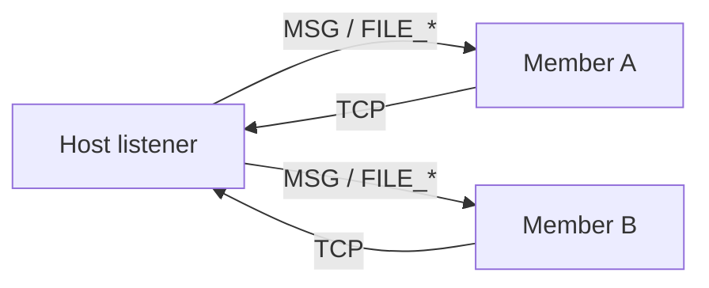

# Flinstone server — architecture and implementation guide

This document describes the **multi-user server** product: shell commands, terminal colours, TCP framing, file and message transfer, and member identity. It is **normative for product behaviour** on top of the network contracts.

**Follow-up tracker:** every CodeRabbit / Codex item from PR `#282` and every in-source `TODO` for P3-13 lives in **`docs/P3_13_FOLLOWUP.md`**. The companion roadmap rows live in **`docs/ROADMAP.md`** under `TODO: P3-13 (#283)` / `(#280)` / `(#279)` / `(#238)` / `(single-device WAN demo)`.

**Status (PRE 4.2.0 BUILD 8+):** the server foundation is implemented and lives at **`kernel/core/net/net_server.[ch]`** (host + member registry, ANSI announcement protocol), **`kernel/core/net/net_client.[ch]`** (client state machine + cached roster snapshot + private-message send), **`kernel/core/net/server_bg.[ch]`** (pthread receive loops), **`userland/command/cmd_server.c`** (shell verbs), and **`userland/shell/fl_colors.[ch]`** + **`userland/shell/shell_io.[ch]`** (colour palette + prompt-aware async output). See **§3.4 Private and public messages**, **§3.5 Multi-IP / non-loopback hosting**, and **§3.6 Host transfer on leave / exit** below for the additions that ship in this train; file transfer (**`server send -file`**) is still scoped for a follow-up commit.

Related: **`docs/P3_13_CHAT_SERVER.md`** (chat-room v1), **`docs/P3_NETWORKING.md`** ([protocol inventory](P3_NETWORKING.md#application-layer-and-common-internet-protocols) — this product is **not** FTP/SFTP/HTTP), **`docs/ROADMAP.md`**.

---

## 1 — Scope and dependency ladder

| Layer | Roadmap | Status (prep PR) |
|-------|---------|------------------|
| UDP demux + RX queues | **P3-6** | **`fl_net_udp_*_port`** in **`net_udp.c`** |
| TCP byte stream | **P3-7** | Hosted **`fl_net_sock_*`**; in-tree FSM still TODO |
| Socket API | **P3-13a** | **`contract_p3_sockets.h`**, **`net_socket.c`** |
| Session wire constants | **P3-13** | **`contract_p3_session_wire.h`** |
| Server hub + shell | **P3-13** | **Shipped on PRE 4.2.0 BUILD 8+** (`net_server.c` framing/relay, `cmd_server.c` shell verbs, `server_bg.c` background recv) — see §3.4–§3.6 and §8 for what's in the file-transfer follow-up |
| **`server_share/`** + file metadata | **P5-5**–**P5-7** | Contracts only |

Build order followed in this train: socket shim → **`net_server.c`** framing + relay → **`cmd_server.c`** + background recv → file chunk path with **P2-3** authz on privileged paths (last step still scoped for the **`server send -file`** follow-up, see §8).

---

## 2 — Terminal colours (ANSI)

User-typed text and server feedback use **ANSI escape sequences** on hosted terminals (TTY). Default user input is **white**; server status uses **green** (success), **red** (errors), and **yellow** (warnings).

Source pattern (CC BY-SA 4.0, [Stack Overflow](https://stackoverflow.com/a/23657072)):

```c
#define RED   "\x1B[31m"
#define GRN   "\x1B[32m"
#define YEL   "\x1B[33m"
#define BLU   "\x1B[34m"
#define MAG   "\x1B[35m"
#define CYN   "\x1B[36m"
#define WHT   "\x1B[37m"
#define RESET "\x1B[0m"
```

| Role | Macro | Example output |
|------|-------|----------------|
| Normal user / shell input | **KWHT** | `server send -message "Hello" -user JohnDoe` |
| Server success | **KGRN** | `[Server] hosting as 'flinstone' on 10.99.0.1:49913` |
| Server error | **KRED** | `[ERROR] nickname 'flinstone' is taken or matches another member's username` |
| Server warning / interactive nick prompt | **KYEL** | `Your username flinstone is already in use by another connected user, would you want to be nicked [Y/N]?` |
| Server announcement | **KBLU** | `[Server Announcement] User flinstone {2} has been nicked by host. Their nickname is "Jeff".` |
| Public / private chat | **KCYN** | `[Server Message, You -> Bobby]: Hello private` |

The exact macro definitions (matching the **Stack Overflow** CC BY-SA 2.5 reference at **<https://stackoverflow.com/a/3586005>**, retrieved 2026-05-29) live in **`userland/shell/fl_colors.h`**:

```c
#define KNRM "\x1B[0m"
#define KRED "\x1B[31m"
#define KGRN "\x1B[32m"
#define KYEL "\x1B[33m"
#define KBLU "\x1B[34m"
#define KMAG "\x1B[35m"
#define KCYN "\x1B[36m"
#define KWHT "\x1B[37m"
```

Implementation note: wrap **only** the server-prefixed status lines; do not colour arbitrary user **`echo`** output unless the user opts in. The colour helpers route through prompt-aware prelude/postlude hooks registered by **`userland/shell/shell_io.c`** so that an asynchronous announcement is never glued onto the live `shell> ` prompt — the helper clears the input line, prints the tagged message on its own line, then redraws `shell> ` plus the buffered keystrokes.

---

## 3 — Shell commands (product)

All commands are subcommands of **`server`**. Parsing is **`server <verb> [options]`** (flags may be reordered where noted).

### 3.1 Session control (from **`docs/P3_13_CHAT_SERVER.md`**)

| Command | Example | Effect |
|---------|---------|--------|
| **`server host`** | `server host 10.0.2.15:7777` | Listen on **ip:port**; caller is **host**; background recv on |
| **`server join`** | `server join 10.0.2.15:7777` | TCP connect as **member** |
| **`server msg`** | `server msg Hello room` | Broadcast chat line (via host relay) |
| **`server leave`** | `server leave` | Disconnect; host may **promote** another member |
| **`server kill`** | `server kill` | **Host only** — end session (**P2-3** authz) |

#### Bind address: any `ip:port` the machine can use (not a fixed whitelist)

**`server host`** and **`server join`** take a user-supplied endpoint (`<ipv4>:<port>`), parsed by **`fl_server_parse_endpoint`** (**`docs/P3_13_CHAT_SERVER.md`**). There is **no** hardcoded list of allowed addresses in the product design—examples like **`10.0.2.15:7777`** (TAP lab) and **`45.68.43.4:80`** (public routable) are illustrations only.

| You specify | Typical use |
|-------------|-------------|
| **`127.0.0.1:PORT`** | Same-machine or loopback-only lab |
| **`10.0.2.15:PORT`** (or **`FL_NET_TAP_IPV4`**) | QEMU/TAP private lab |
| **LAN address** (e.g. **`192.168.1.50:7777`**) | Shells on the same network |
| **Public routable IPv4** (e.g. **`45.68.43.4:80`**) | Internet-facing host when that address is assigned to the machine (or forwarded to it) and policy allows |
| **`0.0.0.0:PORT`** | Listen on **all local IPv4 interfaces** (POSIX **INADDR_ANY**); members connect using a concrete IP they can reach |

**Port:** any **1–65535** at parse time. Ports **&lt; 1024** usually need **root** / **`sudo`** on hosted Unix (same as binding **`:80`** elsewhere).

**What must still be true (environment, not app whitelist):**

1. **Bind succeeds** — the IPv4 address is local to an interface (or **`0.0.0.0`**) and nothing else holds that **port**.
2. **Members can route to the host** — they **`server join`** the same **ip:port** (or a hostname that resolves to a reachable address); NAT/firewall must allow inbound TCP.
3. **Stack path** — on **hosted (H)**, **`fl_net_sock_bind`** / **`listen`** delegate to the OS (full routing table). On an in-tree-only path later, the host address must exist on a netdev with a matching **`fl_net_route_add`** entry (**P3-5** + **P3-4** ARP).

**v1 limits:** IPv4 literals only (no **`[::1]:port`**). No automatic “pick best public IP”—the operator chooses the bind string.

### 3.2 Session roster (`server connected`)

| Command | Example | Effect |
|---------|---------|--------|
| **`server connected`** | `server connected` | List every member in the session with **`member_id`**, principal, optional host-global nickname, and host marker |

**Default output** (no nicknames yet; **JohnDoe** joined twice):

```text
[1] JohnDoe
[2] JohnDoe
[3] Flinstone
```

With a **host** on slot 1:

```text
[1] JohnDoe <— host
[2] JohnDoe
[3] Flinstone
```

With **host-global** nicknames (host set slot 2 to **Jeff**; slot 1 left unset):

```text
[1] JohnDoe
[2] JohnDoe {Jeff}
[3] Flinstone
```

**Local-only** nicknames (only the viewer sees `{nick}`) — e.g. **Flinstone** nicknames slot 1 as **Ashly** for themselves only:

```text
[1] JohnDoe {Ashly}
[2] JohnDoe
[3] Flinstone
```

Other members still see `[1] JohnDoe` without **Ashly**. See §5.2.

The host assigns **`member_id`** at join (**`HELLO`** / **`HELLO_ACK`**). Ids are **stable for the connection** and listed in join order unless a maintainer documents reordering on host promote.

### 3.3 Private and public messages (`server msg`)

Both shipped today; **`server send -file`** remains scoped for a follow-up commit.

| Command | Effect | Local render (sender) | Remote render (receiver) |
|---------|--------|------------------------|---------------------------|
| **`server msg <text>`** | Broadcast to every member | `[Server Message, You -> All]: <text>` | `[Server Message, From <sender>]: <text>` |
| **`server msg -all <text>`** | Explicit broadcast (same as above) | `[Server Message, You -> All]: <text>` | `[Server Message, From <sender>]: <text>` |
| **`server msg -user <name> <text>`** | Private chat (resolved by host-global nick → local nick → unique principal) | `[Server Message, You -> <name>]: <text>` | `[Server Message, <sender> -> You]: <text>` |
| **`server msg -user <name> -id <N> <text>`** | Private chat; pin to the duplicate ordinal `{N}` when several connected members share the principal | `[Server Message, You -> <name> {N}]: <text>` | `[Server Message, <sender> -> You]: <text>` |
| **`server msg -id <N> <text>`** | Private chat by raw `member_id` (`N` is the assigned id, not the disambiguation ordinal) | `[Server Message, You -> <display>]: <text>` | `[Server Message, <sender> -> You]: <text>` |

All chat lines render in **KCYN**. Private messages travel as **`OP_MSG_DIRECT`** (client → host) and **`OP_MSG_DIRECT_DELIVER`** (host → recipient) and are **not** copied to any other peer.

**Nick preference for display:** host-global nick wins over a client-local nick. When the local viewer has set a client-side nick for a member who later receives a host-global nick, the host-global value overrides the local one in every render (private messages included). The original wording in **`docs/SERVER.md` §5** still applies for client-local overrides on the viewer side.

### 3.4 Packet capture (cross-subnet end-to-end evidence)

`make test_netns_pcap` (gated by `FL_NETNS_PCAP_OK=1`) runs **`tests/manual_demo_netns_pcap.sh`**, which builds a two-subnet routed topology entirely in network namespaces:

```text
   netA (192.168.10.0/24)              netB (192.168.20.0/24)
   fl_host    192.168.10.2 ---|       |--- fl_client 192.168.20.2
                              br-a   br-b
                                |    |
                            fl_router (192.168.10.1 / 192.168.20.1,
                                       net.ipv4.ip_forward=1)
```

`tcpdump` runs **inside the router namespace** so every TCP segment that crosses the subnet boundary lands in the capture. Three artifacts are written into `/opt/cursor/artifacts/`:

| File | Content |
|---|---|
| `netns_router_capture.pcap` | Raw frames, openable in Wireshark / `tshark` |
| `netns_router_capture.txt` | `tcpdump -r ... -n -tttt` timeline |
| `netns_router_session_frames.txt` | Per-frame session-protocol decode produced by **`tests/decode_session_pcap.py`** (magic `0x46`, version, opcode → name from `contract_p3_session_wire.h`, flags, payload length, ASCII preview) + per-opcode counts |

The decoder is standalone and reusable: `python3 tests/decode_session_pcap.py <any.pcap> [--counts]` works on any Flinstone capture, not just the one this demo produces. It requires `python3 -m pip install scapy` for the per-frame view; without scapy installed it exits 0 with a one-line note and the raw `.pcap` is still produced as the primary artifact.

**Sandbox prerequisites** (matches `AGENTS.md` § *Cursor Cloud specific instructions*):

```bash
sudo apt-get install -y iproute2 tcpdump tmux
sudo sysctl -w net.bridge.bridge-nf-call-iptables=0
```

The `bridge-nf-call-*` sysctl is the single most common reason a working topology silently drops frames — by default the kernel sends bridged traffic through `iptables`, which then drops anything not explicitly accepted. Setting it to `0` is reversible and only needs to happen once per host boot.

Mininet (`apt-get install -y mininet openvswitch-switch`) is an equally valid choice on environments where the `openvswitch` kernel module is loadable. In containerised CI / Cursor Cloud it is not, so the raw `ip netns` recipe in this script is the portable path.

### 3.5 Multi-IP / non-loopback hosting

`server host` and `server join` accept any local-or-routable IPv4 endpoint. `server join` adds an optional `-bind <local_ip>` flag so the joining client sources its TCP from a specific local IP (used by lab demos that put each peer on a distinct `10.99.0.X` loopback alias, and by the auto-reconnect path after a host transfer):

```sh
server join 10.99.0.1:49913 -bind 10.99.0.10
```

When `-bind` is omitted, the kernel picks the default source IP for the route to the destination (same as a plain `connect()`).

### 3.6 Host transfer on `server leave` / shell `exit`

When the host runs `server leave` (or the shell's `exit` / `exit -y` / `exit -n` while still hosting), the server picks the lowest non-host `member_id` as the successor, broadcasts **`OP_CTRL_HOST_PROMOTE`** with payload `[u16 new_host_id][u32 new_host_ip_be][u16 new_host_port]`, and tears down the old listener. The successor's client side automatically:

1. Stops its receive loop.
2. Disconnects from the old session.
3. Calls `fl_net_server_host_start` on its **own** local IP (recorded at join time via `getsockname()`) and the same port.
4. Starts the server receive loop and prints `[Server] you are now the host on this session`.

Every other peer:

1. Stops its receive loop.
2. Disconnects from the old session.
3. Retries `fl_net_client_connect_from(local_ip, new_ip, new_port)` up to 10× with 150 ms back-off so the new listener has time to bind, then resumes background receive.
4. Re-enters the optional `Y/N` nick prompt if the new session triggers a principal collision.

When the host is the only member, the same code path emits **`OP_CTRL_KILL`** instead of promote and closes every socket.

### 3.7 Shell `exit` integration

Both `exit` (interactive prompt) and `exit -y` / `exit -n` (one-shot) call `cmd_server_atexit()` before tearing the shell down. The hook routes through `verb_leave` semantics: a hosting shell triggers `fl_net_server_transfer_and_stop` (so the session survives), and a joined client shell triggers `fl_net_client_disconnect`. The user does not have to remember to run `server leave` before quitting.

### 3.8 File transfer (planned native protocol)

The follow-up file-transfer surface is **native Flinstone server file** first; SFTP is a compatibility adapter over that native service, not the core file-transfer system. See **`docs/SERVER_FILE_TRANSFER_SFTP_PLAN.md`** for the implementation roadmap.

| Command | Example | Effect |
|---------|---------|--------|
| **`server file -all`** | `server file -all ./public.txt -v` | Public file offer to all connected sessions except the sender |
| **`server file -user`** | `server file -user "JohnDoe" ./report.txt -v` | Private file offer to one resolved member |
| **`server file -id`** | `server file -id 3 ./report.txt -weo` | Private file offer to an explicit member id |
| **`server send -file`** (legacy alias) | `server send -file "./funny/joke.txt" -user "JohnDoe"` | Compatibility alias routed to **`server file -user`** |

Permission flags mirror the file-share contract: **`-v`** view, **`-w`** write, **`-e`** edit (implies view), **`-r`** run (implies view), **`-o`** overwrite, and **`-Ex <duration>`** expiration. Combined forms such as **`-er`**, **`-vr`**, and **`-weo`** are valid parser inputs.

**Targeting rules:**

| Target form | Who resolves it |
|-------------|-----------------|
| **`-id 1`** | Always **`member_id` 1** |
| **`-user "JohnDoe" -id 1`** | **`member_id` 1**, with the name retained for UI/audit context |
| **`-user "Jeff"`** | **Host-global** nick first |
| **`-user "Ashly"`** | **Local** nick only for the caller who set **Ashly** on that slot |
| **`-user "JohnDoe"`** (no **`-id`**) | Error if more than one connected **JohnDoe**; ok if unique |

**Sender notification policy:** the sender receives local command status only (for example, `[Server] file offer sent`) and never receives a **`FILE_OFFER`** event generated by its own command. Public offers route to all sessions except the sender; private offers route to the target only.

**Recipient options** are overwrite a matching local file, save into **`/server_share`**, or decline. Overwrite requires **`FL_FILE_PERM_OVERWRITE`** and server-share placement requires **`FL_FILE_PERM_SERVER_SHARE`**.

The sender's system records stable member ids, display snapshots, principal names, optional nick snapshots, path metadata, permissions, expiration, and chunking metadata in **`fl_server_file_offer_t`**. Variable wire fields are encoded as **`[u16_be length][bytes]`** byte strings.

Default landing directory name: **`server_share/`** (**`FL_SERVER_SHARE_DIR_NAME`**, **P5-5**).

---

## 4 — Packets over sockets

### 4.1 Transport

- **Control and chat:** **TCP** (**RFC 793**), one connection per member to the **host** (hub topology).
- **Optional lab/datagram side channel:** **UDP** via **P3-6** demux (not required for v1 chat).

Hosted labs use **`fl_net_sock_*`** (**`net_socket.c`**), which maps to POSIX **`socket`/`bind`/`listen`/`accept`/`connect`/`send`/`recv`** until the in-tree **P3-7** FSM owns the path.

### 4.1.1 BSD shim coverage (`fl_socket / fl_bind / fl_listen / fl_accept / fl_send / fl_recv / fl_close`)

The same surface backs three #239 acceptance items:

| Surface | Verb / call site | End-to-end test |
|---|---|---|
| `fl_socket / fl_bind / fl_listen / fl_accept / fl_send / fl_recv / fl_close` | `server host`, `server join`, the **STREAM** path | `tests/test_p3_network.c::test_net_socket_tcp_loopback` |
| `fl_socket / fl_bind / fl_send / fl_recv / fl_close` | `udpsend`, `udplisten`, the **DGRAM** path | `tests/test_p3_network.c::test_net_socket_udp_loopback` |
| `udpsend` + `udplisten` shell verbs (loopback echo) | `userland/command/cmd_udp.c` | `tests/test_p3_udp_cmds.c` via `make test_p3_udp_cmds` |

### 4.1.2 “No Linux kernel socket required for loopback or TAP destinations”

This is one of the **#239** acceptance criteria. Current status: the **hosted** shim still delegates to POSIX sockets, but **loopback is fully covered by the in-tree path** (`net_loopback.c`, `test_loopback_arp_exchange`, `test_loopback_ping`, `test_loopback_tcp`, `test_udp_echo_loopback`, `test_netdev_loopback_frame`), and TAP frames round-trip via `net_tap.c` + `test_tap_smoke`. The remaining ask — making `fl_net_sock_open(STREAM)` itself bypass the Linux kernel socket on a loopback or TAP destination — depends on **P3-7** TCP state machine + **P3-6** UDP demux promoting from “lab helpers” to “the native path the shim auto-selects”. The shim already has a place to add that switch (the `FL_NET_SOCK_HOSTED` define in `net_socket.c`); once P3-7 owns the listener / connect path, the shim can prefer the in-tree FSM when `addr_be` is loopback or a configured TAP route, and fall back to POSIX otherwise.

### 4.1.3 `udpsend` / `udplisten` shell verbs

```text
udpsend <ip:port> <message...>
udplisten <port> [-c count] [-W timeout_ms] [-bind <local_ip>]
```

`udpsend` opens `fl_net_sock_open(DGRAM)` → `fl_net_sock_connect(peer_be, port)` → `fl_net_sock_send(payload)`. `udplisten` opens `DGRAM` → `fl_net_sock_bind(local, port)` → loops `fl_net_sock_recv(buf, timeout_ms)` and prints each datagram. Implementation: **`userland/command/cmd_udp.c`**. Loopback echo proof: **`make test_p3_udp_cmds`**.

### 4.2 Session frame (TCP byte stream)

Constants: **`contracts/networking/contract_p3_session_wire.h`**.

| Offset | Size | Field |
|--------|------|-------|
| 0 | 1 | **`magic`** = **`0x46`** (`'F'`) |
| 1 | 1 | **`version`** = **`1`** |
| 2 | 1 | **`opcode`** |
| 3 | 1 | **`flags`** (reserved **`0`** in v1) |
| 4 | 2 | **`length_be`** (payload length, **0..`FL_NET_SESSION_MAX_MSG`**) |
| 6 | *n* | **payload** (UTF-8 for text; binary for file chunks) |

**Chat opcodes:** **`HELLO`**, **`HELLO_ACK`**, **`MEMBER_LIST`**, **`NICK_PROMPT`**, **`MSG`**, **`MSG_BROADCAST`**, **`CTRL_*`**, **`HOST_NICK_SET`**, **`ERR`** — see **`docs/P3_13_CHAT_SERVER.md`** and **`contract_p3_session_wire.h`**.

**File opcodes (v1 extension):**

| Opcode | Name | Payload |
|--------|------|---------|
| **`0x30`** | **`FILE_OFFER`** | Serialized **`fl_server_file_offer_t`** (length-prefixed fields) |
| **`0x31`** | **`FILE_CHUNK`** | Offset + bytes (**≤ `FL_SERVER_FILE_CHUNK_MAX`**) |
| **`0x32`** | **`FILE_DONE`** | Checksum / final status |
| **`0x33`** | **`FILE_ACCEPT`** | Receiver accepts with overwrite or server-share disposition |
| **`0x34`** | **`FILE_DECLINE`** | Receiver declines the offer |
| **`0x35`** | **`FILE_REVOKE`** | Owner revokes a share id |
| **`0x36`** | **`FILE_LIST`** | Inbox/public/sent listing request or response |
| **`0x37`** | **`FILE_STATUS`** | File-offer status / error result |

Partial reads must be buffered per connection (TCP is a byte stream).

### 4.3 Hub relay



The host **does not** mesh peer TCP; it relays frames to every other member except the sender.

---

## 5 — Member identity and nicknames (**P5-7**)

### 5.1 Session ids (`member_id`)

| Field | Rule |
|-------|------|
| **principal** | Logged-in shell user (e.g. **`flinstone`**, **`JohnDoe`**) |
| **member_id** | **`1..N`** shown in **`server connected`** as **`[1]`**, **`[2]`**, … |
| **disambiguated** | **`1`** when another connected member already uses the same principal |
| **is_host** | **`1`** for the listener / elected host after promote |

Assignment (document in **`.ver`** when fixed): monotonic join order at **`HELLO`**; optional hardware-token hash stored for audit, not shown in the default list.

Wire: **`HELLO`** carries **`principal`**; **`HELLO_ACK`** returns **`member_id`**. **`MEMBER_LIST`** (**`contract_p3_session_wire.h`**) refreshes the roster after join, leave, or host nick change.

### 5.2 Nicknames (local vs host-global)

| Scope | Who sets it | Who sees it | Send targeting |
|-------|-------------|-------------|----------------|
| **Local** | Any member, client-side | Only that member’s **`server connected`** | That member may **`-user "Ashly"`** (their local alias) |
| **Host-global** | **Host only** | **Everyone** in **`server connected`** | **Anyone** may **`-user "Jeff"`** without **`-id`** |

**Duplicate principal on join:** if **JohnDoe** connects when **JohnDoe** is already present, the host may send **`NICK_PROMPT`** so the new member may choose a **host-global** nick (optional). Example: second **JohnDoe** accepts nick **Jeff** → everyone sees **`[2] JohnDoe {Jeff}`**.

**Host-global example:** host nicknames slot 2 as **Jeff**:

```text
[1] JohnDoe
[2] JohnDoe {Jeff}
[3] Flinstone
```

All members may run:

```text
server send -file "./funny/joke.txt" -user "Jeff"
```

**Local nickname example:** **Flinstone** (only) nicknames slot 1 as **Ashly**:

```text
[1] JohnDoe {Ashly}
[2] JohnDoe
[3] Flinstone
```

Only **Flinstone** may use:

```text
server send -file "./funny/joke.txt" -user "Ashly"
```

Everyone else must use **`server send … -user "JohnDoe" -id 1`**.

Planned shell verbs (server application PR): **`server nick -id <n> -name "<nick>"`** (local), **`server nick -id <n> -name "<nick>" -global`** (host only → **`HOST_NICK_SET`** on the wire).

Normative C types: **`fl_server_member_t`**, **`fl_server_nick_scope_t`** in **`contract_p5_member_identity.h`**.

---

## 6 — File delivery contract (**P5-6**)

Normative contracts:

- **`contract_p5_file_perms.h`** defines the 16-bit file permission word, normalization, and quick revocation / overwrite checks.
- **`contract_p5_file_delivery.h`** defines **`fl_server_file_offer_t`**, chunk/done records, byte-string helpers, and receiver disposition.
- **`contract_p3_packet.h`** defines FILE_* payload encode/decode boundaries so command and router code do not hand-assemble byte offsets.
- **`contract_p3_session_wire.h`** defines the shared session frame channel, file opcodes, receiver resolution, display snapshots, and offer rendering.
- **`contract_p3_sftp_adapter.h`** records that SFTP maps onto native server-file policy instead of bypassing it.

| Field group | Meaning |
|-------------|---------|
| **member ids** | Stable sender and receiver routing ids; receiver **`0`** means public/all |
| **display snapshots** | Sender and receiver display strings captured at send time for UI/audit stability |
| **principal/nick snapshots** | Original principals and optional host/local nick context |
| **permissions** | **`fl_file_perms_t`** bitset: revoked MSB, overwrite LSB, view/write/edit/run/server-share/expiration bits |
| **expiration** | **`expires_at = 0`** means never expires |
| **chunking** | File size, chunk size, total chunks, chunk offset/index payloads |
| **paths** | Sender path, suggested destination path, and file name |

**Example:** users **Flinstone** and **JohnDoe** both have `./funny/joke.txt`. Flinstone runs:

```text
server file -user "JohnDoe" ./funny/joke.txt -vo
```

JohnDoe's client receives **`FILE_OFFER`** with Flinstone's path and display snapshot. JohnDoe may overwrite his **`joke.txt`**, save into **`server_share/`**, or decline. Flinstone does not receive a network file-offer echo for the command.

---

## 7 — Storage layout (**P5-5**)

| Path | Purpose |
|------|---------|
| **`./server_share/`** | Default inbox for files with no existing path on the recipient |
| User tree | Existing paths (e.g. **`./funny/joke.txt`**) when overwrite is selected |

VFS integration (**P5-1**/**P5-2**) must respect **jail** and **P2-3** when opening sender paths outside the jail.

---

## 8 — Module map (server foundation shipped; `server send -file` pending)

| Path | Status | Responsibility |
|------|--------|----------------|
| **`userland/command/cmd_server.c`** | ✅ shipped | Parse **`host`/`join`/`connected`/`msg`/`announce`/`nick`/`set-nick`/`leave`/`kill`**; host transfer + auto-reconnect glue |
| **`kernel/core/net/server_bg.c`** | ✅ shipped | pthread background **`recv`** loops for both host (accept + member poll) and client (event delivery) |
| **`kernel/core/net/net_server.c`** | ✅ shipped | Host listener, member registry, framing, relay, ANSI announcement protocol, host-transfer state machine |
| **`kernel/core/net/net_client.c`** | ✅ shipped | Client connect / disconnect / send / receive + cached roster snapshot |
| **`userland/shell/fl_colors.[ch]`** | ✅ shipped | `K*` ANSI macros + prompt-aware async output helpers |
| **`userland/shell/shell_io.[ch]`** | ✅ shipped | pthread mutex + readline buffer snapshot so background announcements don't glue to the prompt |
| **`kernel/core/net/net_socket.c`** | ✅ shipped | Socket shim (`fl_net_sock_*`); STREAM + DGRAM |
| **`kernel/core/net/net_udp.c`** | ✅ shipped | UDP demux + `fl_net_udp_bound_ports_snapshot` |
| File-chunk path (`server send -file`) | ⏳ pending | `FILE_OFFER` / `FILE_CHUNK` / `FILE_DONE` plus accept/decline/revoke/list/status opcodes are reserved in **`contract_p3_session_wire.h`**; cross-user delivery + `server_share/` staging from **`contract_p5_file_delivery.h`** lands in the follow-up implementation |

`server` is registered in the shell command table like `ping`, and tears down through `cmd_server_atexit()` on `exit`.

---

## 9 — Testing

| Test | Train | Status |
|------|-------|--------|
| `test_net_udp_demux_queue` | `make test_p3_network` | ✅ shipped |
| `test_net_socket_tcp_loopback` | `make test_p3_network` | ✅ shipped |
| `test_net_socket_udp_loopback` | `make test_p3_network` | ✅ shipped (#239) |
| `test_p3_server::announce_join_leave_nick` etc. (5 sub-tests) | `make test_p3_server` | ✅ shipped (#239) |
| `test_p3_udp_cmds` | `make test_p3_udp_cmds` | ✅ shipped (#239) |
| `test_p3_net_tools` (arp/ifconfig/route/netstat/nslookup/netsh + endian parity) | `make test_p3_net_tools` | ✅ shipped (#239) |
| `test_server_file_offer_roundtrip` | follow-up file-transfer PR | ⏳ pending |

---

## 10 — References

- **`docs/P3_13_CHAT_SERVER.md`** — chat opcodes and host election
- **`docs/P3_NETWORKING.md`** — stack layers
- **`contracts/networking/contract_p3_session_wire.h`**
- **`contracts/storage/contract_p5_server_share.h`**, **`contract_p5_file_delivery.h`**, **`contract_p5_member_identity.h`**
- GitHub **#238** (TCP/UDP infra), **#239** (server application)
