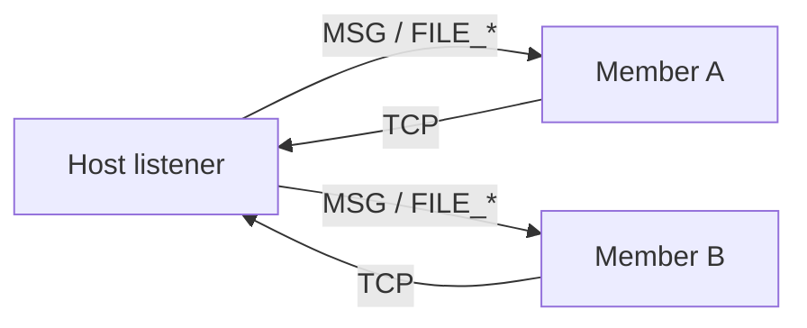

# Flinstone server — architecture and implementation guide

This document describes the **multi-user server** product: shell commands, terminal colours, TCP framing, file and message transfer, and member identity. It is **normative for product behaviour** on top of the network contracts.

**This train (network prep PR) does not ship the server.** It adds **P3-6** UDP demux, a **P3-13a** hosted socket shim (**`net_socket.c`**), session wire constants (**`contract_p3_session_wire.h`**), and **P5-5**–**P5-7** storage contracts for **`server_share/`** and file delivery. A follow-up PR implements **`cmd_server.c`**, **`net_server.c`**, and the background receive path.

Related: **`docs/P3_13_CHAT_SERVER.md`** (chat-room v1), **`docs/P3_NETWORKING.md`**, **`docs/ROADMAP.md`**.

---

## 1 — Scope and dependency ladder

| Layer | Roadmap | Status (prep PR) |
|-------|---------|------------------|
| UDP demux + RX queues | **P3-6** | **`fl_net_udp_*_port`** in **`net_udp.c`** |
| TCP byte stream | **P3-7** | Hosted **`fl_net_sock_*`**; in-tree FSM still TODO |
| Socket API | **P3-13a** | **`contract_p3_sockets.h`**, **`net_socket.c`** |
| Session wire constants | **P3-13** | **`contract_p3_session_wire.h`** |
| Server hub + shell | **P3-13** | **Not in prep PR** — see §8 |
| **`server_share/`** + file metadata | **P5-5**–**P5-7** | Contracts only |

Build order for the **server PR**: socket shim (done here) → **`net_server.c`** framing + relay → **`cmd_server.c`** + background recv → file chunk path with **P2-3** authz on privileged paths.

---

## 2 — Terminal colours (ANSI)

User-typed text and server feedback use **ANSI escape sequences** on hosted terminals (TTY). Default user input is **white**; server status uses **green** (success), **red** (errors), and **yellow** (warnings).

Source pattern (CC BY-SA 4.0, [Stack Overflow](https://stackoverflow.com/a/23657072)):

```c
#define RED   "\x1B[31m"
#define GRN   "\x1B[32m"
#define YEL   "\x1B[33m"
#define BLU   "\x1B[34m"
#define MAG   "\x1B[35m"
#define CYN   "\x1B[36m"
#define WHT   "\x1B[37m"
#define RESET "\x1B[0m"
```

| Role | Macro | Example output |
|------|-------|----------------|
| Normal user / shell input | **WHT** | `server send -message "Hello" -user JohnDoe` |
| Server success | **GRN** | `[server] message delivered to JohnDoe` |
| Server error | **RED** | `[server] user JohnDoe not connected` |
| Server warning | **YEL** | `[server] file exists; pass -overwrite to replace` |

Implementation note: wrap **only** the server-prefixed status lines; do not colour arbitrary user **`echo`** output unless the user opts in.

---

## 3 — Shell commands (product)

All commands are subcommands of **`server`**. Parsing is **`server <verb> [options]`** (flags may be reordered where noted).

### 3.1 Session control (from **`docs/P3_13_CHAT_SERVER.md`**)

| Command | Example | Effect |
|---------|---------|--------|
| **`server host`** | `server host 10.0.2.15:7777` | Listen on **ip:port**; caller is **host**; background recv on |
| **`server join`** | `server join 10.0.2.15:7777` | TCP connect as **member** |
| **`server msg`** | `server msg Hello room` | Broadcast chat line (via host relay) |
| **`server leave`** | `server leave` | Disconnect; host may **promote** another member |
| **`server kill`** | `server kill` | **Host only** — end session (**P2-3** authz) |

### 3.2 Messaging and files (this document)

| Command | Example | Effect |
|---------|---------|--------|
| **`server send -message`** | `server send -message "Hello" -user "JohnDoe"` | Deliver UTF-8 text to one connected member |
| **`server send -file`** | `server send -file "./funny/joke.txt" -user "JohnDoe"` | Offer file bytes + metadata; recipient chooses disposition |

**Privileged paths:** sending a file **outside the session jail** requires **root** or **`sudo`** (same policy as other jail-crossing builtins). In-jail relative paths use the caller's resolved cwd.

**Recipient options** when a file already exists at the same relative path (e.g. both users have `./funny/joke.txt`):

1. **Overwrite** the existing file with the transferred content (`overwrite_existing=1`).
2. **Save under `server_share/`** when no file exists at that path, or when the user accepts share placement (`use_server_share=1`).
3. **Decline** — do not write to share or overwrite (`decline_storage=1`).

The sender's system records the **full resolved path** at send time (`sender_path` in **`fl_server_file_offer_t`**). The recipient UI prompts (or flags) map to **`fl_server_file_disposition_t`** in **`contracts/storage/contract_p5_file_delivery.h`**.

Default landing directory name: **`server_share/`** (**`FL_SERVER_SHARE_DIR_NAME`**, **P5-5**).

---

## 4 — Packets over sockets

### 4.1 Transport

- **Control and chat:** **TCP** (**RFC 793**), one connection per member to the **host** (hub topology).
- **Optional lab/datagram side channel:** **UDP** via **P3-6** demux (not required for v1 chat).

Hosted labs use **`fl_net_sock_*`** (**`net_socket.c`**), which maps to POSIX **`socket`/`bind`/`listen`/`accept`/`connect`/`send`/`recv`** until the in-tree **P3-7** FSM owns the path.

### 4.2 Session frame (TCP byte stream)

Constants: **`contracts/networking/contract_p3_session_wire.h`**.

| Offset | Size | Field |
|--------|------|-------|
| 0 | 1 | **`magic`** = **`0x46`** (`'F'`) |
| 1 | 1 | **`version`** = **`1`** |
| 2 | 1 | **`opcode`** |
| 3 | 1 | **`flags`** (reserved **`0`** in v1) |
| 4 | 2 | **`length_be`** (payload length, **0..`FL_NET_SESSION_MAX_MSG`**) |
| 6 | *n* | **payload** (UTF-8 for text; binary for file chunks) |

**Chat opcodes:** **`HELLO`**, **`HELLO_ACK`**, **`MSG`**, **`MSG_BROADCAST`**, **`CTRL_*`**, **`ERR`** — see **`docs/P3_13_CHAT_SERVER.md`**.

**File opcodes (v1 extension):**

| Opcode | Name | Payload |
|--------|------|---------|
| **`0x30`** | **`FILE_OFFER`** | Serialized **`fl_server_file_offer_t`** (length-prefixed fields) |
| **`0x31`** | **`FILE_CHUNK`** | Offset + bytes (**≤ `FL_SERVER_FILE_CHUNK_MAX`**) |
| **`0x32`** | **`FILE_DONE`** | Checksum / final status |

Partial reads must be buffered per connection (TCP is a byte stream).

### 4.3 Hub relay



The host **does not** mesh peer TCP; it relays frames to every other member except the sender.

---

## 5 — Member identity (**P5-7**)

| Field | Rule |
|-------|------|
| **principal** | Logged-in shell user (e.g. **`flinstone`**) |
| **member_id** | **`0`** when unique; otherwise a stable disambiguator |
| **disambiguated** | **`1`** when **`member_id`** was assigned due to duplicate principals |

Disambiguation sources (implementation choice, document in **`.ver`** when fixed):

- Hardware token id hash (preferred when available), else
- Monotonic **join order** slot assigned by the host at **`HELLO`**.

Wire **`HELLO`** payload carries **`principal`** ASCII; **`HELLO_ACK`** returns **`member_slot`** / **`member_id`**.

---

## 6 — File delivery contract (**P5-6**)

Normative C struct: **`fl_server_file_offer_t`** in **`contract_p5_file_delivery.h`**.

| Field | Meaning |
|-------|---------|
| **`sender_path`** | Resolved path on sender at offer time |
| **`sender_principal`** | Who sent |
| **`recipient_principal`** | Intended recipient |
| **`file_size`** | Total bytes |
| **`sender_member_id`** | Wire identity |
| **`disposition.overwrite_existing`** | **1** → replace recipient file at same relative path |
| **`disposition.use_server_share`** | **1** → use **`server_share/`** when appropriate |
| **`disposition.decline_storage`** | **1** → recipient rejects storage |

**Example:** users **Flinstone** and **JohnDoe** both have `./funny/joke.txt`. Flinstone runs:

```text
server send -file "./funny/joke.txt" -user "JohnDoe"
```

JohnDoe's client receives **`FILE_OFFER`** with Flinstone's absolute/resolved path. JohnDoe may overwrite his **`joke.txt`**, save into **`server_share/`**, or decline.

---

## 7 — Storage layout (**P5-5**)

| Path | Purpose |
|------|---------|
| **`./server_share/`** | Default inbox for files with no existing path on the recipient |
| User tree | Existing paths (e.g. **`./funny/joke.txt`**) when overwrite is selected |

VFS integration (**P5-1**/**P5-2**) must respect **jail** and **P2-3** when opening sender paths outside the jail.

---

## 8 — Module map (future server PR)

| Path | Responsibility |
|------|----------------|
| **`userland/command/cmd_server.c`** | Parse **`host`/`join`/`send`/`leave`/`kill`** |
| **`userland/shell/server_bg.c`** | Background **`recv`** → inbound ring |
| **`kernel/core/net/net_server.c`** | Hub, framing, relay, file session state |
| **`kernel/core/net/net_socket.c`** | Socket shim (**prep PR**) |
| **`kernel/core/net/net_udp.c`** | UDP demux (**prep PR**) |

Register **`server`** in the shell command table like **`ping`**.

---

## 9 — Testing

| Test | Train |
|------|-------|
| **`test_net_udp_demux_queue`** | Prep PR — **`make test_p3_network`** |
| **`test_net_socket_tcp_loopback`** | Prep PR — hosted TCP |
| **`test_server_host_join_msg`** | Server PR |
| **`test_server_file_offer_roundtrip`** | Server PR |

---

## 10 — References

- **`docs/P3_13_CHAT_SERVER.md`** — chat opcodes and host election
- **`docs/P3_NETWORKING.md`** — stack layers
- **`contracts/networking/contract_p3_session_wire.h`**
- **`contracts/storage/contract_p5_server_share.h`**, **`contract_p5_file_delivery.h`**, **`contract_p5_member_identity.h`**
- GitHub **#238** (TCP/UDP infra), **#239** (server application)
