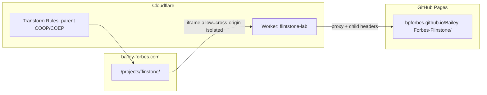

# Cloudflare deploy: Flinstone lab iframe (first-visit boot)

This guide pairs a **child Worker** (`flintstone.bailey-forbes.com`) with **parent
response headers** on `bailey-forbes.com` so the portfolio iframe boots without a
prior top-level GitHub Pages visit.

Artifacts live in `infra/cloudflare/`.

## Architecture



| Layer | Host | Mechanism | Headers |
|-------|------|-----------|---------|
| Parent | `bailey-forbes.com` | Transform Rules (response) | COOP, COEP `credentialless`, Permissions-Policy |
| Child | `flintstone.bailey-forbes.com` | Worker proxy | COEP `require-corp`, CORP, CSP `frame-ancestors`, `no-store` on manifests |

## 1. Deploy the lab Worker

### Prerequisites

- `bailey-forbes.com` DNS on Cloudflare (orange-cloud proxy enabled).
- Node 18+ locally, or deploy from Cloudflare dashboard.

### CLI deploy

```bash
cd infra/cloudflare
npm install -g wrangler   # or: npx wrangler ...
wrangler login
wrangler deploy
```

### DNS record

Create a proxied CNAME (or AAAA via Workers route only):

| Type | Name | Target | Proxy |
|------|------|--------|-------|
| CNAME | `flintstone` | `bailey-forbes.com` (or Workers route handles it) | Proxied |

With `wrangler.toml` routes, Cloudflare binds the Worker to
`flintstone.bailey-forbes.com/*` automatically when the subdomain exists in the zone.

### Smoke test

Open `https://flintstone.bailey-forbes.com/` top-level. DevTools → Network →
document response headers should include:

```
Cross-Origin-Embedder-Policy: require-corp
Cross-Origin-Resource-Policy: cross-origin
Content-Security-Policy: frame-ancestors https://bailey-forbes.com
```

Confirm `#status` reaches **Ready** and serial contains `FLINTSTONE_KERNEL_BOOT_OK`.

## 2. Parent Transform Rules (`bailey-forbes.com`)

Apply on **HTML responses for the Flinstone project page only** (recommended) so
Google Fonts and other site pages stay untouched.

**Cloudflare dashboard:** Rules → Transform Rules → **Modify Response Header** → Create rule.

| Field | Value |
|-------|-------|
| Rule name | `flintstone-parent-isolation` |
| Expression | `(http.host eq "bailey-forbes.com" or http.host eq "www.bailey-forbes.com") and starts_with(http.request.uri.path, "/projects/flinstone")` |
| Operation | Set static |
| Header | `Cross-Origin-Opener-Policy` → `same-origin` |
| Operation | Set static |
| Header | `Cross-Origin-Embedder-Policy` → `credentialless` |
| Operation | Set static |
| Header | `Permissions-Policy` → `cross-origin-isolated=(self "https://flintstone.bailey-forbes.com")` |

### Full-site variant (optional)

If you prefer one rule for the entire portfolio origin, drop the `starts_with(...)`
clause. Test third-party assets (fonts, analytics) afterward — `credentialless` is
usually safer than `require-corp` but not risk-free.

### Rules API (JSON sketch)

```json
{
  "description": "Flinstone iframe parent isolation",
  "enabled": true,
  "expression": "(http.host eq \"bailey-forbes.com\" or http.host eq \"www.bailey-forbes.com\") and starts_with(http.request.uri.path, \"/projects/flinstone\")",
  "action_parameters": {
    "headers": [
      { "operation": "set", "header": "Cross-Origin-Opener-Policy", "value": "same-origin" },
      { "operation": "set", "header": "Cross-Origin-Embedder-Policy", "value": "credentialless" },
      {
        "operation": "set",
        "header": "Permissions-Policy",
        "value": "cross-origin-isolated=(self \"https://flintstone.bailey-forbes.com\")"
      }
    ]
  }
}
```

## 3. Portfolio repository updates

After the Worker is live, point the guest window at the Worker origin (not raw Pages).

In `src/apps.ts`:

```typescript
export const FLINTSTONE_GUEST_SRC = "https://flintstone.bailey-forbes.com/";
// ...
flinstone: {
  // ...
  src: FLINTSTONE_GUEST_SRC,
  origin: "https://flintstone.bailey-forbes.com",
  iframeAllow: "cross-origin-isolated; fullscreen; clipboard-write",
}
```

Rebuild TypeScript (`npm run build`) and deploy the portfolio site.

Remove or shorten the “open lab top-level once” fallback copy on
`/projects/flinstone/` once first-visit iframe boot is verified.

## 4. Verification checklist

1. **Child headers:** `curl -sI https://flintstone.bailey-forbes.com/ | grep -i cross-origin`
2. **Parent headers:** `curl -sI https://bailey-forbes.com/projects/flinstone/ | grep -i cross-origin`
3. **Iframe boot:** Incognito → `https://bailey-forbes.com/projects/flinstone/` → Launch lab → Ready + VGA cell `F`
4. **postMessage:** DevTools console on portfolio page — no origin mismatch; status shows “Live · attached”
5. **Cache:** `curl -sI https://flintstone.bailey-forbes.com/artifacts/build-info.json` → `Cache-Control: no-store`

Local parity test (Flinstone repo):

```bash
make browser-kernel
node ./scripts/test_browser_iframe.cjs
```

## 5. Worker behaviour notes

- **Proxies** `https://bpforbes.github.io/Bailey-Forbes-Flinstone/` — GitHub Actions
  Pages deploy on `main` remains the artifact source; the Worker tracks it automatically.
- **Omits child COOP** on `Sec-Fetch-Dest: iframe`; top-level `document`
  navigations get `COOP: same-origin` plus COEP, per
  `docs/portfolio-iframe-integration.md`.
- **Strips** upstream COEP/CSP/X-Frame-Options from Pages before applying lab headers.
- **`coi-serviceworker.js`** may still register; native COEP from the Worker makes the
  SW reload path unnecessary but harmless.

## 6. Server chat relay (multi-visitor)

Visitors on GitHub Pages and `flintstone.bailey-forbes.com` share one chat room
through this Worker: Durable Object `LabRelayRoom` on `/ws?room=lab`, plus
`GET /relay-health` for a CORS probe. The lab client auto-joins on Ready.

After changing relay code, redeploy the Worker:

```bash
cd infra/cloudflare
npx wrangler deploy
```

The Node hub (`tools/browser-lab/server-relay-hub.mjs`) remains the local
dev path: `python3 scripts/serve_browser_lab.py --port 8768 --relay-port 8767`.

Override the public URL from a portfolio wrapper if needed:

```html
<script>
  window.FLINTSTONE_LAB_CONFIG = {
    relayUrl: "wss://flintstone.bailey-forbes.com/ws?room=lab"
  };
</script>
```

Browser-hosted runtime only; local VM/bare metal keeps native C/ASM in `kernel/core/net/`.
